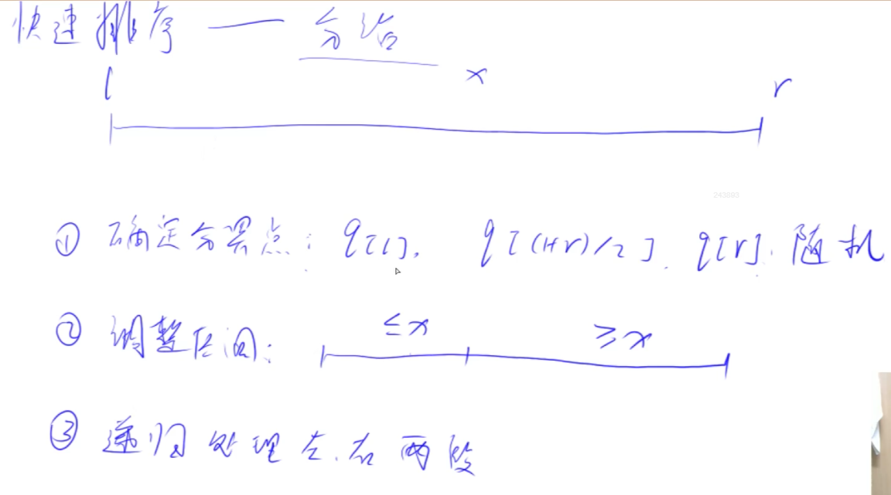
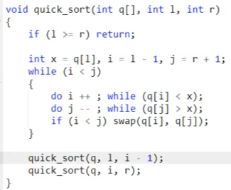
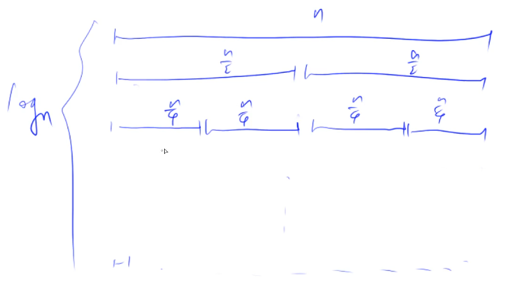
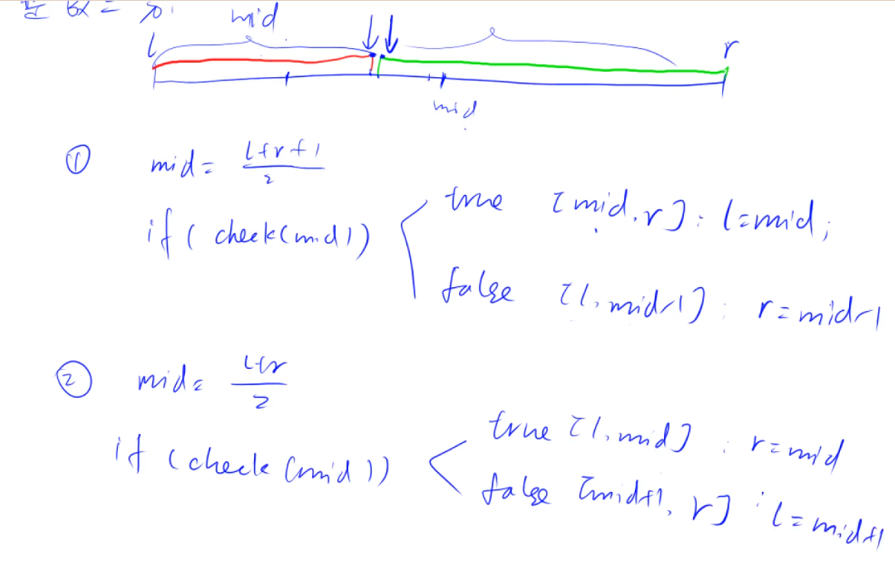

# Basic Algorithm 1

- 排序
    - 快排
    - 归并排序
- 二分查找
    - 整数
    - 浮点数

## 快速排序

- 运用分治的思想
- 是不稳定的排序算法

- 分为三步：
    - 确定分界点
    - **调整区间(重点)**
    - 递归处理左右两段



- 注意：
    - 第二步的分界点并不一定等于x


- 此种方法有效避开所有边界问题：
```C++
// 3 比较熟练但还是有些许错误

#include <iostream>

using namespace std;

const int N = 1e6 + 10;
int n;
int q[N];

void quick_sort(int q[], int l, int r) {
    if (l >= r) return;

    // 确定分界点
    int x = q[(l + r + 1) / 2]；
    int i = l - 1, j = r + 1;
    while (i < j) {
        do i++; while (q[i] < x);
        do j--; while (q[j] > x);
        if (i < j) swap(q[i], q[j]);
    }

    // 递归
    quick_sort(q, l, i - 1);
    quick_sort(q, i, r);
}


int main()
{
    cin >> n;
    for (int i = 0; i < n; i++) cin >> q[i];

    quick_sort(q, 0, n - 1);

    for (int i = 0; i < n; i++) cout << q[i] << " ";
    return 0;
}

```

### 问题分析：



当分界点为l，使用i做区间边界的时候，有些情况下会发生死循环。（当数据是[1,2]时）


## 归并排序

- 运用分治的思想
- 稳定的排序（**相同元素的相对位置不变**）
- 时间复杂度：O(nlogn)
    - 每层递归需要O(n)的时间，共有logn层，所以总时间复杂度为O(nlogn)



- 分为三步：
    - 以中间为界，分成两段 ```mid = (l + r) / 2```
    - 递归处理左右两段
    - 归并->把两个有序的数组合并成一个有序的数组 此处O(n)

```c++
// 1不熟练很多错误

#include<iostream>

using namespace std;

const int N = 1e6 + 10;

int n;
int q[N], tmp[N];

void merge_sort(int q[], int l, int r) {
    if (l >= r) return;

    int mid = l + r >> 1;

    merge_sort(q, l, mid);
    merge_sort(q, mid + 1, r);
    int k = 0, i = l, j = mid + 1;
    while (i <= mid && j <= r)
        if (q[i] <= q[j]) tmp[k++] = q[i++];
        else tmp[k++] = q[j++];
    while (i <= mid) tmp[k++] = q[i++];
    while (j <= r) tmp[k++] = q[j++];

    for (int i = l, j = 0; i <= r; i++, j++) q[i] = tmp[j];
}

int main() {
    cin >> n;
    for (int i = 0; i < n; i++) cin >> q[i];

    merge_sort(q, 0, n - 1);

    for (int i = 0; i < n; i++) cout << q[i] << " ";
}
```

## 整数二分查找

- 重点是：找到分界点



在第一种方法中，若不加1，在l = r - 1 这个特殊情况之下，mid更新之后还是等于l，l = mid导致死循环。

```c++
// 第一种
// 区间[l,r]被划分为[l,mid] 和 [mid + 1,r] 时使用
int bsearch_1(int l, int r){
    while(l < r){
        int mid = (l + r + 1) / 2;
        if(check(mid)) l = mid;
        else r = mid - 1;
    }
    return l;
}

// 第二种
// 区间[l,r]被划分为[l,mid - 1] 和 [mid,r] 时使用
int bsearch_2(int l, int r){
    while(l < r){
        int mid = (l + r) / 2;
        if(check(mid)) r = mid;
        else l = mid + 1;
    }
    return l;
}
```