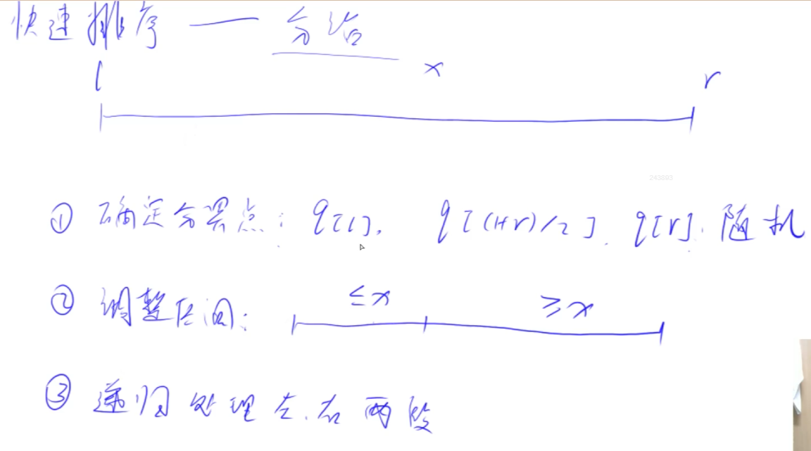

# Basic Algorithm 1

- 排序
    - 快排
    - 归并排序
- 二分查找
    - 整数
    - 浮点数

## 快速排序

- 运用分治的思想
- 是不稳定的排序算法

- 分为三步：
    - 确定分界点
    - **调整区间(重点)**
    - 递归处理左右两段



- 注意：
    - 第二步的分界点并不一定等于x


- 此种方法有效避开所有边界问题：
```C++
#include <iostream>

using namespace std;

const int N = 1e6 + 10;
int n;
int q[N];

void quick_sort(int q[], int l, int r) {
    if (l >= r) return;

    // 确定分界点
    int x = q[(l + r + 1) / 2]；
    int i = l - 1, j = r + 1;
    while (i < j) {
        do i++; while (q[i] < x);
        do j--; while (q[j] > x);
        if (i < j) swap(q[i], q[j]);
    }

    // 递归
    quick_sort(q, l, i - 1);
    quick_sort(q, i, r);
}


int main()
{
    cin >> n;
    for (int i = 0; i < n; i++) cin >> q[i];

    quick_sort(q, 0, n - 1);

    for (int i = 0; i < n; i++) cout << q[i] << " ";
    return 0;
}

```

### 问题分析：


当分界点为l，使用i做区间边界的时候，有些情况下会发生死循环。（当数据是[1,2]时）


## 归并排序

- 运用分治的思想
- 稳定的排序（**相同元素的相对位置不变**）

- 分为三步：
    - 以中间为界，分成两段
    - 递归处理左右两段
    - 归并->把两个有序的数组合并成一个有序的数组