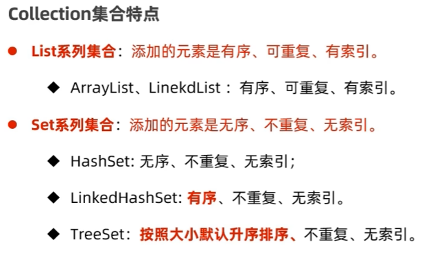

# Arrays & Hashing

## LC217. Contains Duplicate

### Dictionary

在C#中，`Dictionary` 是一个泛型集合类型，属于 .NET 框架中的 `System.Collections.Generic` 命名空间。具体来说，`Dictionary<TKey, TValue>` 表示一个键类型为 `TKey`，值类型为 `TValue` 的字典。

#### `Dictionary` 是一种 **泛型类**，它具有以下几个特性：

1. **键唯一性**：字典中的每个键必须是唯一的。如果尝试添加一个已存在的键，会抛出异常（`ArgumentException`）。

2. **键值对**：每个键都关联一个值，使用键可以高效地检索对应的值。

3. **高效性**：`Dictionary` 使用哈希表作为底层数据结构，因此查找、添加、删除操作的平均时间复杂度为 O(1)。
- `Dictionary` 作为一种常用的数据结构，适用于需要快速查找、插入和删除操作的场景。

#### 示例
```csharp
using System;
using System.Collections.Generic;

class Program
{
    static void Main()
    {
        // 创建一个字典
        Dictionary<int, string> dict = new Dictionary<int, string>();

        // 添加键值对
        dict.Add(1, "One");
        dict.Add(2, "Two");
        dict.Add(3, "Three");
        dic[a] = b;  // 在a键处增加b值

        // 访问字典中的值
        string value = dict[1]; // "One"

        // 检查是否存在特定键
        bool containsKey = dict.ContainsKey(2); // true
        bool containsValue = dict.ContainsValue(2);

        // 删除键值对
        dict.Remove(2);

        // 遍历字典
        foreach (var kvp in dict)
        {
          Console.WriteLine($"Key: {kvp.Key}, Value: {kvp.Value}");
        }
    }
}
```

#### 答案
```
Dictionary<int,int> number = new Dictionary<int,int>();
foreach(int num in nums){
    if(number.ContainsKey(num)){
        return true;
    }
    number[num] = 1;
}
return false;
```

### HashSet




- HashSet: 无序，不重复，无索引

#### 答案
```cs
return new HashSet<int>(nums).Count < nums.Length;
```


## LC219. Contains Duplicate II