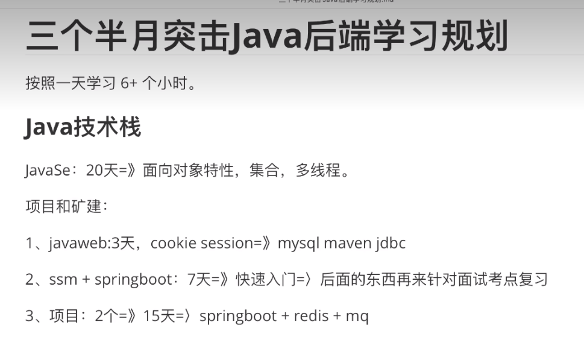
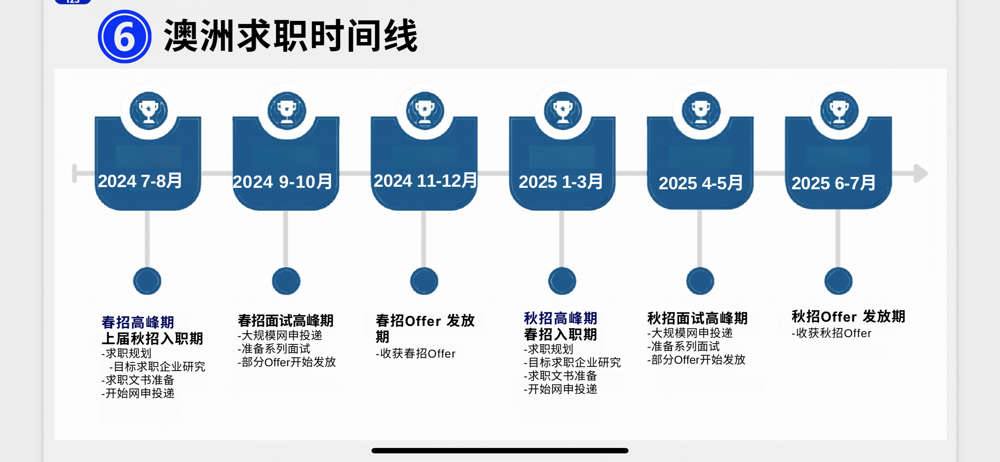
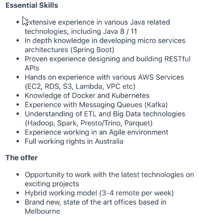
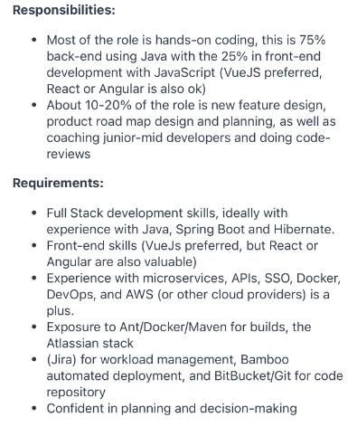

要想精通Java后端开发，你需要掌握以下几个关键领域：

1. Java基础知识：

    - Java的基本语法和结构。
    - 面向对象编程（OOP）的原则，如继承、封装和多态。
    - Java集合框架（如List、Map、Set等）。

2. Java开发环境：
    - 熟悉Java开发工具，如IntelliJ IDEA、Eclipse或NetBeans。
    - 使用和配置构建工具，如Maven或Gradle。
    - 使用版本控制系统，如Git。

3. 数据库技术：
    - SQL语言的基础。
    - 关系型数据库的使用，如MySQL、PostgreSQL或Oracle。
    - Java数据库连接技术（JDBC）和对象关系映射框架（如Hibernate或JPA）。

4. 后端框架：
    - 学习并使用流行的Java后端框架，如Spring Boot、Spring MVC、MyBatis等。
    - 理解RESTful API的设计和实现。

5. 安全性：
    - 理解Web安全基础，如身份验证、授权和安全传输。
    - 使用Spring Security等安全框架。

6. 测试：
    - 单元测试和集成测试的基础知识。
    - 使用JUnit、Mockito等测试工具。

7. 中间件技术：
    - 消息队列（如RabbitMQ、Kafka）。
    - 缓存技术（如Redis、Memcached）。

8. 容器化和部署：
    - Docker容器技术的基础。
    - 使用Kubernetes等容器编排工具。
    - 持续集成/持续部署（CI/CD）的基本概念。

9. 微服务架构：
    - 理解微服务的基本概念和优点。
    - 使用Spring Cloud等框架构建微服务。

10. 高级Java特性：
    - Java 8及以上版本的新特性，如流（Streams）、Lambda表达式和新的日期时间API。
    - 并发编程，了解线程、同步、异步和并行处理。

11. 设计模式和架构：
    - 学习常用的设计模式，如工厂模式、单例模式、策略模式等。
    - 理解软件架构原则，如SOLID原则、DRY（Don't Repeat Yourself）原则。

12. 前端技术：

    - 了解基本的前端技术，如HTML、CSS和JavaScript，这有助于与前端开发者更好地协作。
    - 学习一些流行的前端框架或库，如React、Angular或Vue.js。

13. 云服务和API管理：

    - 学习如何在云平台上部署和管理应用，如AWS、Azure或Google Cloud Platform。
    - 理解和使用API网关，服务网格等现代云架构组件。

14. 性能优化和监控：

    - 学习如何分析和优化Java应用的性能。
    - 使用性能监控工具，如Prometheus、Grafana或New Relic。

15. DevOps实践：

    - 学习DevOps文化和实践，理解开发和运维的紧密整合。
    - 学习自动化脚本和工具，如Ansible、Chef或Puppet。

16. 软件开发生命周期管理：

    - 理解敏捷开发方法论，如Scrum或Kanban。
    - 项目和团队管理技能。

- 澳洲求职时间线

- Java Engineer 工作要求

