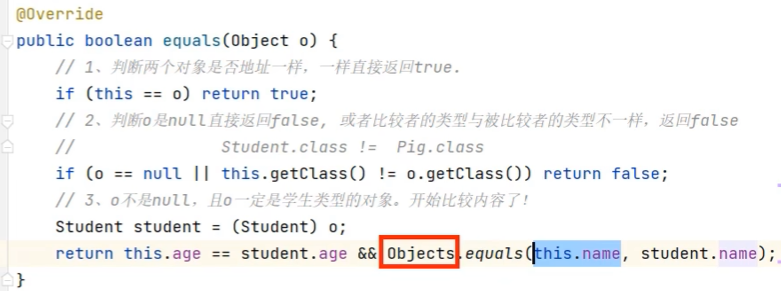
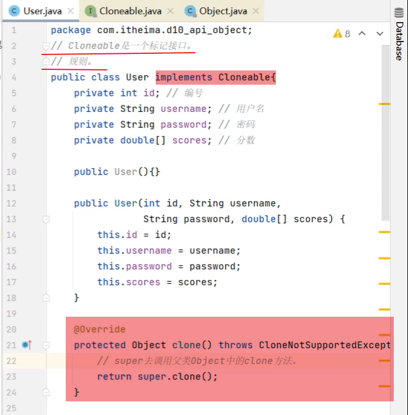
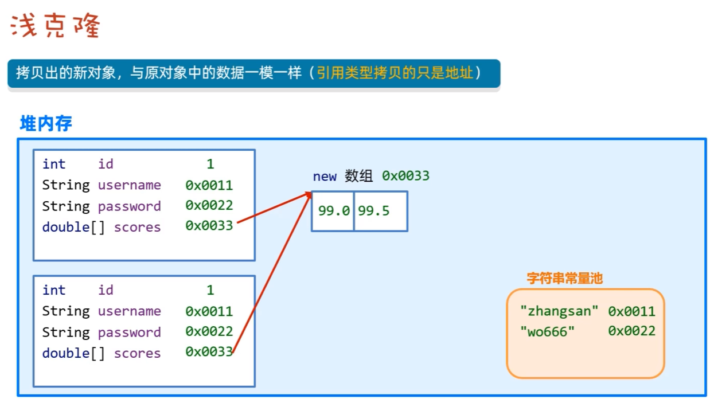
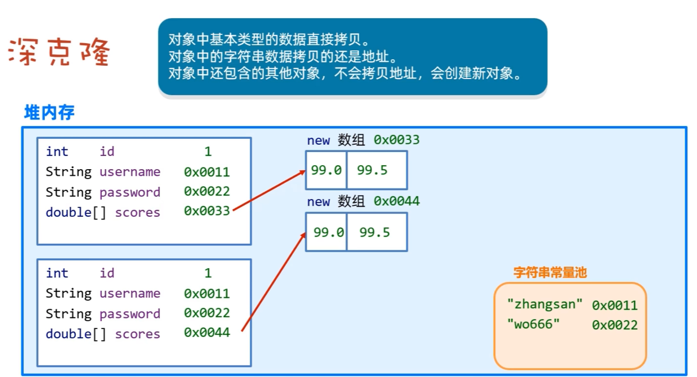
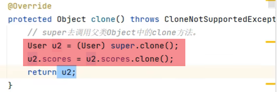
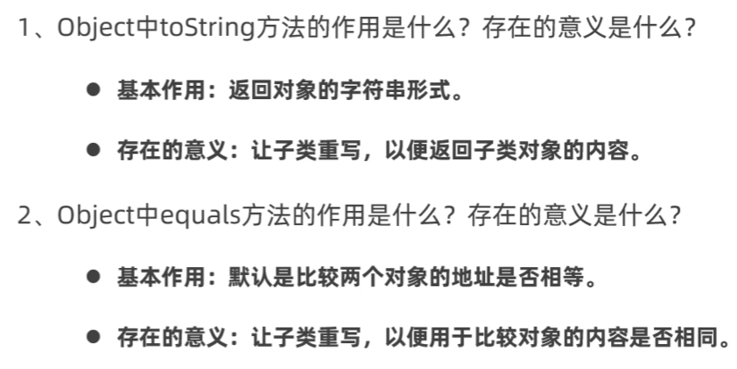

# 12. lang.Object

- Object类是Java中所有类的共同父类。因此Java中所有类的对象都可以直接使用Object类中的方法。

### 12.1 Object类的常见方法

| 方法名 | 说明 |
| --- | --- |
| ```public String toString()``` | 返回对象的字符串表示形式 |
| ```public boolean equals (Object o)``` | 判断两个对象是否相等（比较的是地址） |
| ```protected Object clone()``` | 对象克隆 |

### 12.2 toString()方法

- Object类中的toString()方法是所有类的默认方法，用于返回对象的字符串表示形式。
- 该方法默认返回对象的类名@内存地址，可以通过重写该方法来自定义对象的字符串表示形式。
- 一般情况下，toString()方法返回的字符串应该包含对象的所有重要信息，方便开发人员查看。


### 12.3 equals()方法

- Object类中的equals()方法是所有类的默认方法，用于判断两个对象是否相等。
- 该方法默认比较的是对象的地址，如果需要比较对象的内容，则需要重写该方法。




### 12.4 clone()方法

- Object类中的clone()方法是所有类的默认方法，用于创建并返回对象的克隆。

- 如果自定义了一个类，但是由于protected修饰符的限制，导致该类无法直接调用Object类的clone()方法，则需要重写该方法，并且在方法中调用Object类的clone()方法。
    - 注意: 要给自定义的类添加implements Cloneable接口，以便调用Object类的clone()方法。（Cloneable接口是一个标记接口）
    - 在重写的clone()方法中，用super去调用父类Object中的Clone方法，并返回克隆对象。



#### 12.4.1浅拷贝：



#### 12.4.2深拷贝：




#### 12.4.3 将浅拷贝改为深拷贝



### 12.5 总结

