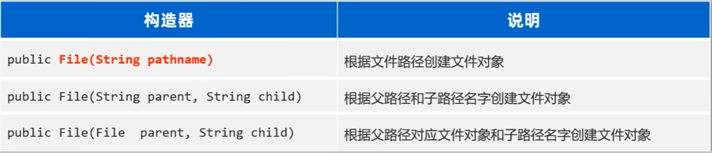
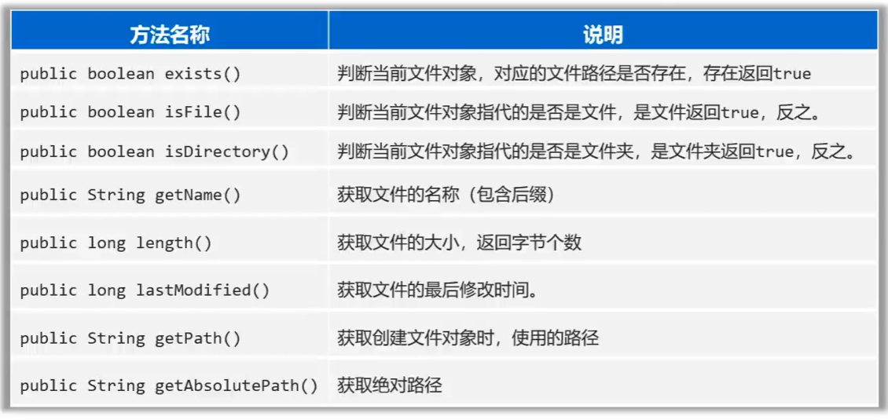
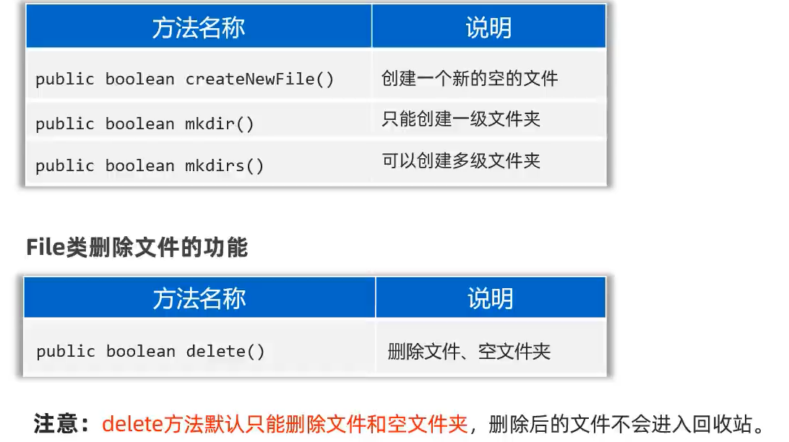
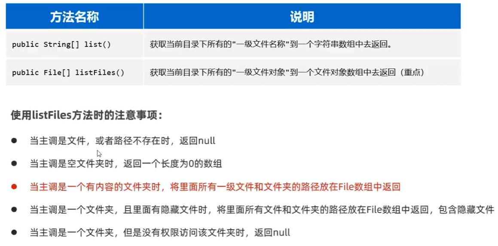
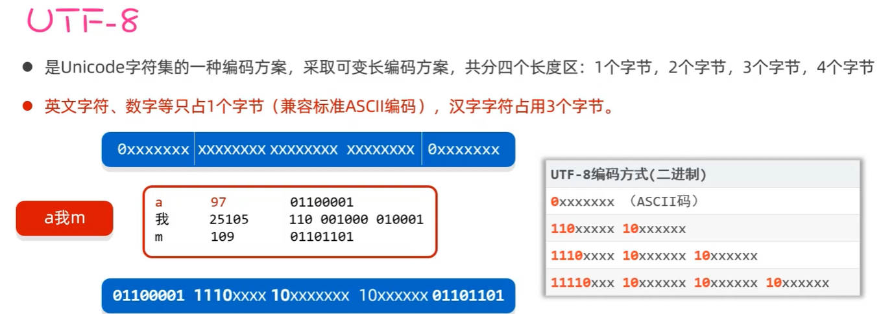
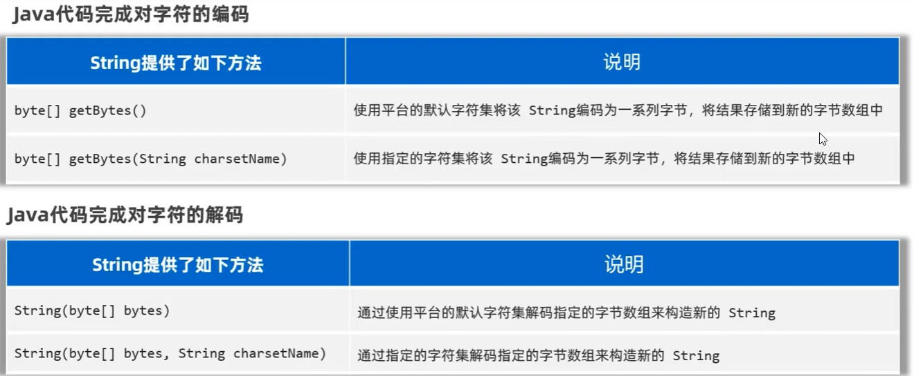

# 28. io_File 与 IO流

- File类是java.io包中用于处理文件和目录的类。
- File类提供了对文件和目录的创建、删除、重命名、文件属性的访问、文件或目录的遍历等操作。
- File类只可以对文件本身进行操作，不能读写文件里面存储的数据

### 创建File类的对象



- 注意：
    - File对象可以指代一个不存在的文件路径
    - File对象可以指代一个文件夹，也可以指代一个文件

### 常用方法1：判断文件类型、获取文件信息



### 常用方法2：创建文件、删除文件



### 常用方法3：遍历文件夹



### 文件搜索案例

```java
public static void main(String[] args) throws Exception {
    search(new File("D:\\"),"QQMusic.exe");
}

/**
* 去目录下搜索某个文件
* @param dir 目录
* @param fileName 文件名
*/
public static void search(File dir, String fileName) throws Exception {
    // 1. 把非法情况拦截住
    if(dir == null || !dir.exists() || !dir.isDirectory()){
        return;
    }

    // 2. 获取当前目录下的全部一级文件对象
    File[] files = dir.listFiles();

    // 3. 判断当前目录下是否存在一级文件对象，以及是否可以拿到一级文件对象
    if(files != null && files.length > 0){
        for(File file : files){
            if(file.isFile()){
                if(fileName.equals(file.getName())){
                    System.out.println(file.getAbsolutePath());
                    Runtime runtime = Runtime.getRuntime();
                    runtime.exec(file.getAbsolutePath());
                }
            }
            else if(file.isDirectory()){
                search(file, fileName);
            }
        }
    }
}
```

### 前置知识-字符集


#### utf-8



#### 编码与解码

