# 30.Special File and Journaling

- ```.properties```键值对的形式，存储系统的配置信息

- ```.xml```存储有关系的数据
    - 作为系统的配置文件
    - 作为信息进行传输

## Properties文件

### 特点：
    - 键值对形式
    - 键不能重复
    - 文件名后缀为```.properties```


### Properties实现类

- 是一个Map集合（键值对集合），但我们一般不会当集合用
- 核心作用：Properties是用来代表属性文件的，通过Properties可以读写属性文件里面的内容

### 使用 Properties 读取属性文件里的键值对数据

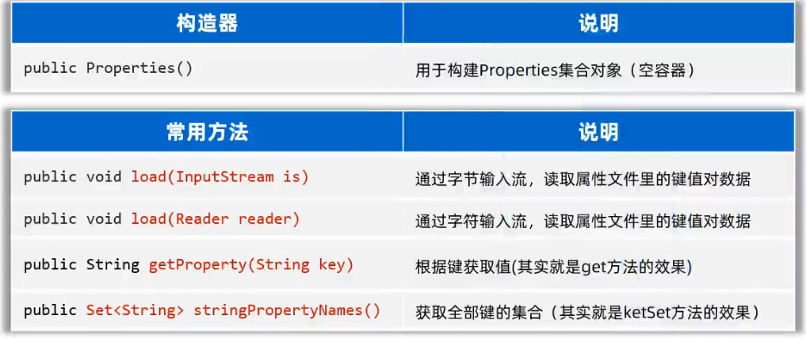

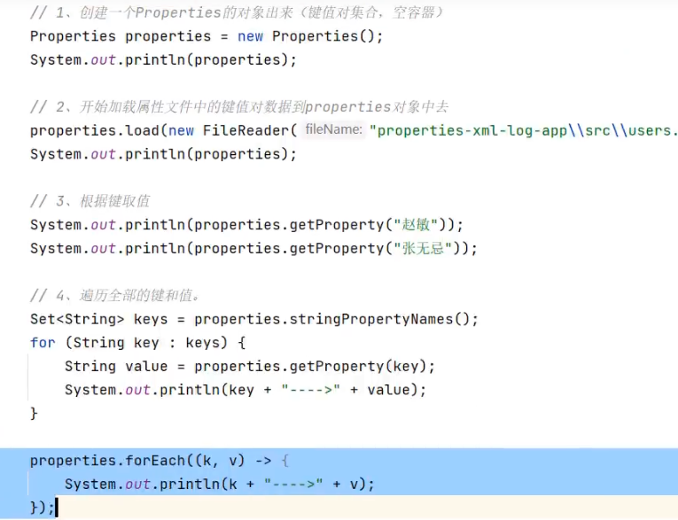

### 使用 Properties 把键值对数据写出到属性文件中

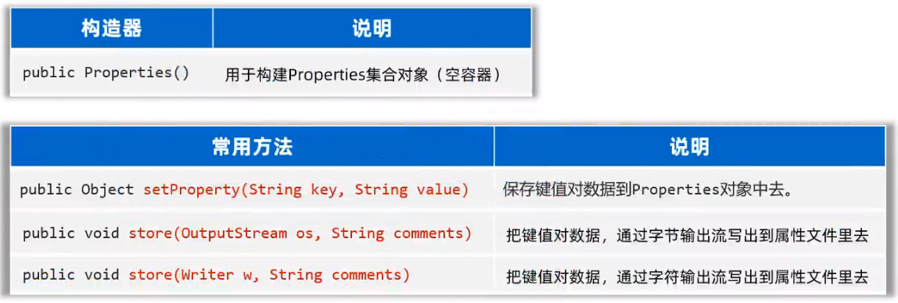

## XML文件

- 全称Extensible Markup Language，可扩展标记语言

### 特点：
- XML中的 ```<标签名>``` 称为一个标签或一个元素，一般是成对出现的
- XML中的标签名可以自己定义（可扩展），但是要正确的嵌套
- XML中只能有一个根标签
- XML中的标签可以有属性
- 如果一个文件中防止的是XML格式的数据，这个文件就是XML文件，后缀名一般为```.xml```

### XML语法规则

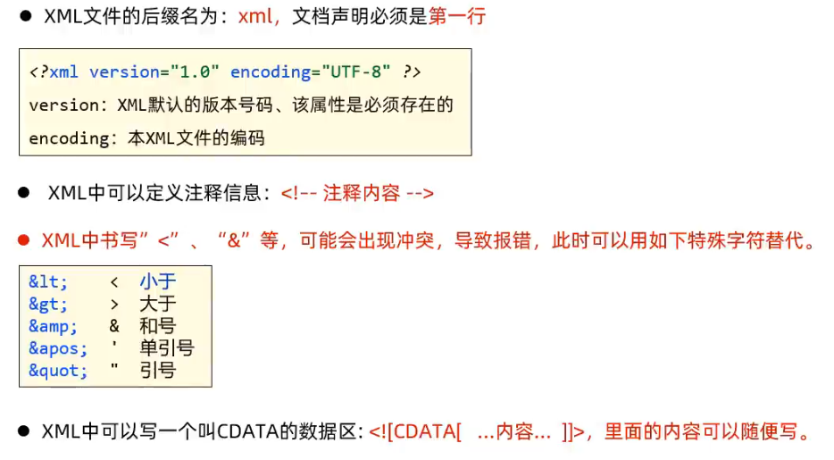

### XML的作用和应用场景

- 本质是一种数据格式，可以存储复杂的数据结构和数据关系
- 应用场景：经常用作系统的配置文件，或者作为一种特殊的数据结构，在网络上传输

## 解析XML文件

使用```DOM4j```来解析XML文件

### 思想：文档对象模型（Document Object Model）

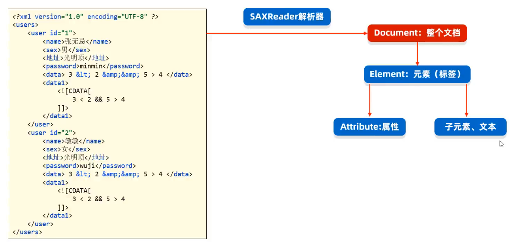

### 得到DOcument对象

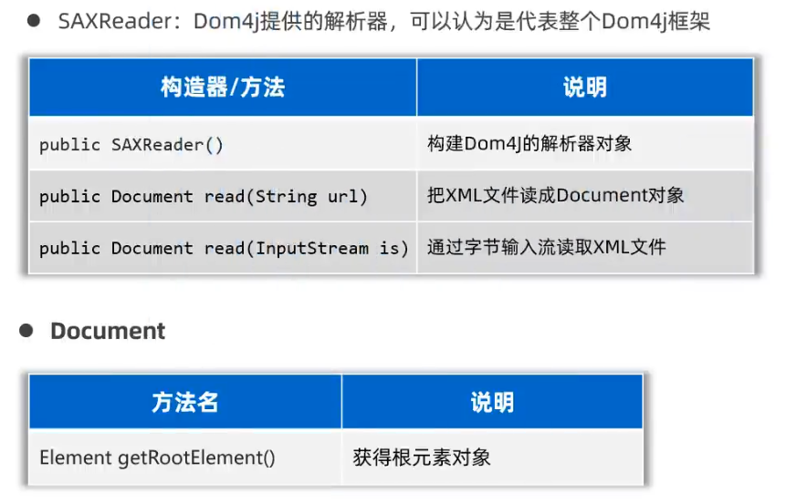

### element提供的方法

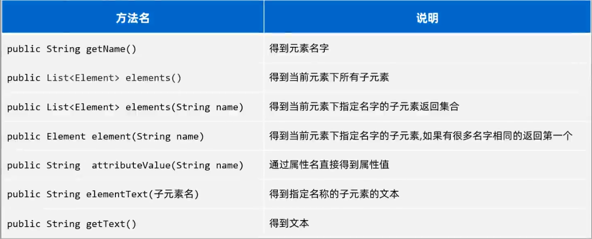

## Journaling 日志技术

- 可以将系统执行的信息，方便的记录到指定的位置（控制台，文件，数据库）
- 可以随时以开关的形式控制日志的启停，无需侵入到源码中修改

### 体系结构

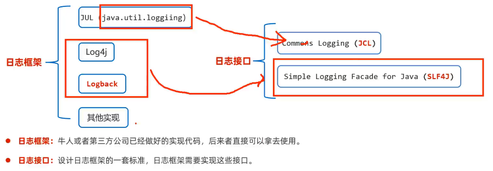

- 注意1：因为对于Commons Logging接口不满意，所以才有了SLF4J（Simple Logging Facade for Java）因为对Log4j的性能不满意，有人就搞了Logback
- 注意2：Logback是基于slf4j日志规范实现的框架


### Logback 日志框架

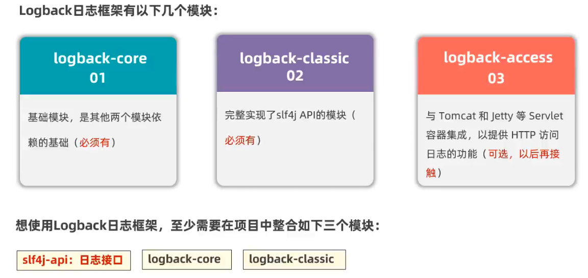

### Logback 快速入门

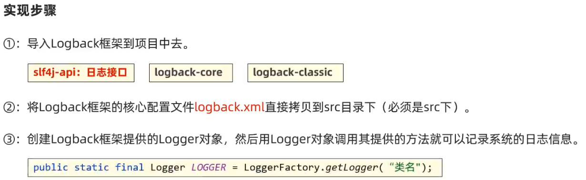

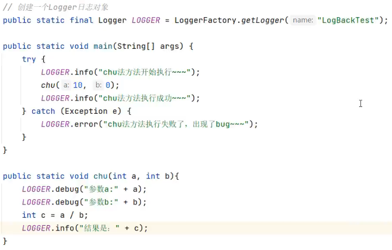

### Logback 配置文件详解

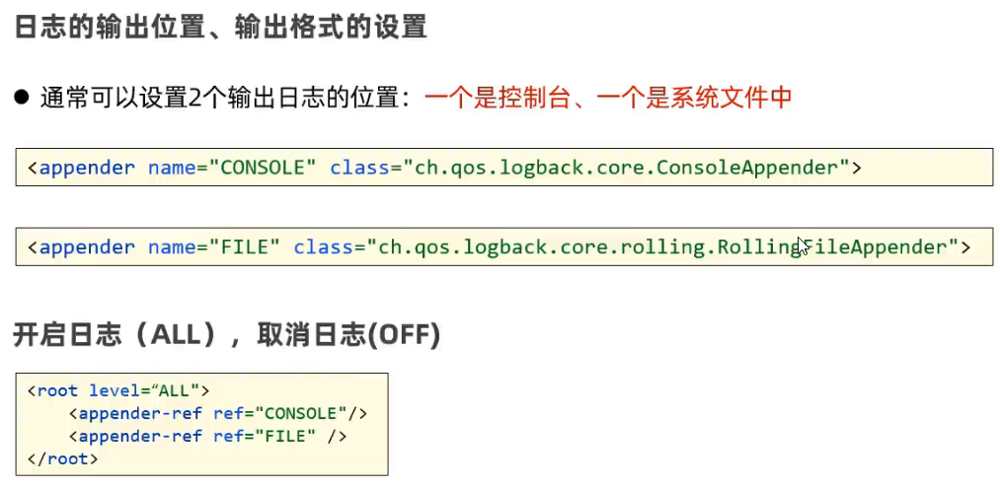

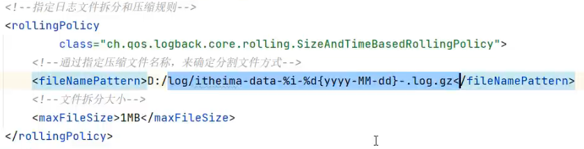

### 日志级别
- 日志级别指的是日志信息的类型，日志都会分级别，常见的日志级别如下（优先级从低到高）：

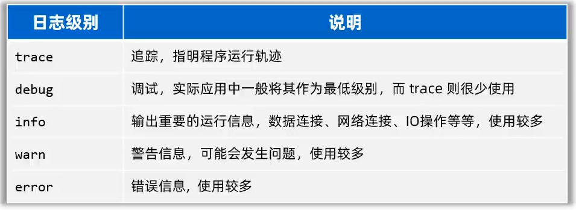

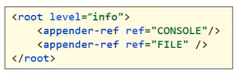

- 只有日志级别是大于或等于核心配置文件配置的日志级别，才会被记录，否则不会记录