# 31. Multithreading

- 多线程是指从软硬件上实现的多条执行流程的技术（多条线程由CPU调度执行）

## 如何创建多条线程

- Java是通过java.lang.Thread类来创建多线程的。

### 方式一：继承Thread类

1. 定义一个子类MyThread，继承Thread类，重写run()方法。
2. 创建MyThread对象
3. 调用start()方法，启动线程。（启动后还是执行run()方法）

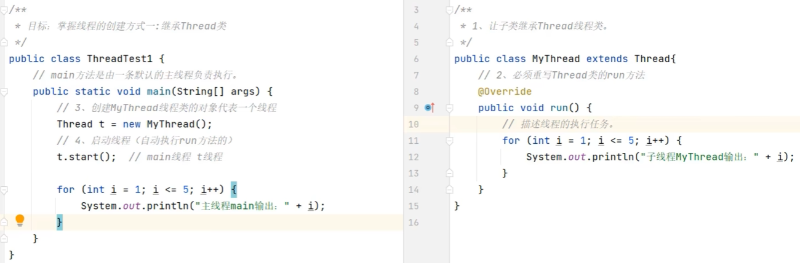

- 优缺点：
    - 优点：编码简单
    - 缺点：
        1. 无法返回结果线程类已经继承了Thread类，无法继承其他类，不利于功能的扩展。
        2. 假如线程执行完毕后有一些数据需要返回，重写的run方法不能直接返回结果

- 注意事项：
    - 启动线程必须是调用start()方法，不能直接调用run()方法。（直接调用run()方法，会被当成普通的对象）
    - 不要把主线程的任务全部放在子线程之前

### 方式二：实现Runnable接口

1. 定义一个线程任务类MyRunnable实现Runnable接口，重写run()方法。
2. 创建MyRunnable任务对象
3. 把MyRunnable任务对象交给Thread类创建线程对象
    - ```public Thread(Runnable target) ```   封装Runnable对象称为线程对象
4. 调用start()方法，启动线程。（启动后还是执行run()方法）


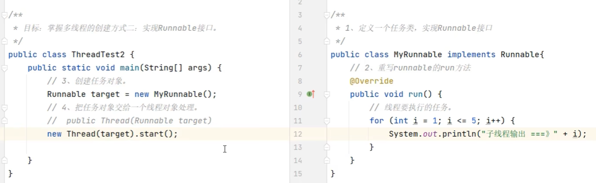

- 优缺点：
    - 优点：任务类只是实现接口，可以继续继承其他类，实现其它接口，扩展性强
    - 缺点：
        1. 需要多创建一个Runnable对象
        2. 假如线程执行完毕后有一些数据需要返回，重写的run方法不能直接返回结果

- 方式二的匿名内部类写法
    1. 可以创建Runnable匿名内部类对象
    2. 再交给Thread线程对象
    3. 再调用线程对象的start()方法启动线程

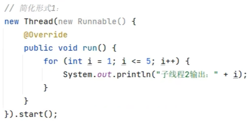

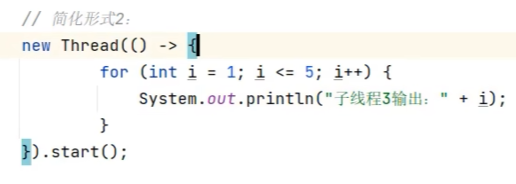

### 方式三：利用Callable接口与FutureTask类

1. 创建任务对象
    - 定义一个类实现Callable接口，重写call()方法，封装要做的事情，和要返回的数据
    - 把Callable类型的对象封装成FutureTask（线程任务对象）
        - FutureTask是一个任务对象，实现了Runnable对象
        - 可以在线程执行完毕之后，用未来任务对象调用get方法获取线程执行完毕的结果
2. 把线程任务对象交给Thread对象
3. 调用Thread对象和start方法启动线程
4. 线程执行完毕后，通过FutureTask对象的get()方法获取线程任务执行的结果

- FutureTask提供的API：

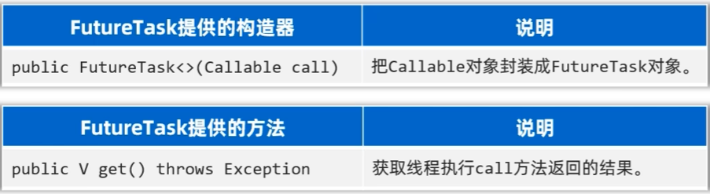

```java
public static void main(String[] args) throws Exception {

    // 3. 创建一个Callable对象
    Callable<String> mycallable = new Mycallable(100);

    // 4. 把Callable的对象封装成一个FutureTask对象（任务对象）
    FutureTask<String> f1 = new FutureTask<>(mycallable);
    // 5. 把任务对象交给一个Thread对象
    new Thread(f1).start();

    // 6. 获取线程执行完毕后返回的结果
    // 注意：如果执行到这，假如上面的代码还没有执行完毕，这里的代码会暂停，等待上面线程执行完毕后，才会获取结果
    String s = f1.get();
    System.out.println(s);
}

// 1. 让这个类实现Callable接口
public static class Mycallable implements Callable<String>{

    private int n;
    public Mycallable(int n) {
        this.n = n;
    }


    // 2. 重写call方法
    @Override
    public String call() throws Exception {
        int sum = 0;
        for (int i = 1; i <= n; i++) {
            sum += i;
        }
        return "线程求出的1-"+n+"的和是："+sum;
    }
}
```

- 优缺点：
    - 优点：
        1. 线程任务类只是实现接口，可以继续继承类和实现接口，扩展性强
        2. 可以在线程执行完毕后去获取线程执行的结果
    - 缺点：
        - 代码复杂度高，需要定义一个类实现Callable接口，重写call()方法，还需要FutureTask对象，还需要Thread对象


## Thread提供的方法

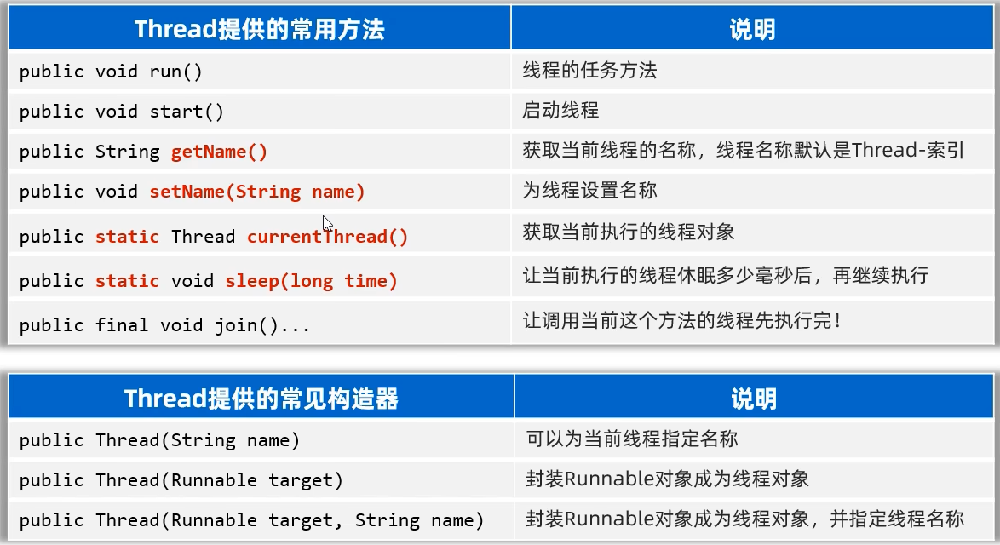

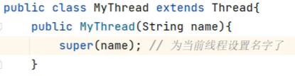


- Thread类还提供了诸如：yield(),interrupt(),守护线程，线程优先级等线程的控制方法，在开发中很少使用

## 线程安全问题

- 多个线程同时操作同一个资源的时候，可能会出现业务安全问题

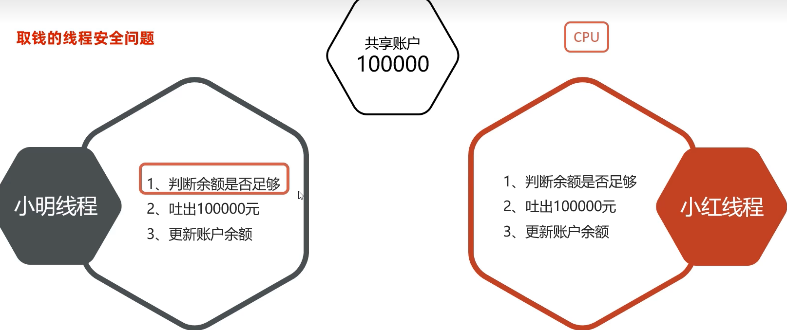

## 线程同步

- 解决线程安全问题的方案
### 思想
让多个线程实现先后依次访问共享资源，这样就解决了安全问题

### 常见方案
- 加锁：每次只允许一个线程加锁，加锁后才能访问，访问完毕后自动解锁，然后其他线程才可以再加锁进来

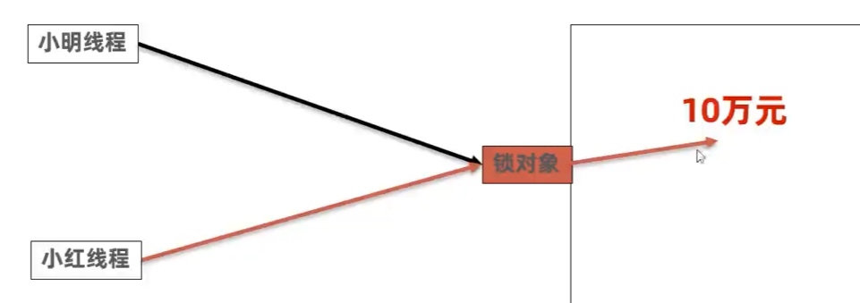

#### 方式一：同步代码块

- 作用：把访问共享资源的核心代码块上锁，以此来保证线程安全
- 原理：每次只允许一个线程加锁，加锁后才能访问，访问完毕后自动解锁，然后其他线程才可以再加锁进来
- 注意事项：对于当前同时执行的线程来说，同步锁必须是同一把(同一个对象)，否则会出bug

```java
synchronized(同步锁){
    // 访问共享资源的代码
}
```
- 锁对象随便选择一个唯一的对象不好：会影响其他无关线程的进行
- 锁对象的使用规范：建议使用共享资源作为锁的对象。
    - 对于实例方法，建议使用this作为锁的对象。
    - 对于静态方法，建议使用字节码(类名.class)作为锁的对象

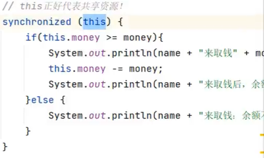

```java
// 静态方法官方推荐使用：类名.class来作为锁
// 静态方法是所有方法通过类名来访问的
public static void test(){
    synchronized(MyClass.class){
        // 访问共享资源的代码
    }
}
```
#### 方式二：同步方法
- 作用：把访问共享资源的核心方法上锁，以此来保证线程安全
- 原理：每次只允许一个线程加锁，加锁后才能访问，访问完毕后自动解锁，然后其他线程才可以再加锁进来

```java
修饰符 synchronized 返回值类型 方法名(参数列表){
    // 访问共享资源的代码
}
```

- 底层原理：
    - 同步方法其实底层也是有隐式锁对象的，只是锁的范围是整个方法代码
    - 如果方法是实例方法：同步方法默认用this作为锁的对象
    - 如果方法是静态方法：同步方法默认用字节码(类名.class)作为锁的对象

#### 方式三：lock锁

- lock锁是JDK5开始提供的一种新的锁定操作，通过它可以创建出锁对象进行加锁和解锁，更灵活，更方便，更强大
- lock锁是接口，不能直接实例化，可以采用它的实现类ReentrantLock来构建lock锁对象

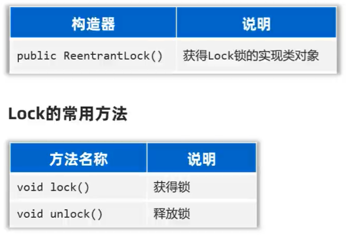

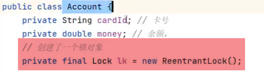

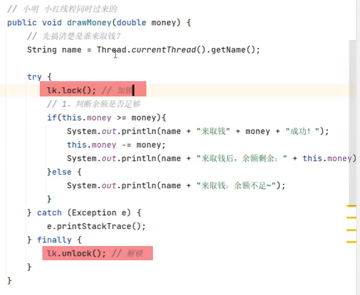

- 用finnally来确保锁一定会被释放

## 线程通信

- 当多个线程共同操作共享的资源时，线程间通过某种方式互相告知自己的状态，以互相协调，并避免无效的资源争夺
- 线程通信的前提是保证线程安全

### 线程通信的常用模型（生产者与消费者模型）

- 生产者线程负责生产数据
- 消费者线程负责消费生产者生产的数据
- 注意：生产者生产完数据应该等待自己，通知消费者消费。消费者消费完数据也应该等待自己，再通知生产者生产

### Object类提供的等待和唤醒方法

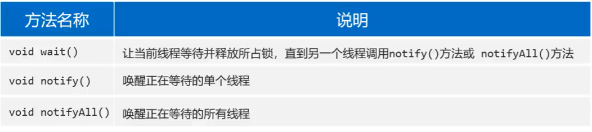

- 上述方法应该使用当前同步锁对象进行调用
- 先唤醒别人，再等待自己

## 线程池

### 认识线程池
- 线程池是一种复用线程的技术

#### 不使用线程池的问题

- 用户每发起一个请求，后台就需要创建一个新线程来处理，下次新任务来了肯定又要创建新线程处理的，而创建新线程的开销是很大的，并且请求过多时，肯定会产生大量的线程出来，这样会严重影响系统的性能

#### 线程池工作原理

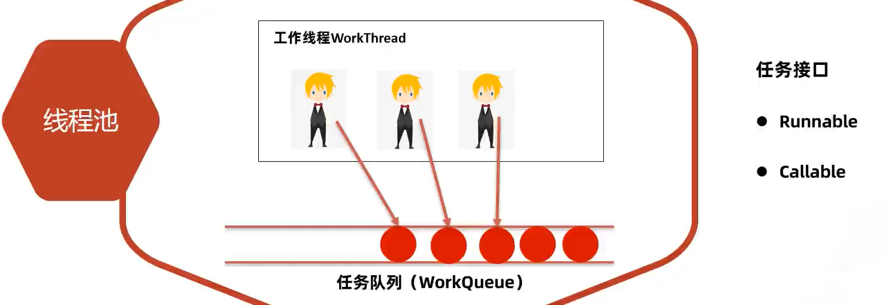

### 如何创建线程池
- JDK5.0之后提供了ExecutorService接口

#### 如何得到线程池对象？

方式一：使用ExecutorServices的实现类ThreadPoolExecutor自创建一个线程池对象

方式二：使用Executors（线程池的工具类）调用方法返回不同特点的线程池对象

#### 方法一：ThreadPoolExecutor构造器

```java
piblic ThreadPoolExecutor(int corePoolSize, int maximumPoolSize, long keepAliveTime, TimeUnit unit, BlockingQueue<Runnable> workQueue, ThreadFactory threadFactory, RejectedExecutionHandler handler)
```

1. corePoolSize：指定线程池的核心线程的数量
2. maximumPoolSize：指定线程池的最大线程数量
3. keepAliveTime：指定临时线程的存活时间
4. unit：指定keepAliveTime的时间单位
5. workQueue：指定线程池中的任务队列
    - ```ArrayBlockingQueue```基于数组实现的任务队列，可以控制大小
    - ```LinkedBlockingQueue```基于链表实现的任务队列，不限制大小
6. threadFactory：指定线程工厂，用于创建线程
    - ```Executors.defaultThreadFactory()``` 获取一个默认的线程工厂
7. handler：指定拒绝策略（线程都在忙，任务队列也满了的时候，新任务来了该怎么处理）

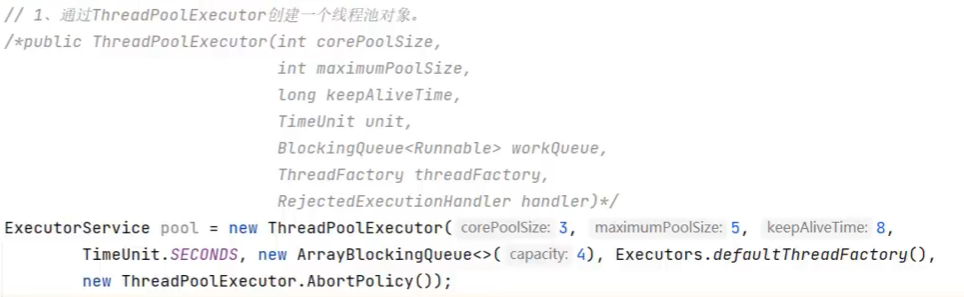

- 注意事项：
    - 临时线程什么时候创建？
        - 新任务提交时发现和信线都在忙，任务队列也满了，并且还可以创建临时线程，此时才会创建临时线程
    - 什么时候会拒绝新任务？
        - 核心线程和临时线程都在忙，任务队列也满了，新的任务过来的时候才会开始拒绝任务