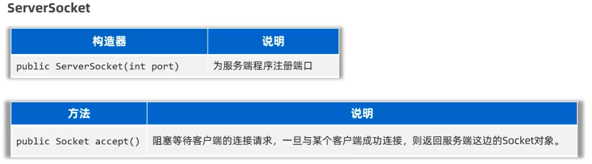

# 32. 网络编程

- 可以让设备中的程序与网络上其他设备的程序进行数据交互（实现网络通信的）
- java.net包提供了用于网络编程的类和接口

## 通信的基本架构

- 基本架构有两种：
    - CS架构（Client-Server）：客户机-服务器架构
    - BS架构（Browser-Server）：浏览器-服务器架构

### IP地址

- IP地址（Internet Protocol Address）：唯一标识网络上计算机的地址
- IP地址有两种形式：
#### IP地址表示形式：
- IPv4地址：32位(4字节)，通常用**点分十进制**表示，如192.168.1.1
- IPv6地址：128位，通常用**冒分十六进制**表示，如2001:0db8:85a3:0000:0000:8a2e:0370:7334

#### 公网IP与内网IP：
- 公网IP：是可以连接互联网的IP地址
- 内网IP：也叫局域网IP，只能在组织机构内部使用
- 192.168.x.x：保留给局域网使用, 范围是192.168.0.0~192.168.255.255，专为组织机构内部使用

#### 特殊IP地址：
- 127.0.0.1 与 localhost：表示本机回环地址，用于本机测试

#### IP常用命令：
- ipconfig：查看网络接口信息
- ping IP地址：检查网络是否连通

#### InetAddress类：
- InetAddress类表示IP地址，提供获取IP地址信息的方法

##### 常用方法


### 端口号

- 标记正在计算机设备商运行的应用程序的
- 被规定为一个16位的二进制，范围是0~65535

#### 分类

- 周知端口：0~1023，被预先定义的知名应用占用（如：HTTP占80，FTP占21）
- 注册端口：1024~49515，分配给用户进程或某些应用程序
- 动态端口：49516~65535，由操作系统动态分配

注意：我们自己开发程序的时候，一般选择使用注册端口，且一个设备中不能出现两个程序的端口号一样，否则会出错

### 通信协议
- 网络上通信的设备，事先规定的连接规则，以及传输数据的规则被称为网络通信协议

#### 开放式网络互联标准
- OSI网络参考模型：全球网络互联标准
- TCP/IP协议簇：事实上的国际标准


##### UDP协议

- UDP（User Datagram Protocol）：用户数据报协议
- 特点：
    - 无连接
    - 不可靠
    - 通信效率高

- 不事先建立连接，数据按照包发，一包数据包含：自己的IP，程序端口，目的地IP，程序端口和数据（限制在64KB内）等

- 应用场景：语音通话，视频直播

##### TCP协议

- TCP（Transmission Control Protocol）：传输控制协议
- 特点：
    - 面向连接
    - 可靠通信
    - 通信效率相对不高
- TCP的最终目的：要保证在不可靠的信道上实现可靠的传输
- TCP主要有三个步骤实现可靠传输：三次握手建立连接，传输数据进行确认，四次挥手断开连接

**可靠连接**：确定通信双方，收发信息都是正常无问题的（全双工）

## UDP通信
- 特点：无连接，不可靠通信
- 不事先建立连接，发送端每次把要发送的数据（限制在64KB内），接收端IP等信息封装成一个数据包，发出去就不管了
- Java提供了一个```java.net.DatagramSocket```类来实现UDP通信

### DatagramSocket
- 用于创建客户端，服务端


### DatagramPacket
- 创建数据包


### 实现步骤
- 客户端实现步骤
1. 创建DatagramSocket对象（客户端对象）
2. 使用while死循环不断的接受用户的数据输入，如果用户输入的exit则退出程序
3. 创建DatagramPacket对象，封装要发送的数据（数据包对象）
4. 使用DatagramSocket对象的send方法，传入DatagramPacket对象，发送数据
5. 释放资源

- 服务端实现步骤
1. 创建DatagramSocket对象并且指定接口（服务端对象）
2. 创建DatagramPacket对象，用于接收数据（数据包对象）
3. 使用DatagramSocket对象的receive方法，传入DatagramPacket对象
4. 使用while死循环不读拿的进行第三步
5. 释放资源

## TCP通信
- 特点：面向连接，可靠通信
- 底层能保证数据成功传到服务端
- 通信双方事先会采用“三次握手”方式建立可靠连接，实现端到端的通信。
- Java提供了一个```java.net.Socket```类来实现TCP通信

#### 客户端开发
- 客户端程序就是通过Socket对象与服务端建立连接


- 客户端实现步骤
    1. 创建客户端的Socket对象，指定服务端的IP地址和端口号，请求与服务端的连接
    2. 使用socket对象调用getOutputStream方法，得到字节输出流
    3. 使用字节输出流完成数据的发送
    4. 释放资源，关闭socket管道

```java
public static void main(String[] args) throws Exception {
    System.out.println("——————客户端启动成功——————");
    Socket socket = new Socket("127.0.0.1", 8888);

    OutputStream os = socket.getOutputStream();
    DataOutputStream dos = new DataOutputStream(os);

    Scanner scanner = new Scanner(System.in);
    while (true) {
        System.out.println("请输入");
        String msg = scanner.nextLine();
        if(msg.equals("exit")){
            System.out.println("关闭成功");
            dos.close();
            socket.close();
            break;
        }
        dos.writeUTF(msg);
        dos.flush();
    }
}
```

#### 服务端开发
- 服务器程序就是通过ServerSocket对象监听客户端的连接请求



- 服务端实现步骤
    1. 创建服务端的ServerSocket对象，指定监听的端口号
    2. 使用ServerSocket对象的accept方法，得到客户端的Socket对象
    3. 使用Socket对象调用getInputStream方法，得到字节输入流，完成数据的接收
    4. 释放资源，关闭socket管道

```java
public static void main(String[] args) throws Exception {
    System.out.println("——————服务端启动成功——————");

    ServerSocket serverSocket = new ServerSocket(8888);
    Socket socket = serverSocket.accept();
    DataInputStream in = new DataInputStream(socket.getInputStream());

    while (true) {
        try {
            String rs = in.readUTF();
            System.out.println(rs);
        } catch (Exception e) {
            System.out.println(socket.getRemoteSocketAddress() + "离线了");
            in.close();
            socket.close();
            break;
        }
    }
}
```

#### 多对多同时通信


```java
// Client.java

public static void main(String[] args) throws Exception {
    System.out.println("——————客户端启动成功——————");
    Socket socket = new Socket("127.0.0.1", 8888);

    OutputStream os = socket.getOutputStream();
    DataOutputStream dos = new DataOutputStream(os);

    Scanner scanner = new Scanner(System.in);
    while (true) {
        System.out.println("请输入");
        String msg = scanner.nextLine();
        if(msg.equals("exit")){
            System.out.println("关闭成功");
            dos.close();
            socket.close();
            break;
        }
        dos.writeUTF(msg);
        dos.flush();
    }
}
```

```java
// Server.java

public static void main(String[] args) throws Exception {
    System.out.println("——————服务端启动成功——————");

    ServerSocket serverSocket = new ServerSocket(8888);

    while (true) {
        Socket socket = serverSocket.accept();
        System.out.println("有人上线了" + socket.getRemoteSocketAddress());

        new ServerReaderThread(socket).start();
    }
}
```

```java
// ServerReaderThread.java

public class ServerReaderThread extends Thread{
    private Socket socket;
    public ServerReaderThread(Socket socket) {
        this.socket = socket;
    }

    @Override
    public void run() {
        try {
            InputStream is = socket.getInputStream();
            DataInputStream dis = new DataInputStream(is);
            while(true){
                try {
                    String msg = dis.readUTF();
                    System.out.println(msg);
                } catch (Exception e) {
                    System.out.println("有人下线了" + socket.getRemoteSocketAddress());
                    dis.close();
                    socket.close();
                    break;
                }
            }
        } catch (Exception e) {
            throw new RuntimeException(e);
        }

    }
}
```

#### 综合案例1- 即时通讯+群聊
- 端口转发思想


#### 综合案例2- 实现一个简易版的BS架构