# 02. Maven

## 2.1 Maven简介

### 什么是Maven？
- Maven是apache旗下的一个开源项目，是一款用于管理和构建java项目的工具
- 基于项目对象模型（POM）的概念，通过一小段描述信息来管理项目的构建

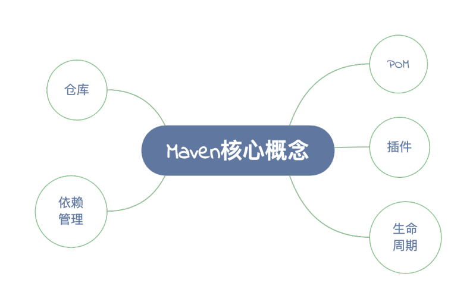

### Maven的作用？

1. 依赖管理：方便快捷的管理项目依赖的资源（jar包），避免版本冲突的问题

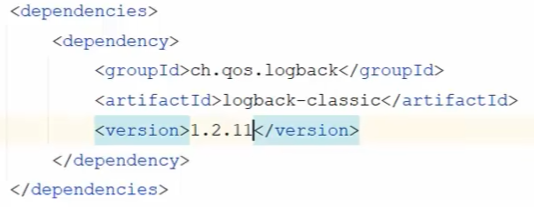

2. 统一项目结构：提供标准统一的项目结构

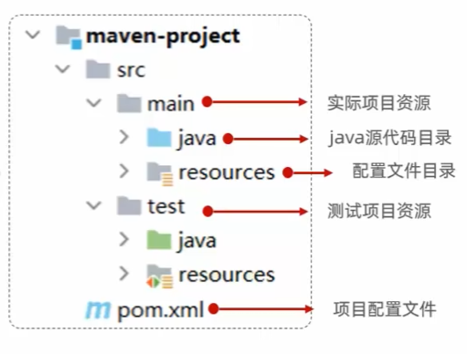

- ```pom.xml```是Maven项目下的核心配置文件
- java代码编译后产生的文件会存储在```taget```文件夹中


3. 项目构建：标准跨平台（linux、windows、mac）的自动化项目构建方式

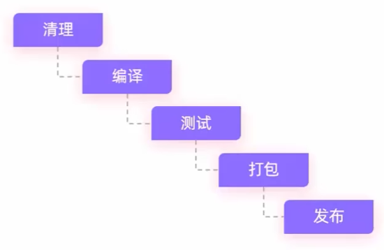

### Maven 模型

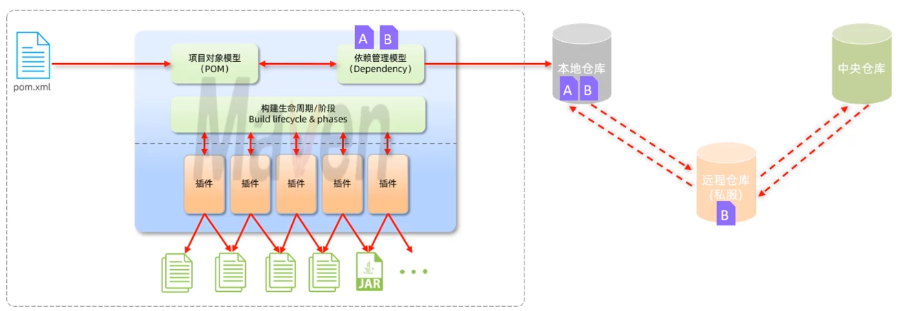

### Maven安装与配置

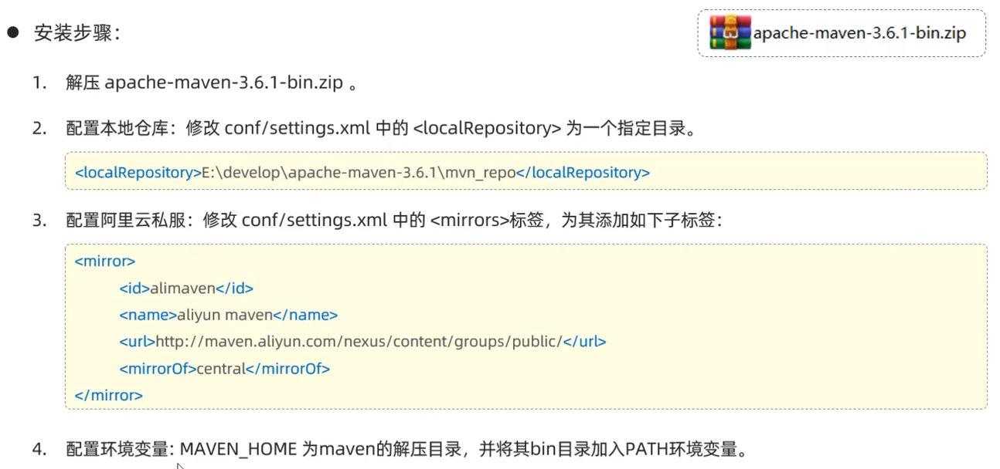

- 在文件夹中新建mvn_repo文件夹，用于指定本地仓库
- 在conf文件夹中找到settings.xml文件，修改本地仓库路径

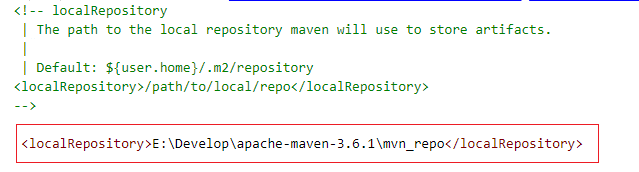

```
// 查看版本号，验证是否添加成功
mvn -v
```

### Maven 结构

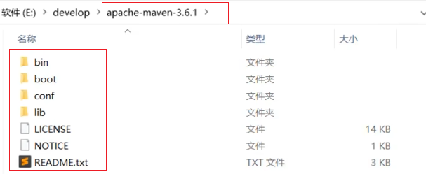

- bin：存放Maven的可执行文件
- boot：存放启动类
- conf：存放配置文件
- lib：存放依赖的jar包

## 2.2 IDEA集成Maven

### 配置Maven环境（当前工程）
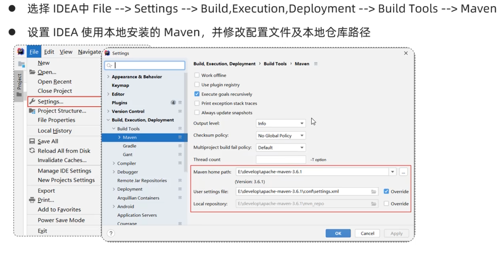

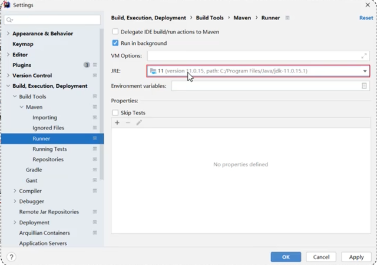

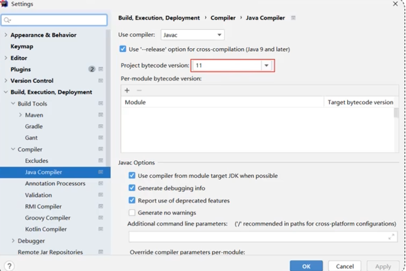

### 配置Maven环境（全局）

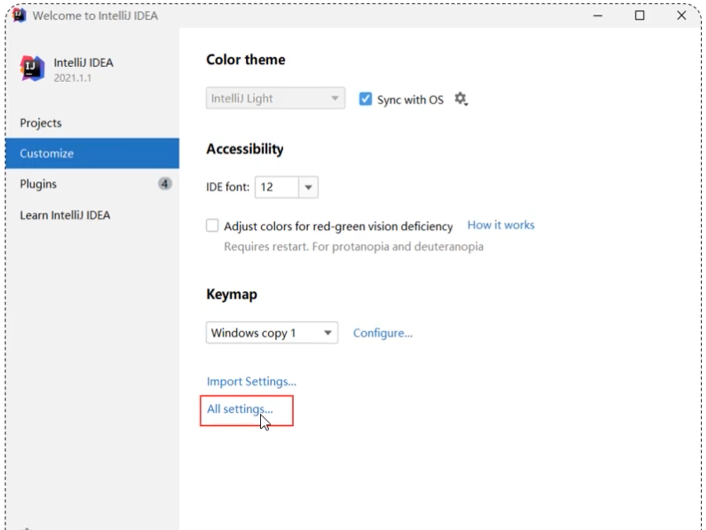

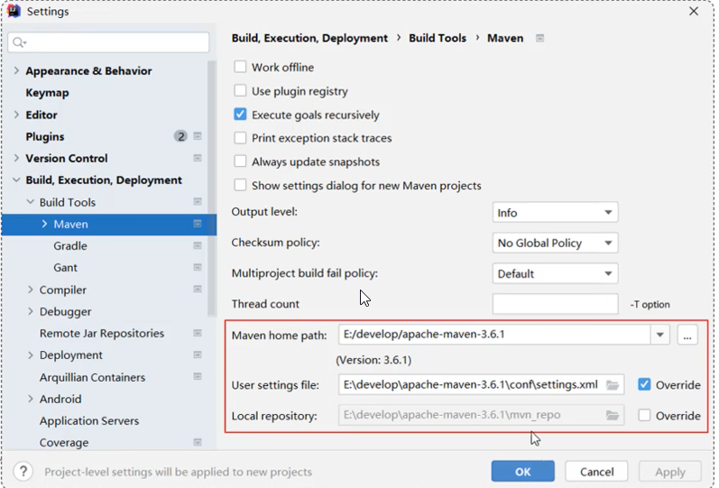

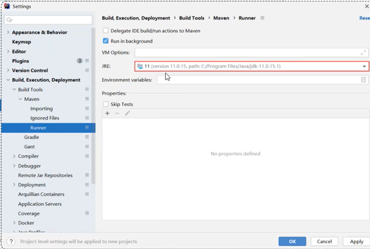

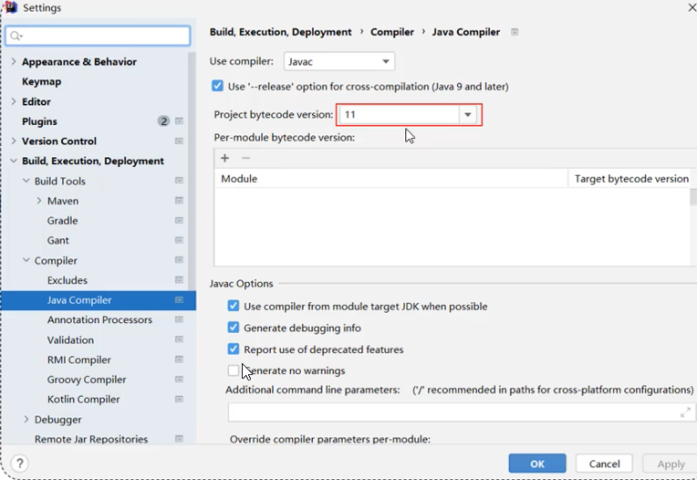

### 创建Maven项目

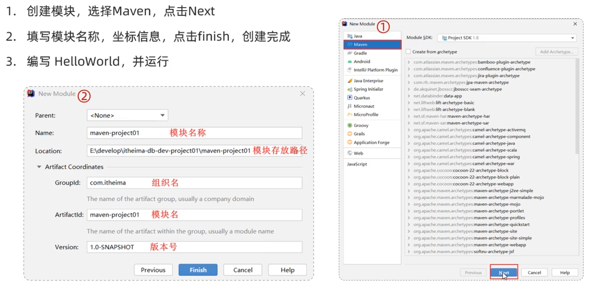


### Maven 坐标

#### 什么是Maven坐标？
- Maven中的坐标是资源的唯一标识，通过该坐标可以唯一定位资源位置。
- 使用坐标来定义项目或引入项目中需要的依赖。

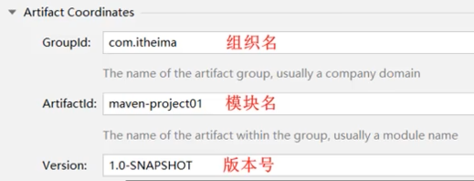

#### Maven坐标的主要组成

- groupId：定义当前Maven项目隶属组织名称（通常是域名反写，例如 com.example.project）
- artifactId：定义当前Maven项目名称（通常是模块名称，例如 order-service）
- version：定义当前Maven项目版本号

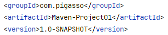

### IDEA导入Maven项目

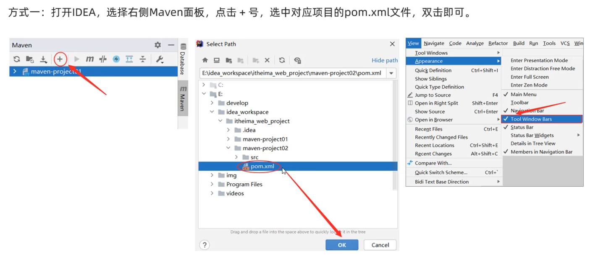

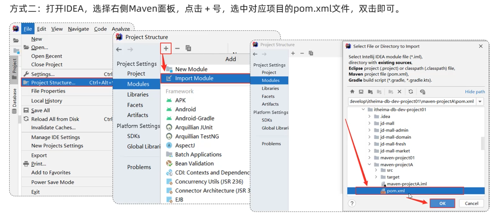

## 2.3 依赖管理

### 依赖配置

- 依赖：指当前项目运行所需要的jar包，一个项目中可以引入多个依赖
- 配置：
    1. 在pom.xml文件中编写```<dependency>```标签，配置依赖信息
    2. 在```<dependencies>```标签下，配置多个```<dependency>```标签，引入坐标
    3. 定义坐标的 groupId、artifactId、version
    4. 点击刷新按钮，引入最新加入的坐标

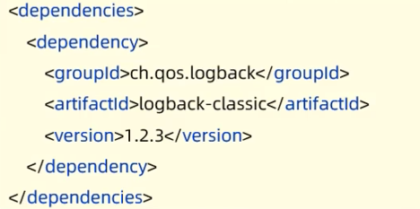

### 依赖传递

- 依赖具有传递性：当一个项目依赖另一个项目时，依赖的jar包也会被传递给依赖项目
    - 直接依赖：在当前项目中通过依赖配置建立的依赖关系
    - 间接依赖：被依赖的资源如果依赖其他资源，当前项目间接依赖其他资源

- 排除依赖：排除依赖指的是主动断开依赖的资源，被排除的资源无需指定版本

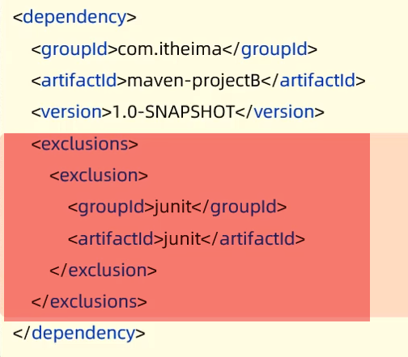

### 依赖范围

- 默认情况下，依赖的jar包可以在任何地方使用。
- 可以通过```<scope>```标签来指定依赖的作用范围，范围有以下几种：
    - 主程序范围有效（main文件夹范围内）
    - 测试程序范围有效（test文件夹范围内）
    - 是否参与打包运行（package指令范围内）

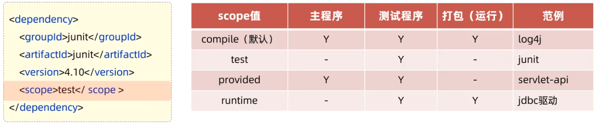

### 生命周期

- Maven的生命周期就是为了对所有的maven项目构建过程进行抽象和统一

- Maven中有3套相互独立的生命周期：
    - clean：清理工作
    - default：核心工作，如：编译，测试，打包，安装，部署等
    - site：生成报告，发布站点等

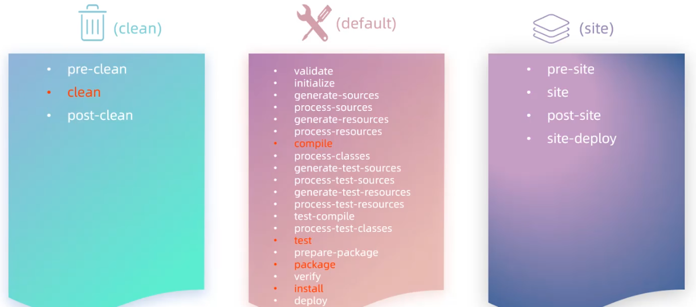

- 生命周期阶段：
    - clean：移除上一次构建生成的文件
    - compile：编译源代码
    - test：使用合适的单元测试框架运行测试（junit）
    - package：将编译后的文件打包，如：jar，war等
    - install：安装项目到本地仓库
- 在同一套生命周期中，当运行后面的阶段时，前面的阶段都会运行


- 执行指定生命周期的两种方式：

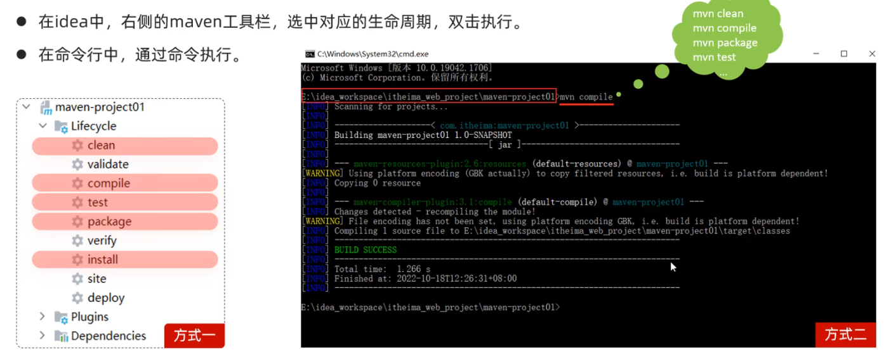

