# 03. Web入门

## 3.1 SpringBoot 快速入门

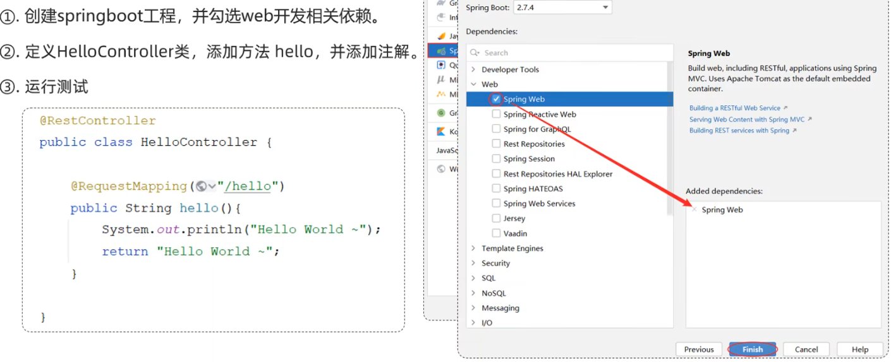

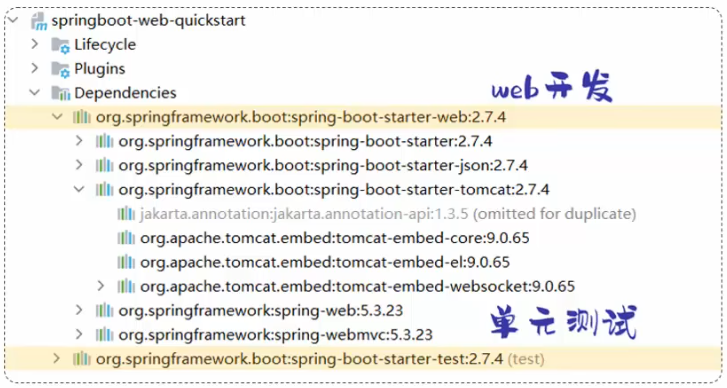

- 这两个依赖被称为起步依赖：
    - spring-boot-starter-web：包含了Web应用开发所需要的常见依赖
    - spring-boot-starter-test：包含了单元测试所需要的常见依赖

## 3.2 HTTP协议

### 概述
- 概念：Hyper Text Transfer Protocol，超文本传输协议，规定了浏览器与服务器之间数据传输的规则

- 特点：
    - 基于TCP协议：面向连接，安全
    - 基于请求-响应模型的：一次请求对应一次响应
    - HTTP协议是无状态协议：对于事务处理没有记忆能力。每次请求-响应都是独立的
        - 缺点：多次请求间不能共享数据
        - 优点：速度快


### 请求协议

#### 请求数据格式

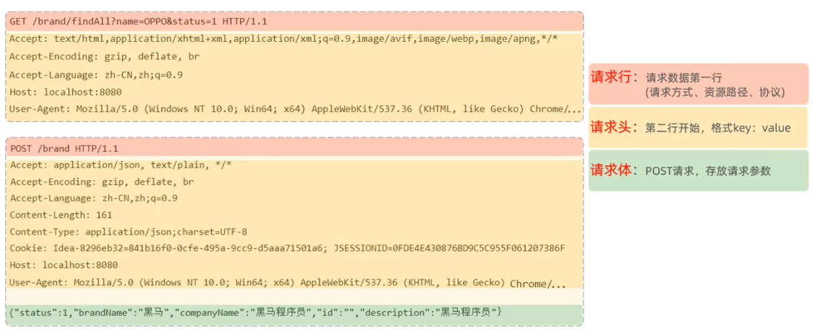

- 请求方式-GET：请求参数在请求行中，没有请求体，如： ```/brand/findAll?name=apple&status=1``` GET请求大小是有限制的
- 请求方式-POST：请求参数在请求体中，POST请求大小没有限制

#### 常见的请求头

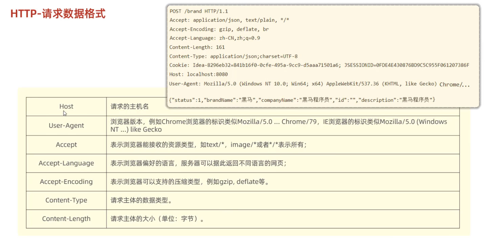

### 响应协议

#### 响应数据格式

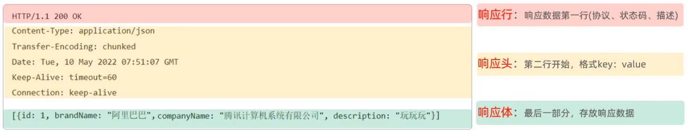

#### 响应状态码

| 状态码分类 | 说明                                                         |
| ---------- | ------------------------------------------------------------ |
| 1xx        | **响应中**——临时状态码，表示请求已经接受，告诉客户端应该继续请求或者如果它已经完成则忽略它 |
| 2xx        | **成功**——表示请求已经被成功接收，处理已完成                 |
| 3xx        | **重定向**——重定向到其它地方：它让客户端再发起一个请求以完成整个处理。 |
| 4xx        | **客户端错误**——处理发生错误，责任在客户端，如：客户端的请求一个不存在的资源，客户端未被授权，禁止访问等 |
| 5xx        | **服务器端错误**——处理发生错误，责任在服务端，如：服务端抛出异常，路由出错，HTTP版本不支持等 |

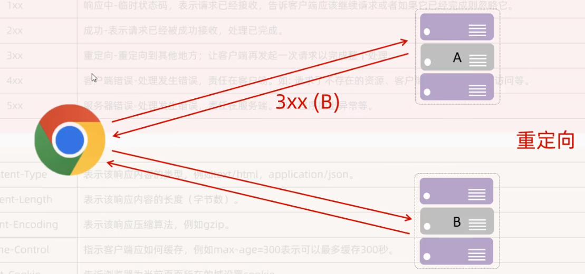


| 状态码  | 英文描述                               | 解释                                                         |
| ------- | -------------------------------------- | ------------------------------------------------------------ |
| **200** | **`OK`**                               | 客户端请求成功，即**处理成功**，这是我们最想看到的状态码     |
| 302     | **`Found`**                            | 指示所请求的资源已移动到由`Location`响应头给定的 URL，浏览器会自动重新访问到这个页面 |
| 304     | **`Not Modified`**                     | 告诉客户端，你请求的资源至上次取得后，服务端并未更改，你直接用你本地缓存吧。隐式重定向 |
| 400     | **`Bad Request`**                      | 客户端请求有**语法错误**，不能被服务器所理解                 |
| 403     | **`Forbidden`**                        | 服务器收到请求，但是**拒绝提供服务**，比如：没有权限访问相关资源 |
| **404** | **`Not Found`**                        | **请求资源不存在**，一般是URL输入有误，或者网站资源被删除了  |
| 405     | **`Method Not Allowed`**               | 请求方式有误，比如应该用GET请求方式的资源，用了POST          |
| 428     | **`Precondition Required`**            | **服务器要求有条件的请求**，告诉客户端要想访问该资源，必须携带特定的请求头 |
| 429     | **`Too Many Requests`**                | 指示用户在给定时间内发送了**太多请求**（“限速”），配合 Retry-After(多长时间后可以请求)响应头一起使用 |
| 431     | **` Request Header Fields Too Large`** | **请求头太大**，服务器不愿意处理请求，因为它的头部字段太大。请求可以在减少请求头域的大小后重新提交。 |
| **500** | **`Internal Server Error`**            | **服务器发生不可预期的错误**。服务器出异常了，赶紧看日志去吧 |
| 503     | **`Service Unavailable`**              | **服务器尚未准备好处理请求**，服务器刚刚启动，还未初始化好   |

状态码大全：https://cloud.tencent.com/developer/chapter/13553


#### 常见的响应头

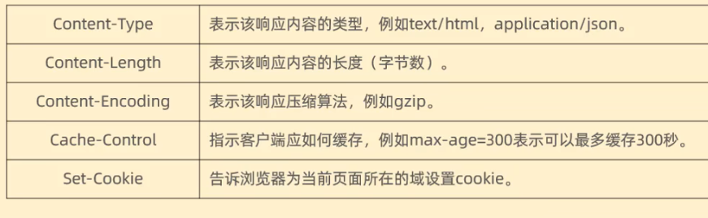

### 协议解析

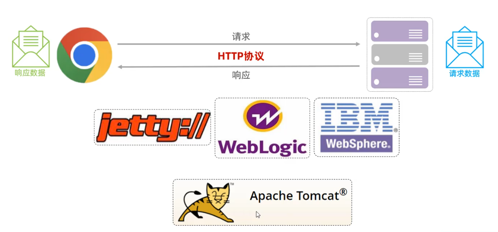

## 3.3 Web服务器Tomcat

### 简介
- Web服务器（Web服务器是一个软件程序，对HTTP协议的操作进行封装，使得程序员不必直接对协议进行操作，让web开发更加便捷。主要的功能是“提供网上信息浏览服务”）

- 一个轻量级的Web服务器，支持servlet和jsp等少量的javaEE规范
- 也被称为web容器，servlet容器

### 基本使用

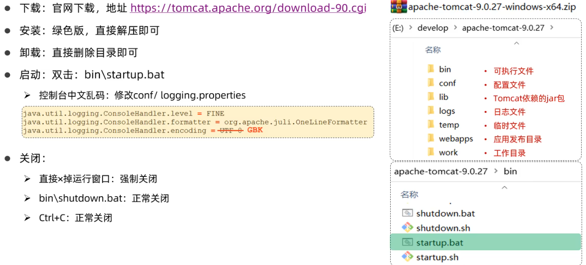

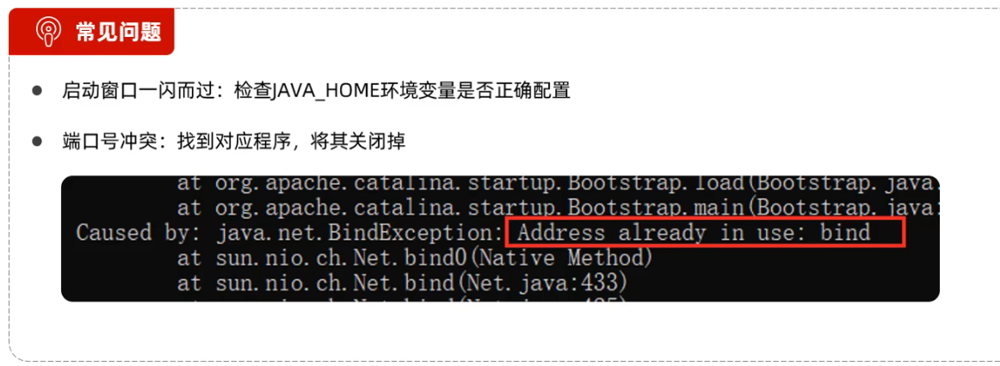

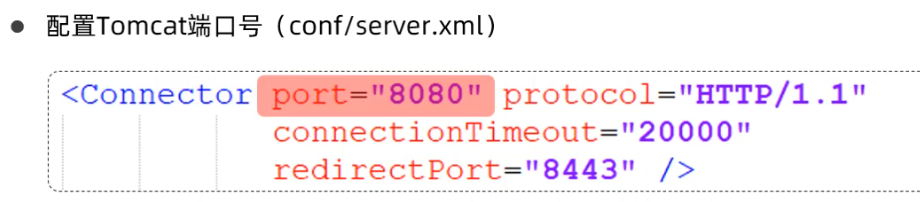

- 注意：HTTP的默认端口号为80，如果将Tomcat端口号改为80，则将来访问Tomcat时，将不用输入端口号

- Tomcat部署应用：将项目放置到webapps目录下，重启Tomcat，即部署完成

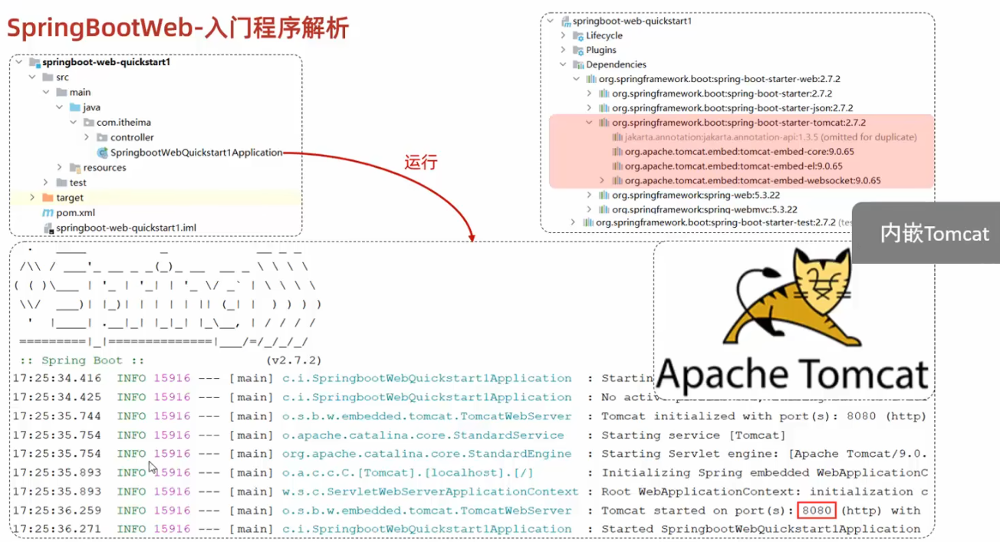