# 04.请求-响应-分层解耦

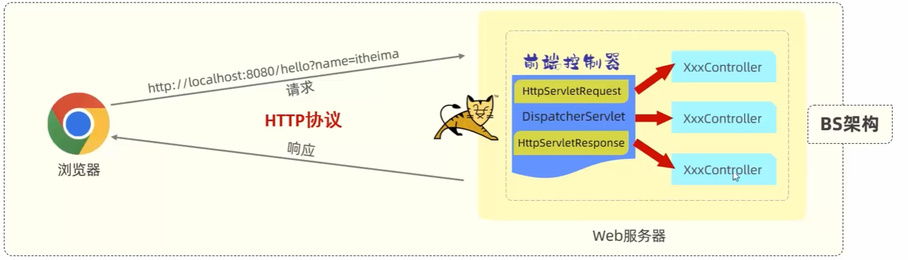

- 请求（HttpServletRequest）：客户端发送的请求信息，包括请求行、请求头、请求体等。
- 响应（HttpServletResponse）：服务器响应客户端的请求，包括响应行、响应头、响应体等。
- BS架构：Browser-Server架构，客户端只需要浏览器，应用程序逻辑和数据都存储在服务端
- Tomcat不能识别controller请求，但是内置DispatcherServlet（实现 Servlet）可以识别请求。

## 请求

### postman工具

- Postman是一款功能强大的网页调试与发送网页HTTP请求的Chrome插件
- 作用：常用于进行接口测试

### 简单参数

#### 原始方式

- 在原始的web程序中，获取请求参数，需要通过HttpServletRequest对象手动获取。

1. Controller方法形参中声明HttpServletRequest对象
2. 调用对象的getParameter方法获取请求参数

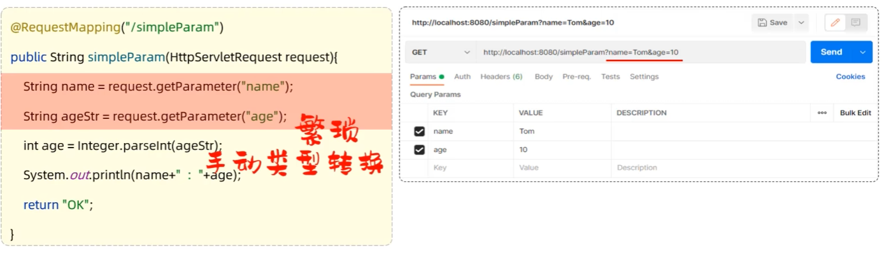


#### SpringBoot方式

- 参数名与形参变量名相同，定义形参即可接收参数
1. 请求参数名与方法形参变量名相同
2. 会自动进行类型转换

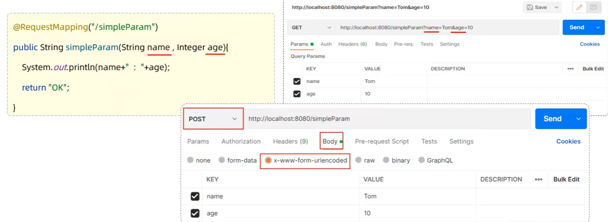

- 如果方法形参名称与请求参数名称不匹配，可以使用```@RequestParam```完成映射

```java
@RequestMapping("/simpleParam")
public String simpleParam(@RequestParam(name = "name") String username, @RequestParam("age") int age) {

    // do something

}
```

- 注意事项： ```@RequestParam```中的required属性默认为true，代表该请求参数必须传递，如果不传递将报错。如果该参数是可选的，可以将required属性设置为false

### 实体参数

#### 简单实体对象：
- 请求参数名与形参对象属性名相同，定义POJO接收即可

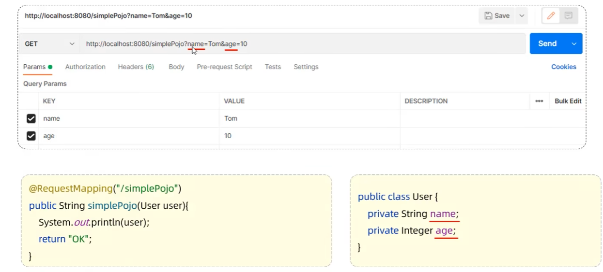

- User中记得重写getter和setter方法以及toString方法，方便调试

#### 复杂实体对象
- 请求参数名与形参对象属性名相同，按照对象层次结构关系即可接收嵌套POJO属性参数

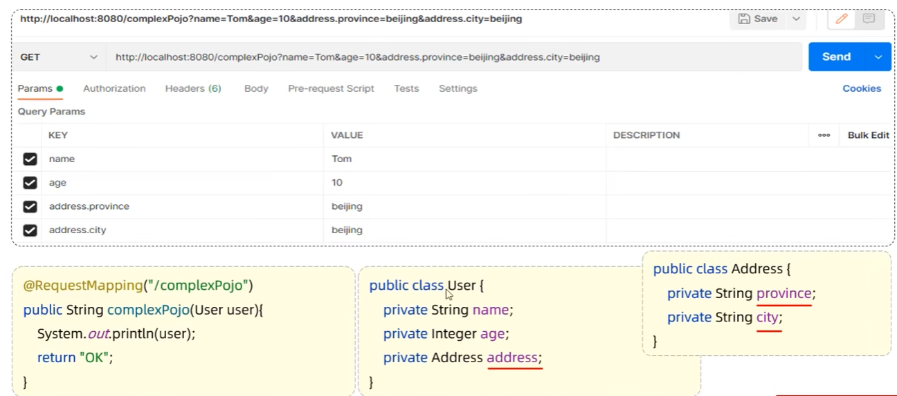

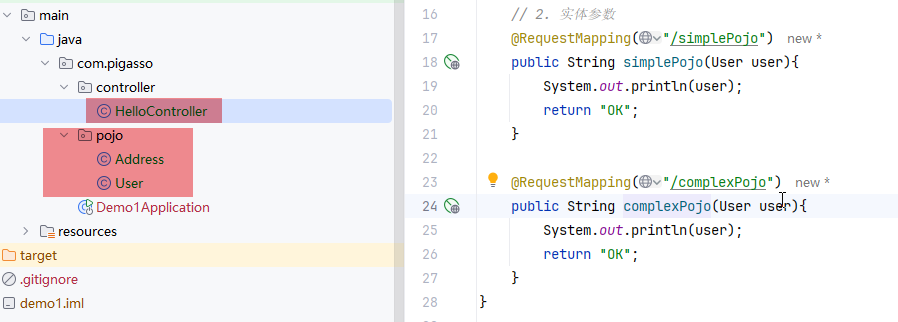

### 数据参数

- 数组参数：请求参数名与形参数组名称相同且请求参数为多个，定义数组类型形参即可接收参数

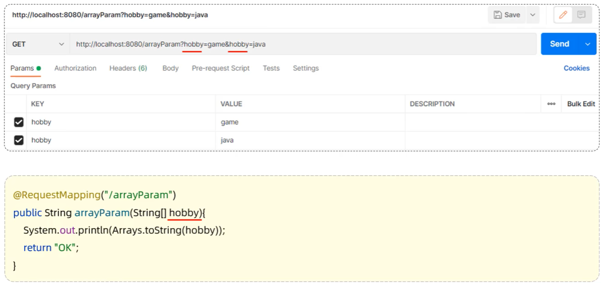

### 集合参数

- 集合参数：请求参数名与形参集合名称相同且请求参数为多个，```@RequestParam```绑定参数关系

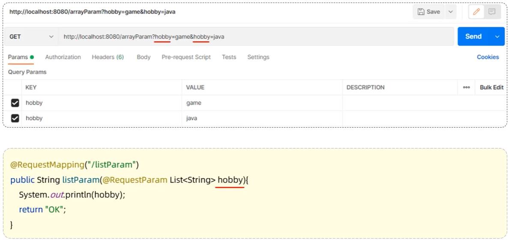

### 日期参数

- 使用```@DateTimeFormat```注解完成日期参数格式转换

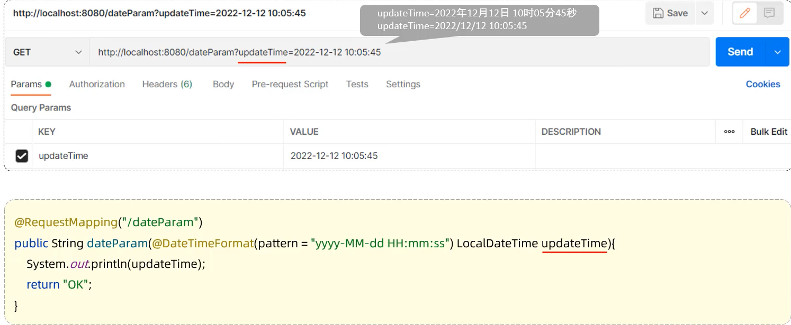

### Json参数
- Json参数：JSON数据键名与形参对象属性名相同，定义POJO类型形参即可接收参数，需要使用```@RequestBody```标识

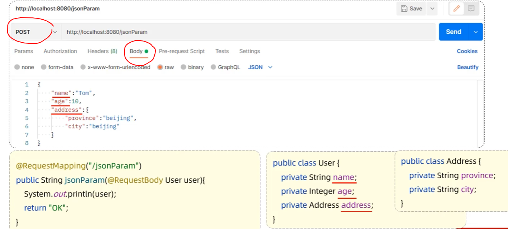

### 路径参数
- 通过请求URL直接传递参数，使用{...}来标识该路径参数，需要使用```@PathVariable```获取路径参数

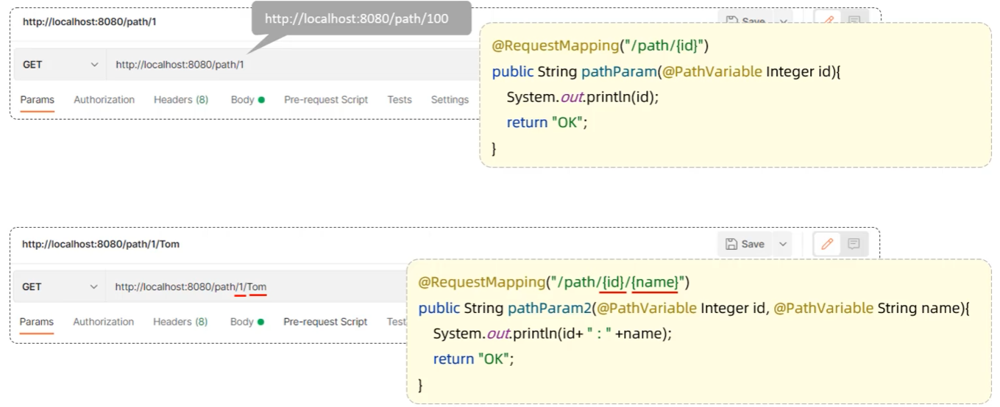

## 响应

- ```@ResponseBody```
    - 类型：方法注解，类注解
    - 位置：Controller方法上/类上
    - 作用：将方法返回值直接响应，如果返回值类型是实体对象/集合，将会转换为JSON格式响应
    - 说明：@RestController = @Controller + @ResponseBody

    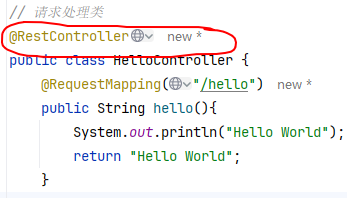


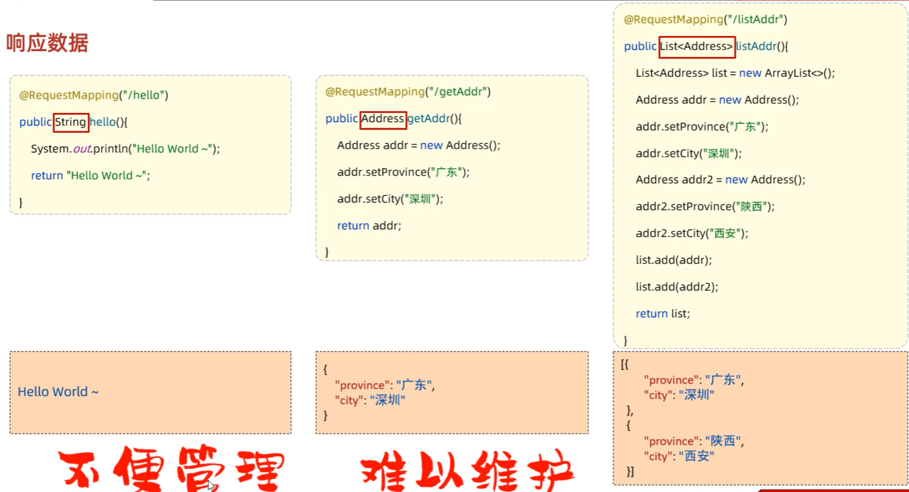

### 统一响应结果

- 在大多数项目中，为了统一返回格式和处理结果，我们经常会定义一个通用的结果封装类。上述代码展示了一个名为Result的泛型类，用于封装接口返回的结果。
- result设计模式 ```Result(code, msg, data)```

```java
public class Result {
    // 响应码：1代表成功，0代表失败
    private int code;
    // 提示信息
    private String msg;
    // 返回的数据
    private Object data;
    // ...
}
```


## 分层解耦

### 三层结构

- 三层架构：Presentation层（Controller）、Service层（Service）、Dao层（Dao）
    - controller：控制层，接收前端发送的请求，对请求进行处理，并响应数据
    - service：业务逻辑层，处理具体的业务逻辑
    - dao：数据访问层（Data Access Object）（持久层），负责数据访问操作，包括数据的增删改查

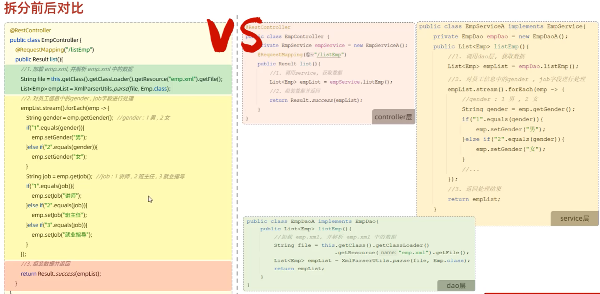

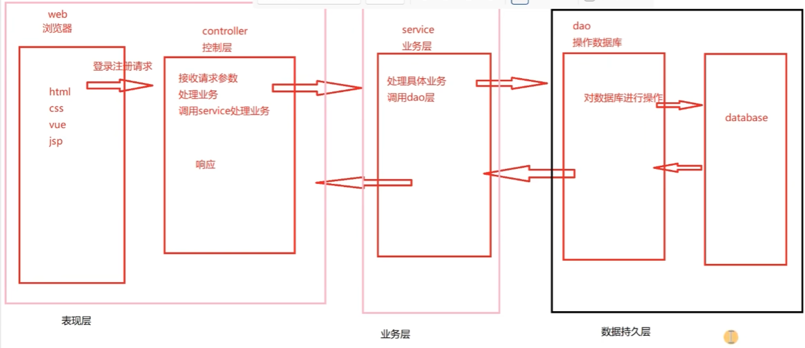

### 分层解耦

- 内聚：软件中各个功能模块内部的功能联系
- 耦合：衡量软件中各个层/模块之间的依赖、关联的程度
- 软件设计原则：高内聚低耦合

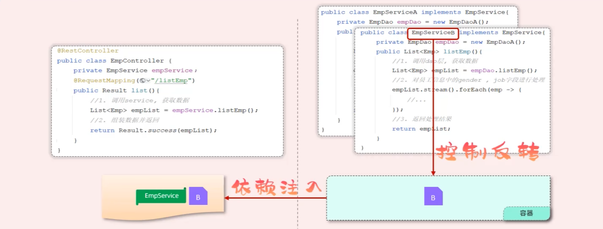
- 控制反转：Inversion Of Control，简称IOC。对象的创建控制权由程序自身转移到了外部（容器），这种思想被称为控制反转
- 依赖注入：Dependency Injection，简称DI。容器为应用程序提供运行时，所依赖的资源，称之为依赖注入
- Bean对象：IOC容器中创建、管理的对象，称之为Bean对象


### IOC&DI入门

- ```@Comonent``` 注解：将当前的类交给IOC容器管理，称为IOC容器中的bean
- ```@Autowired``` 注解：运行时，IOC容器会提供该类型的bean对象，并赋值给该变量 - 依赖注入

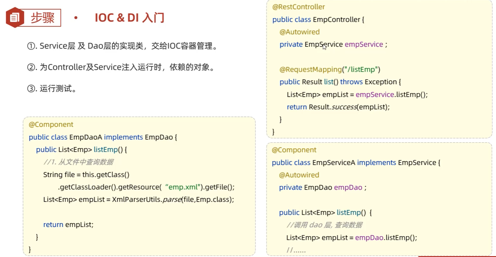

### IOC详解

#### Bean的声明
- 要把某个对象交给IOC容器管理，需要在对应的类上加上如下的注解之一：

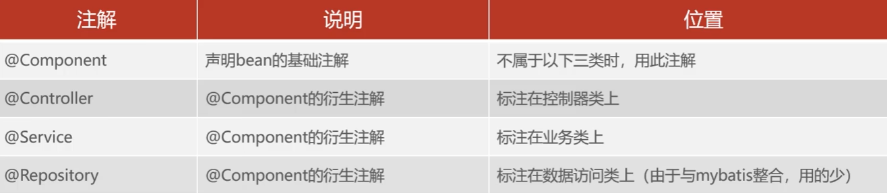

- 声明bean的时候，可以通过value属性指定bean的名字，如果没有指定，默认为类名首字母小写
- 使用以上四个注解都可以声明bean，但是在springboot集成web开发中，声明控制器bean只能用@Controller注解

#### Bean组件扫描

- 前面声明bean的四大注解，要想生效，还需要被组件扫描注解```@ComponentScan```扫描
- ```@ComponentScan```注解虽然没有显式配置，但是实际上已经包含在了启动类声明注解```@SpringBootApplication```中，默认扫描的范围是启动类所在包及其子包


### DI详解

#### Bean注入

- ```@Autowired```注解，默认是按照类型进行的，如果存在多个相同类型的bean，将会报如下错误：

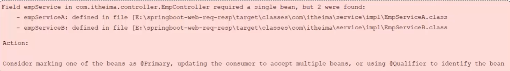

- 通过以下几种方案来解决：
    - ```@Primary```注解
    - ```@Qualifier```注解
    - ```@Resource```注解

##### @Primary注解

```java
@Primary
@Service
public class EmpServiceA implements EmpService {
    // ...
}
```

- 该注解可以指定一个bean为首选bean，当存在多个相同类型的bean时，会优先使用该bean

##### @Qualifier注解

```java
@RestController
public class EmpController {
    @Autowired
    @Qualifier("empServiceA")
    private EmpService empService;
    // ...
```

- 该注解可以指定bean的名字，来注入到变量中

##### @Resource注解

```java
@RestController
public class EmpController {
    @Resource(name = "empServiceA")
    private EmpService empService;
    // ...
```