# 06. MyBatis

## 简介

MyBatis 是一款优秀的持久层框架，它支持定制化 SQL、存储过程以及高级映射。MyBatis 避免了几乎所有的 JDBC 代码和手动设置参数以及获取结果集。 MyBatis 可以使用简单的 XML 或注解来配置和映射原生信息，将接口和 Java 的 POJOs(Plain Old Java Objects，普通的 Java 对象)映射成数据库中的记录。

## 入门程序


1. 准备工作（创建Spring Boot工程，数据库表User，实体类User）

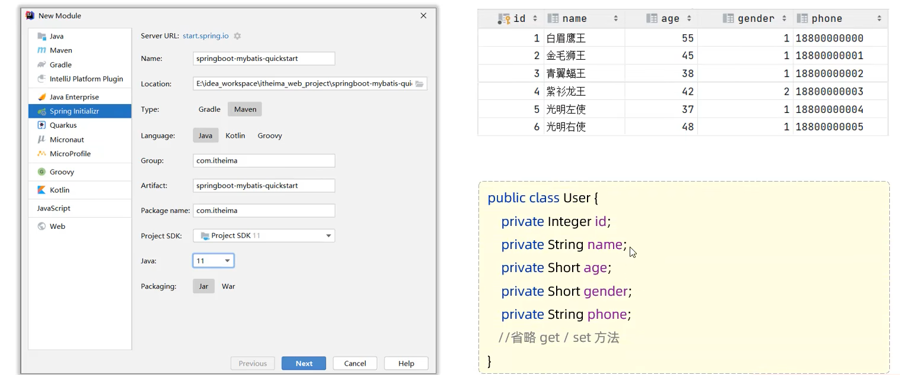

2. 引入MyBatis依赖，配置Mybatis（数据库连接信息）（写在resources目录下的application.properties文件中）

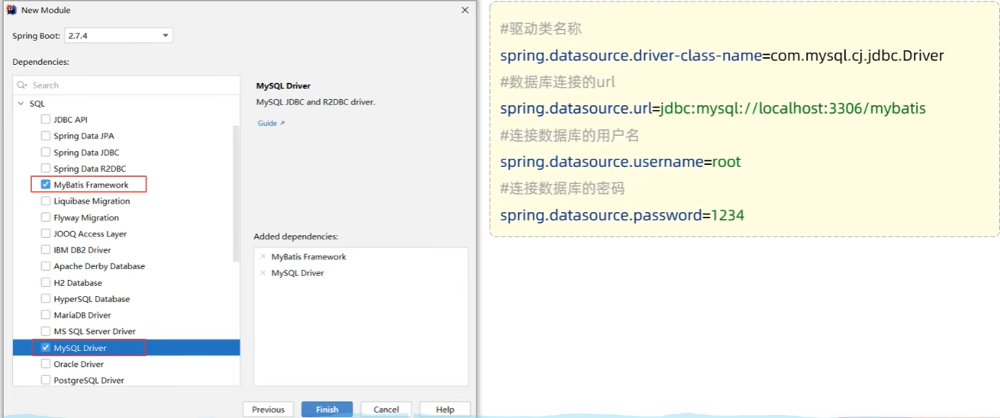

```properties
#驱动类名称
spring.datasource.driver-class-name=com.mysql.cj.jdbc.Driver
#数据库连接的url
spring.datasource.url=jdbc:mysql://localhost:3306/mybatis
#连接数据库的用户名
spring.datasource.username=root
#连接数据库的密码
spring.datasource.password=chch0829
```

3. 编写SQL语句（注解/xml）

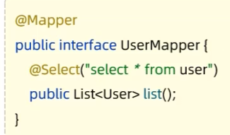

4. 单元测试

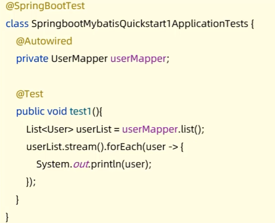

### 配置SQL提示

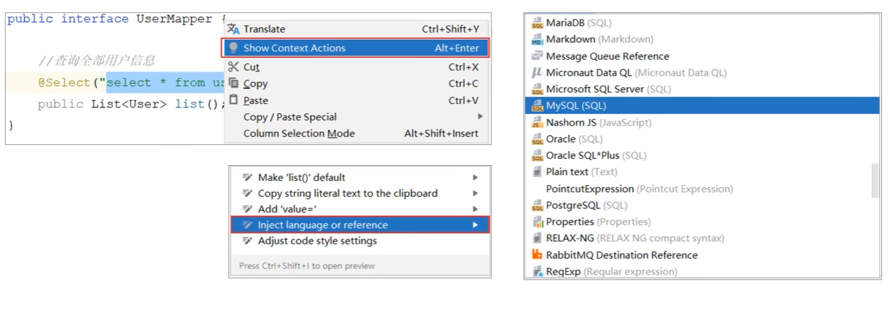

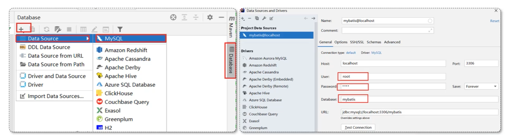

### JDBC 介绍

- JDBC（Java Database Connectivity）是Java用来连接关系型数据库的API。

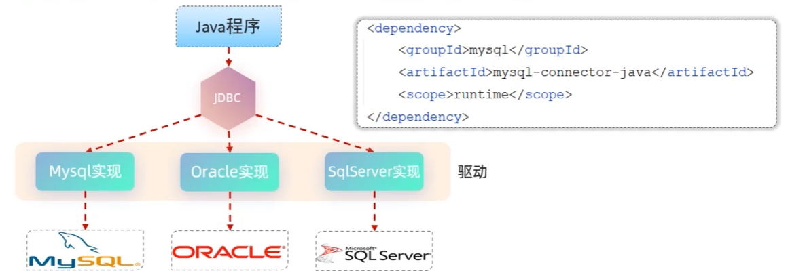

- 本质
    - sun公司官方定义的一套操作所有关系型数据库的规范，即接口
    - 各个数据库厂商去实现这套接口，提供数据库驱动jar包
    - 我们可以使用这套接口编程，真正执行的代码是驱动jar包中的实现类

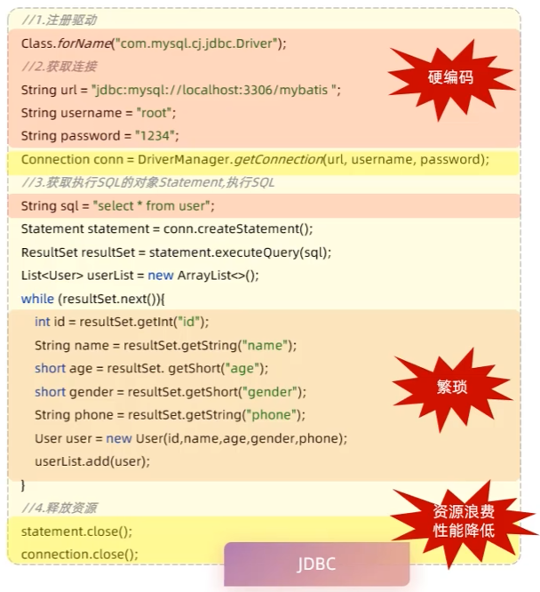

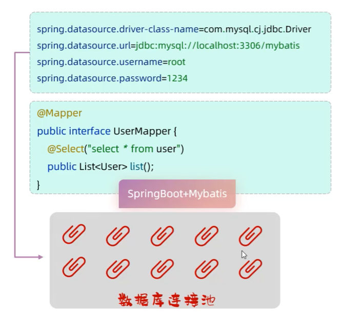

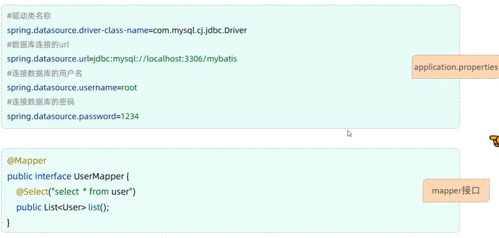

### 数据库连接池

- 数据库连接池
    - 数据库连接池是个容器，负责分配，管理数据库连接（Connection）
    - 它允许应用程序重复一个现有的数据库连接，而不是再重新建立一个
    - 释放空闲时间超过最大空闲时间的连接，来避免因为没有释放连接而引起的数据库连接遗漏
- 优势：
    - 资源复用
    - 提升系统响应速度
    - 避免数据库连接遗漏
- 标准接口：DataSource
    - 官方提供的数据库连接池接口，由第三方组织实现此接口
    - 功能：获取链接 ```Connection getConnection() thorws SQLException```
- 常见产品：
    - DBCP（Apache）
    - C3P0（C3P0）
    - Hikari（Spring Boot默认）
    - Druid（阿里巴巴）

- 切换Druid连接池步骤
- 官方地址：https://github.com/alibaba/druid/tree/master/druid-spring-boot-starter

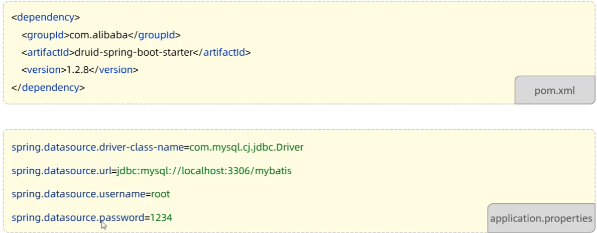

### lombok

- lombok是一个实用的java类库，能通过注解的形式自动生成构造器，getter/setter方法，toString方法，equals/hashCode方法等，并可以自动化生成日志变量，简化java开发，提高效率

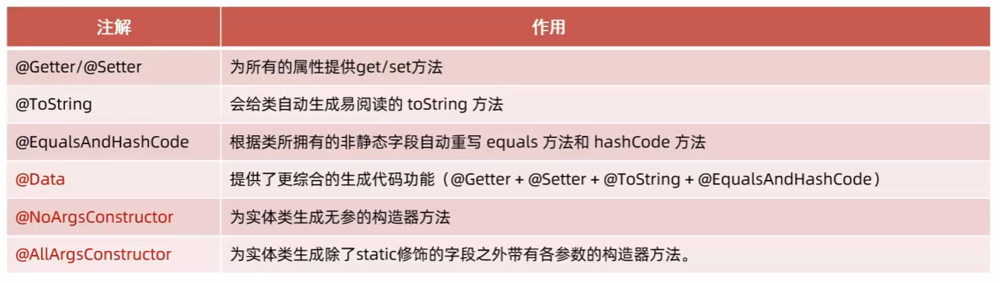

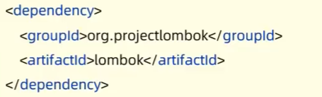
- Lombok会在编译时，自动生成对应的java代码，我们使用lombok时，还需要安装一个lombok的插件(IDEA自带)

## 基础操作

### 准备

- 准备数据库表emp
- 创建一个新的springboot工程，选择引入对应的起步依赖（mybatis，mysql驱动，lombok）
- applicaiton.properties中配置数据库连接信息
- 创建实体类Emp（实体类属性采用驼峰命名）
- 准备Mapper接口（EmpMapper）

### 日志输出

- 可以在application.properties中，打开mybatis的日志，并指定输出到控制台


```properties
# 指定mybatis输出日志的位置，输出控制台
mybatis.configuration.log-impl=org.apache.ibatis.logging.stdout.StdOutImpl
```

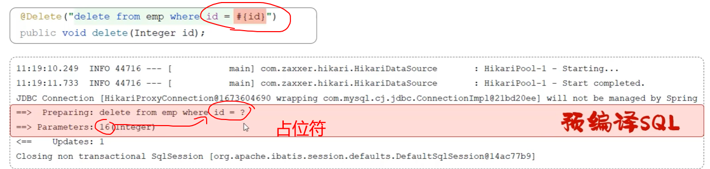

#### 预编译SQL
- 优势：
    - 性能更高
    - 防止SQL注入攻击

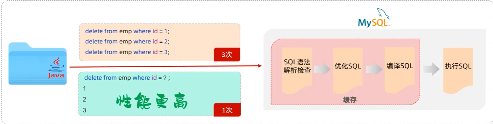

#### SQL注入
- SQL注入是通过操作输入的数据来修改事先定义好的SQL语句，以达到执行代码对服务器进行攻击的方法

#### 参数占位符

- ```#{...}```
    - 执行SQL时，会把```#{...}```替换成？，生成预编译SQL，会自动设置参数值
    - 使用时机：参数传递，都使用#{...}来代替参数值

- ```${...}```
    - 拼接SQL。直接将参数拼接在SQL语句中，存在SQL注入问题
    - 使用时机：如果对表名/列表进行动态设置时使用

### 删除

```java
// 根据id删除数据
// EmpMapper.java(接口)
@Delete("DELETE FROM mybatis.emp WHERE id = #{id}")
public int delete(Integer id);

// Test类
@Autowired
private EmpMapper empMapper;
@Test
public void testListUser(){
    empMapper.delete(17);
}
```

- 如果mapper接口方法形参只有一个普通类型的参数，#{...}里面的属性名可以随便写

### 新增

```java
@Insert("INSERT INTO mybatis.emp(name, age, email) VALUES(#{name}, #{age}, #{email})")
public int insert(Emp emp);
```