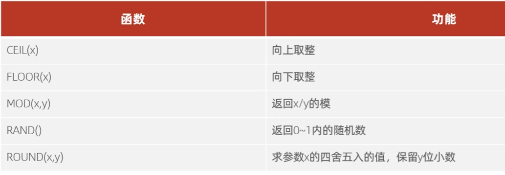
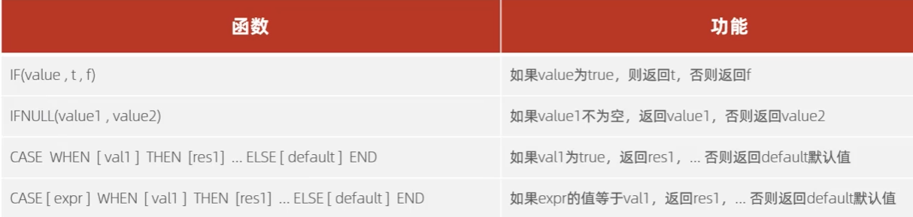

# 数据库相关概念
1. 数据库 DataBase（DB）存储数据的仓库，数据是有组织的进行存储
2.  数据库管理系统 DataBaseManagement System(DBMS)  操纵和管理数据库的大型软件
3. SQL  (Structured Query Language) 操作关系型数据库的编程语言，定义了一套操作关系型数据库统一标准
4. 关系型数据库 (RDBMS)  建立在关系模型基础之上，由多张互相连接的二维表组成的数据库
## MySQL概述
### 启动与停止
第一种方式： 命令行中输入 services.msc

第二种方式 ： 在终端中(以管理员方式运行)
```sql
// 启动
net start mysql80
// 停止
net stop mysql80
```

### MySQL客户端连接
第一种方式：MySQL自带的客户端命令行

第二种方式：在终端中
```sql
mysql [-h 127.0.0.1] [-P 3306] -u root -p
```

## SQL
### DDL (Data Definition Language) 定义
#### DDL数据库操作
##### 查询
```sql
// 查询所有数据库
SHOW DATABASES;
// 查询当前数据库
SELECT DATABASE();
```
##### 创建
```sql
CREATE DATABASE [IF NOT EXISTS] 数据库名 [DEFAULT CHARSET 字符集] [COLLATE 排序规则];
```
##### 删除
```sql
DROP DATABASE [IF EXISTS] 数据库名;
```
##### 使用
```sql
USE 数据库名;
```
#### DDL表操作
##### 查询
```sql
// 查询当前数据库的所有表
SHOW TABLES;
// 查询表结构
DESC 表明
// 查询指定表的建表语句
SHOW CREATE TABLE 表名;
```
##### 创建

```sql
CREATE TABLE 表名(
	字段1 字段1类型 [COMMENT 字段1注释],
	字段2 字段2类型 [COMMENT 字段2注释],
	字段3 字段3类型 [COMMENT 字段3注释],
	...
	字段n 字段n类型 [COMMENT 字段n注释]
)[COMMENT 表注释];
// 最后一个字段不需要 ','
```
举个例子：

```sql
CREATE TABLE USER(
	ID INT COMMENT '编号',
	NAME VARCHAR(50) COMMENT '姓名',
	AGE INT COMMENT '年龄',
	GENDER VARCHAR(1) COMMENT '性别'
)COMMENT '用户表';
```

##### 数据类型

- MySql中的数据类型有很多，主要分为三类：数值类型，字符串类型，日期时间类型


##### 修改

```sql
// 添加字段
ALTER TABLE 表名 ADD 字段名 类型（长度） [COMMENT 注释] [约束];

// 修改数据类型
ALTER TABLE 表名 MODIFY 字段名 新数据类型（长度）

// 修改字段名和字段类型
ALTER TABLE 表名 CHANGE 旧字段名 新字段名 类型（长度） [COMMENT 注释] [约束];

// 删除字段
ALTER TABLE 表名 DROP 字段名;

// 修改表名
ALTER TABLE 表名 RENAME TO 新表名

// 删除表
DROP TABLE [IF EXISTS] 表名;

// 删除指定表，并重新创建该表
TRUNCATE TABLE 表名;
```

### DML (Data Manipulation Language) 操作

##### INSERT
```sql
// 给指定字段添加数据
INSERT INTO 表名 (字段1,字段2,...) VALUES (值1,值2,...);

// 给全部字段添加数据
INSERT INTO 表名 VALUES (值1,值2,...);

// 批量添加数据
INSERT INTO 表名 (字段1,字段2,...) VALUES (值1,值2,...),(值1,值2,...),(值1,值2,...),...;
INSERT INTO 表名 VALUES (值1,值2,...),(值1,值2,...),(值1,值2,...),...;
```

- 注意：
    - 插入数据时，指定的字段顺序需要与值的顺序是一一对应的。
    - 字符串和日期型数据应该包含在引号中。
    - 插入的数据大小，应该在字段的规定范围内。

##### UPDATE

```sql
UPDATE 表名 SET 字段1=值1,字段2=值2,... [WHERE 条件];
```

- 注意：如果没有条件，则会修改整张表的所有数据

##### DELETE

```sql
DELETE FROM 表名 [WHERE 条件];
```

- 注意：
    - 如果没有条件，则会删除整张表的所有数据
    - 不能删除某一个字段的值（可以使用UPDATE）

### DQL (Data Query Language) 查询

```sql
SELECT 字段列表
FROM 表名列表
WHERE 条件列表
GROUP BY 分组字段列表
HAVING 分组后的条件列表
ORDER BY 排序字段列表
LIMIT 分页参数
```

##### 基本查询

```sql
// 1. 查询多个字段
SELECT 字段列表 FROM 表名;
SELECT * FROM 表名;

// 2. 设置别名
SELECT 字段1 [AS 别名1],字段2 [AS 别名2],字段3 [AS 别名3] FROM 表名;

// 3. 去除重复记录
SELECT DISTINCT 字段1,字段2,字段3 FROM 表名;
```
##### 条件查询

```sql
SELECT 字段列表 FROM 表名 WHERE 条件;
```


##### 聚合函数

```sql
SELECT 聚合函数(字段) FROM 表名;
```

- null值不参与聚合计算


##### 分组查询

```sql
SELECT 字段列表 FROM 表名 [WHERE 条件] GROUP BY 分组字段 [HAVING 分组后的条件];
```

- where 与 having 之间的区别：
    - 执行时机不同：where 是分组之前进行过滤，不满足where条件，不参与分组。而having是分组之后对结果进行过滤
    - 判断条件不同：where 不能对聚合函数进行判断，而having可以。

- 执行顺序：where > 聚合函数 > having


##### 排序查询

```sql
SELECT 字段列表 FROM 表名 ORDER BY 字段1 排序方式,字段2 排序方式2,字段3 排序方式3;
```

- 排序方式：
    - ASC：升序
    - DESC：降序
- 如果是多字段排序，当第一个字段值相等时，才会考虑第二个字段的值。


##### 分页查询

```sql
SELECT 字段列表 FROM 表名 LIMIT 起始索引，查询记录数;
```


- 注意：
    - 起始索引从0开始，起始索引 = (页码-1) * 每页记录数
    - 分页查询是数据库的方言，不同的数据库有不同的实现，MySQL中是LIMIT
    - 如果查询的是第一页数据，起始索引可以省略，直接简写为：LIMIT 10

##### 执行顺序


### DCL (Data Control Language) 控制

- 用来管理数据库用户，控制数据库的访问权限

##### 管理用户

```sql
// 1. 查询用户
USE mysql;
SELECT * FROM user;

// 2. 创建用户
CREATE USER '用户名'@'主机名' IDENTIFIED BY '密码';

// 3. 删除用户
DROP USER '用户名'@'主机名';

// 4. 修改用户密码
ALTER USER '用户名'@'主机名' IDENTIFIED WITH mysql_native_password BY '新密码';
```
- 注意：
    - 主机名可以使用%通配
    - 这类SQL开发人员操作的比较少，主要是DBA(Database Administrator 数据库管理员)使用

##### 权限管理


```sql
// 1. 查看权限
SHOW GRANTS FOR '用户名'@'主机名';

// 2. 授予权限
GRANT 权限列表 ON 数据库.表 TO '用户名'@'主机名';

// 3. 收回权限
REVOKE 权限列表 ON 数据库.表 FROM '用户名'@'主机名';
```

- 注意：
    - 多个权限之间，使用逗号分隔
    - 授权时，数据库名和表名都可以使用*进行通配，代表所有

## 函数

### 字符串函数


### 数值函数



### 日期函数


### 流程函数



## 约束

- 概念：约束是作用于表中字段上的规则，用于限制存储在表中的数据
- 目的：保证数据库中数据的正确性，有效性，完整性，一致性


- 注意：约束是作用于表中字段上的，可以在创建/修改表时添加。


***外键约束：***

- 定义：在两个表中建立关联关系，确保两个表中数据的一致性。


```sql
// 创建时添加外键
CREATE TABLE 表名(
	字段 数据类型,
	...
	[CONSTRAINT] [外键名称] FOREIGN KEY (外键字段名) REFERENCES 主表(主表列名)

// 修改时添加外键
ALTER TABLE 表名 ADD [CONSTRAINT] [外键名称] FOREIGN KEY (外键字段名) REFERENCES 主表(主表列名);

// 删除外键
ALTER TABLE 表名 DROP FOREIGN KEY 外键名称;
```


```sql
ALTER TABLE 表名 ADD CONSTRAINT 外键名称 FOREIGN KEY (外键字段名) REFERENCES 主表(主表列名) ON UPDATE CASCADE ON DELETE CASCADE;
```


## 多表查询

### 多表关系

- 一对一关系：一个表中有一条记录对应另一个表中的一条记录
- 一对多关系：一个表中有一条记录对应另一个表中的多条记录
    - 案例：部门与员工的关系
    - 实现：在多的一方建立外键，指向一的一方的主键
- 多对多关系：两个表中有多条记录对应两个表中的多条记录
    - 案例：学生与课程的关系
    - 实现：在两个表中都建立第三张中间表，中间表中包含两个外键，分别指向两个表的主键

## 事务

- 事务是一组操作的集合，他是一个不可分割的工作单位，事务会把所有的操作作为一个整体一起向系统提交或撤销操作请求，即这些操作要么同时成功，要么同时失败


- 默认MySQL的事务是自动提交的，也就是说，当执行一条DML语句，MySQL会立即隐式的提交事务

### 事务操作
```sql
SELECT @@autocommit; // 查看事务自动提交状态
SET @@autocommit = 0; // 关闭事务自动提交
START TRANSACTION; // 开启事务

COMMIT; // 提交事务

ROLLBACK; // 回滚事务
```

### 事务的四大特性（ACID）

1. 原子性（Atomicity）：事务是一个不可分割的工作单位，事务中包括的诸操作要么全部成功，要么全部失败。
2. 一致性（Consistency）：事务完成时，必须使所有的数据都保持一致状态
3. 隔离性（Isolation）：数据库系统提供的隔离机制，保证事务在不收外部并发操作影响的独立环境下运行
4. 持久性（Durability）：事务一旦提交或回滚，他对数据库中的数据的改变是永久的