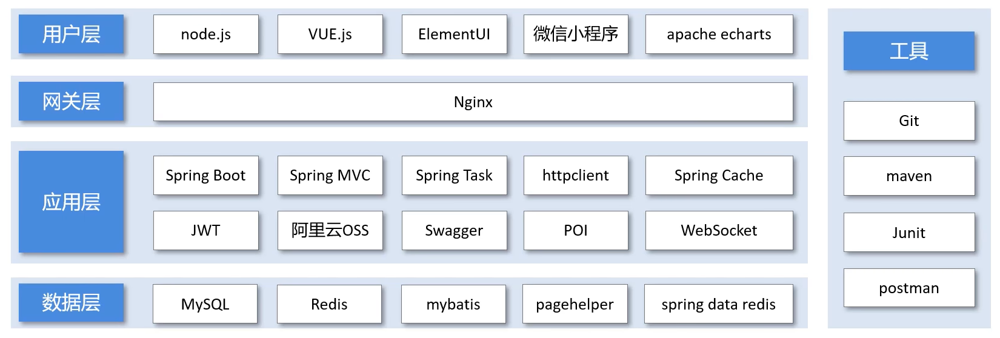

# 01.整体介绍

## 软件开发整体介绍

### 软件开发流程

1. 需求分析（需求规格说明书，产品原型）
2. 设计（UI设计，数据库设计，功能设计，接口设计）
3. 编码（项目代码，单元测试）
4. 测试（测试用例，测试报告）
5. 上线运维（软件环境安装，配置）
6. 维护（软件更新，bug修复）

### 角色分工

- 项目经理：对整个项目负责。任务分配，把控进度
- 产品经理：进行需求调研。输出需求调研文档，产品原型等
- UI设计师：根据产品原型输出界面效果图
- 架构师：项目整体架构设计，技术选型等
- 开发工程师：代码实现
- 测试工程师：编写测试用例，输出测试报告
- 运维工程师：软件环境搭建，软件更新，bug修复，项目上线

### 软件环境

- 开发环境（development）：开发人员在开发阶段使用的环境，一般外部用户无法访问
- 测试环境（testing）：专门给测试人员使用的环境，用于测试项目，一般外部用户无法访问
- 生产环境（production）：项目正式上线使用的环境，正式提供对外服务的环境

## 小猪外卖项目介绍

### 项目介绍

- 定位：专门为餐饮企业（餐厅，饭店）定制的一款产品
- 项目架构：体现项目中业务功能模块
    - 管理端：
        1. 员工管理
        2. 分类管理
        3. 菜品管理
        4. 套餐管理
        5. 订单管理
        6. 工作台
        7. 数据统计
        8. 来单提醒
    - 用户端：
        1. 微信登录
        2. 商品浏览
        3. 购物车
        4. 下单
        5. 微信支付
        6. 历史订单
        7. 地址管理
        8. 用户催单

### 产品原型

- 产品原型：用于展示项目的业务功能，一般由产品经理进行设计

### 技术选型

- 技术选型：展示项目中使用到的技术框架和中间件等

## 开发环境搭建

### 前端环境搭建

前端工程基于nginx运行