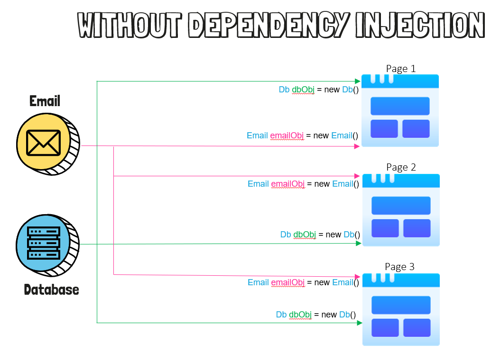
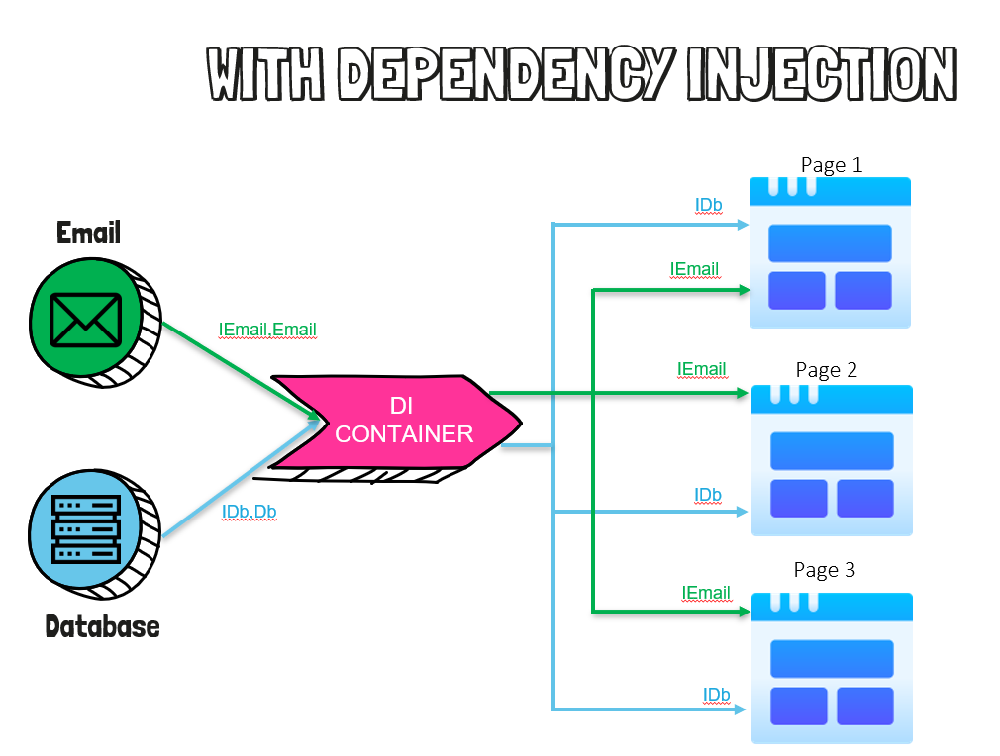

# Dependency Injection (DI)

- Dependency injection is a design pattern in which a class or object has its dependent classes injected rather than directly creating them.This is done so that we do not have to create, manage and dispose the object, and it improves the loose coupling between the classes.

- 依赖注入是一种设计模式，在这种模式中，类或对象将其依赖的类注入，而不是直接创建它们。这样做是为了我们不必创建、管理和处置对象，并且它改善了类之间的松耦合。

