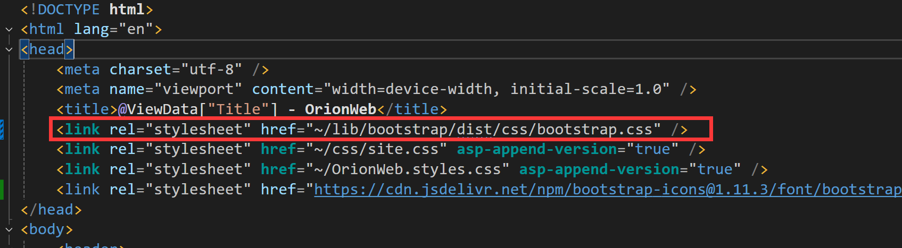
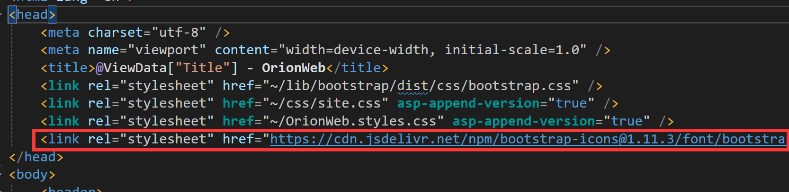

# Add Theme and Icon

### Bootwatch

 [Bootwatch](https://bootswatch.com/) is a free theme library for Bootstrap 4. You can download the themes and customize them to your liking.

1. download bootstrap.css which you want from the Bootwatch website
2. find you lib and pause
3. add the following code to your index.html file:

### Bootstrap Icons

 [Bootstrap Icons](https://icons.getbootstrap.com/) is a free and open-source icon library for Bootstrap 4. You can download the icons and use them in your projects.

1. add the link of CDN

2. choose the icon you want and add it to your HTML code