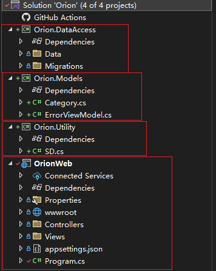

# N-Tier Architecture

这个解决方案使用的是一个**三层架构**（3-tier architecture），具体划分如下：

1. **Presentation Layer（表示层）**：
   - **OrionWeb** 项目属于表示层，包含了视图(Views)、控制器(Controllers)和静态资源（如wwwroot）。它负责处理用户的请求，显示数据，并接收用户输入。

2. **Business Logic Layer（业务逻辑层）**：
   - **Orion.Utility** 项目可以视为业务逻辑层的一部分，虽然目前这个项目中的内容不多，但通常这个层级会包含核心的业务逻辑、服务类和其他与应用程序的业务规则相关的代码。
   - **Orion.Models** 项目也部分属于业务逻辑层，尤其是其中定义的模型类（如`Category.cs`）。这些模型类代表了业务逻辑中使用的数据结构。

3. **Data Access Layer（数据访问层）**：
   - **Orion.DataAccess** 项目属于数据访问层，它主要负责与数据库的交互，进行数据的CRUD（创建、读取、更新、删除）操作。它通常会包含与数据库相关的上下文类（如`DbContext`）、迁移和数据模型映射等。

### 层次划分的总结

- **表示层 (OrionWeb)**：
  - 负责与用户直接交互，处理前端页面和控制器逻辑。

- **业务逻辑层 (Orion.Models & Orion.Utility)**：
  - 处理应用程序的核心逻辑，定义了数据模型以及可能的服务类、帮助类等。

- **数据访问层 (Orion.DataAccess)**：
  - 负责数据的存取和持久化，与数据库进行直接的交互。

这种三层架构能够很好地将应用程序的不同职责分离，使得每一层都可以独立开发、测试和维护，同时也有助于项目的扩展性和可维护性。