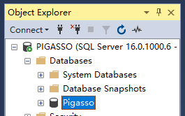

# How to Reset Database

if your migrations are corrupt, you can follow the steps:


1. Delete the whole database.


2. go to 'Pakage Manager Console'

3. ```add-migration AddCategoryToDbAndSeedTable```
    - **解释**：
      - 这条指令用于生成一个新的数据库迁移文件。迁移文件记录了数据库模式（schema）的更改，例如新增表、修改表结构、删除表等。

    - **具体作用**：
      - 当你在代码中修改了数据模型（例如新增了一个实体类或者修改了现有实体类的属性），执行这条命令会生成一个新的迁移文件。迁移文件的名称为`AddCategoryToDbAndSeedTable`，这个名称可以随意命名，用来描述此次迁移的目的。

4. ```update-database```
    - **解释**：
        - 这条指令用于将所有未应用的迁移应用到数据库中，从而更新数据库结构。

    - **具体作用**：
      - 通过执行这条命令，Entity Framework会自动应用之前通过`add-migration`生成的迁移文件中的更改。这意味着数据库的结构将根据迁移文件的内容被更新，例如创建新的表，修改列的类型等。

    - **数据迁移**：
      - 如果迁移文件中包含种子数据（如`HasData`方法配置的种子数据），`update-database`命令也会将这些数据插入到相应的表中。