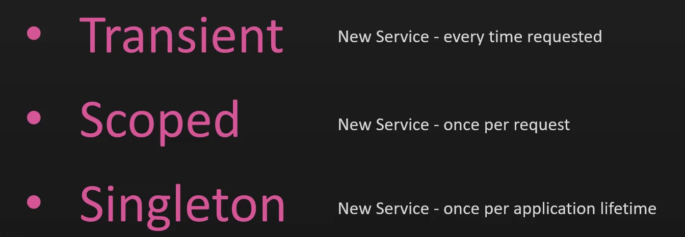
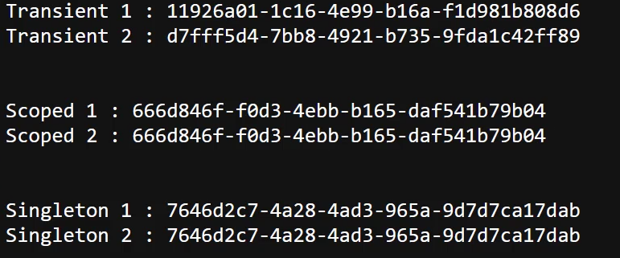
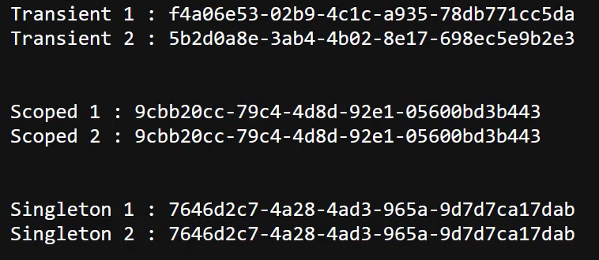

# DI Service Lifetimes

图片中的三个术语——`Transient`、`Scoped` 和 `Singleton`——是依赖注入（Dependency Injection, DI）中服务生命周期的三种模式。它们定义了服务在应用程序中的生命周期，也就是服务对象在被创建、使用和销毁的方式。以下是对这三种生命周期的解析：

### 1. `Transient`

- **含义**：
  - 每次请求服务时都会创建一个新的实例。也就是说，每次从依赖注入容器中请求该服务时，都会得到一个新的对象。

- **适用场景**：
  - 适用于轻量级的、无状态的服务对象，例如工具类、帮助类等。这种服务的实例通常很短暂，且没有跨请求或跨作用域的共享需求。

- **实例管理**：
  - 由于每次请求都会创建新的实例，因此在大量请求时可能会导致较多的内存开销，需谨慎使用。

### 2. `Scoped`

- **含义**：
  - 在每个请求范围内共享同一个实例。即在同一个HTTP请求中，每次请求该服务时都会返回相同的实例；但不同的请求则会创建不同的实例。

- **适用场景**：
  - 适用于需要在整个请求生命周期中共享状态的服务对象。例如，处理某个请求过程中的数据或上下文信息。

- **实例管理**：
  - 这种方式在Web应用程序中非常常见，尤其是在ASP.NET Core应用中，因为它能在每个请求中确保数据的一致性和状态的共享。

### 3. `Singleton`

- **含义**：
  - 在应用程序的整个生命周期内只创建一个实例，所有请求都共享这个实例。即不论请求多少次，始终是同一个对象。

- **适用场景**：
  - 适用于无状态的、需要全局共享的服务对象，例如日志记录器、配置管理器、缓存等。Singleton模式有助于减少内存使用，并确保对象的全局状态一致性。

- **实例管理**：
  - 由于Singleton对象在整个应用程序生命周期中都存在，因此要小心管理其状态，避免因为状态的不一致性而引发问题。

### 总结

- **Transient**：每次请求都会创建新实例，适用于短暂且无状态的服务。
- **Scoped**：在每个请求中共享同一个实例，适用于需要在请求范围内保持一致性的服务。
- **Singleton**：在整个应用程序生命周期内共享同一个实例，适用于全局共享、无状态的服务。

在实际开发中，选择合适的生命周期管理模式能够帮助你更好地控制服务对象的实例化和资源使用，从而优化应用程序的性能和行为。

### 举例

