# 02.简单的HTTP协议

## 2.1　HTTP 协议用于客户端和服务器端之间的通信
- HTTP 协议和 TCP/IP 协议族内的其他众多的协议相同，用于客户端和服务器之间的通信。
- 请求访问文本或图像等资源的一端称为客户端，而提供资源响应的一端称为服务器端。
- 在两台计算机之间使用 HTTP 协议通信时，在一条通信线路上必定有一端是客户端，另一端则是服务器端。而用 HTTP 协议能够明确区分哪端是客户端，哪端是服务器端。

## 2.2　通过请求和响应的交换达成通信
HTTP 协议规定，请求从客户端发出，最后服务器端响应该请求并返回。

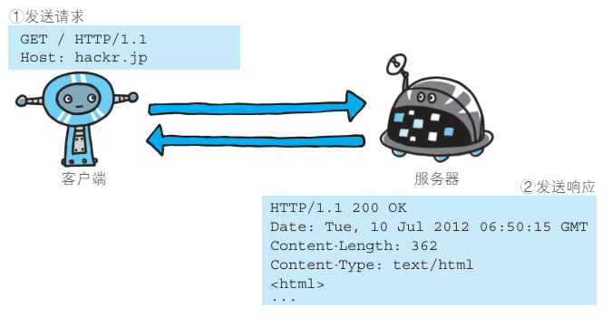

下面则是从客户端发送给某个 HTTP 服务器端的请求报文中的内容。

```http
GET /index.htm HTTP/1.1
Host: hackr.jp
```
- 起始行开头的```GET```表示请求访问服务器的类型，称为方法（method）。
- 随后的字符串 ```/index.htm```指明了请求访问的资源对象，也叫做请求 URI（request-URI）。
- 最后的 ```HTTP/1.1```，即 HTTP 的版本号，用来提示客户端使用的 HTTP 协议功能。

综合来看，这段请求内容的意思是：请求访问某台 HTTP 服务器上的 /index.htm 页面资源。
- 请求报文是由请求方法、请求 URI、协议版本、可选的请求首部字段和内容实体构成的。

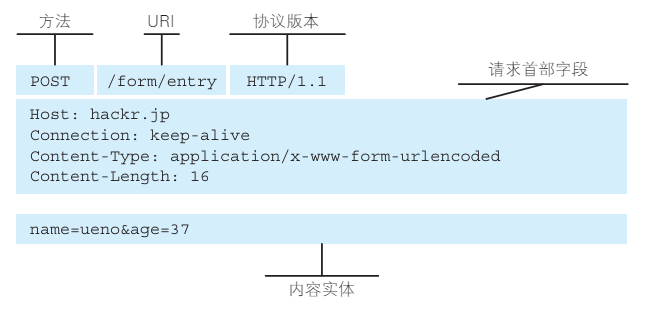


```http
HTTP/1.1 200 OK
Date: Tue, 10 Jul 2012 06:50:15 GMT
Content-Length: 362
Content-Type: text/html
<html>
……
```


- 在起始行开头的 ```HTTP/1.1``` 表示服务器对应的 HTTP 版本。
- 紧挨着的 ```200 OK``` 表示请求的处理结果的状态码（status code）和原因短语（reason-phrase）。下一行显示了创建响应的日期时间，是首部字段（header field）内的一个属性。
- 接着以一空行分隔，之后的内容称为资源实体的主体（entity body）。

响应报文基本上由协议版本、状态码（表示请求成功或失败的数字代码）、用以解释状态码的原因短语、可选的响应首部字段以及实体主体构成。

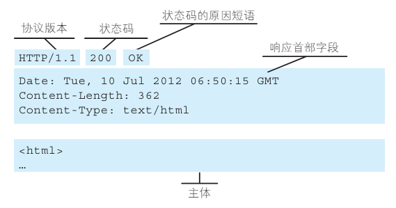

## 2.3　HTTP 是不保存状态的协议

- HTTP 是一种不保存状态，即无状态（stateless）协议。
    - HTTP 协议自身不对请求和响应之间的通信状态进行保存。
    - 也就是说在 HTTP 这个级别，协议对于发送过的请求或响应都不做持久化处理。

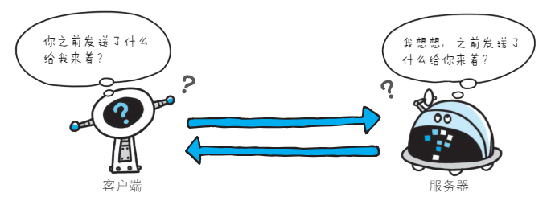

- 使用 HTTP 协议，每当有新的请求发送时，就会有对应的新响应产生。协议本身并不保留之前一切的请求或响应报文的信息。
- 这是为了更快地处理大量事务，确保协议的可伸缩性，而特意把 HTTP 协议设计成如此简单的。

- 可是，随着 Web 的不断发展，因无状态而导致业务处理变得棘手的情况增多了。
    - 比如，用户登录到一家购物网站，即使他跳转到该站的其他页面后，也需要能继续保持登录状态。
    - 针对这个实例，网站为了能够掌握是谁送出的请求，需要保存用户的状态。
    - HTTP/1.1 虽然是无状态协议，但为了实现期望的保持状态功能，于是引入了 Cookie 技术。有了 Cookie 再用 HTTP 协议通信，就可以管理状态了。

## 2.4　请求 URI 定位资源

- HTTP 协议使用 URI 定位互联网上的资源。
- 正是因为 URI 的特定功能，在互联网上任意位置的资源都能访问到。

- 当客户端请求访问资源而发送请求时，URI 需要将作为请求报文中的请求 URI 包含在内。指定请求 URI 的方式有很多。

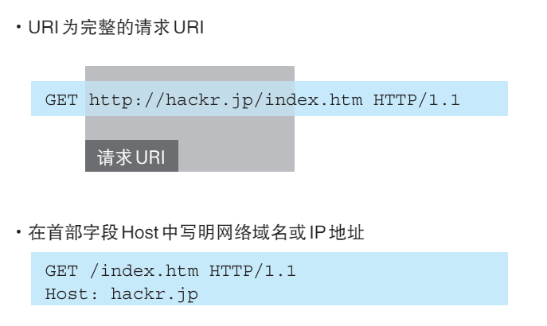

- 除此之外，如果不是访问特定资源而是对服务器本身发起请求，可以用一个 * 来代替请求 URI。下面这个例子是查询 HTTP 服务器端支持的 HTTP 方法种类。

```http
OPTIONS * HTTP/1.1
```

## 2.5 告知服务器意图的 HTTP 方法

下面，我们介绍 HTTP/1.1 中可使用的方法。

### GET：获取资源

- GET 方法用来请求访问已被 URI 识别的资源。
- 指定的资源经服务器端解析后返回响应内容。
    - 如果请求的资源是文本，那就保持原样返回；
    - 如果是像 CGI（Common Gateway Interface，通用网关接口）那样的程序，则返回经过执行后的输出结果。

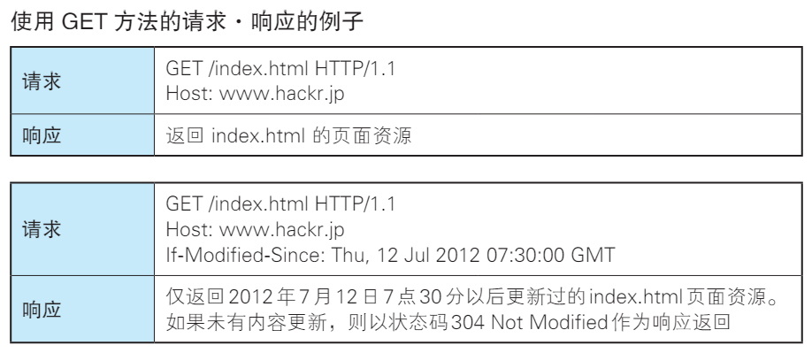

### POST：传输实体主体

POST 方法用来传输实体的主体。
- 虽然用 GET 方法也可以传输实体的主体，但一般不用 GET 方法进行传输，而是用 POST 方法。- 虽说 POST 的功能与 GET 很相似，但 POST 的主要目的并不是获取响应的主体内容。

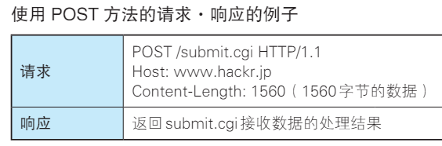

### PUT：传输文件

- PUT 方法用来传输文件。
- 就像 FTP 协议的文件上传一样，要求在请求报文的主体中包含文件内容，然后保存到请求 URI 指定的位置。
- 但是，鉴于 HTTP/1.1 的 PUT 方法自身不带验证机制，任何人都可以上传文件 , 存在安全性问题，因此一般的 Web 网站不使用该方法。
- 若配合 Web 应用程序的验证机制，或架构设计采用 REST（REpresentational State Transfer，表征状态转移）标准的同类 Web 网站，就可能会开放使用 PUT 方法。

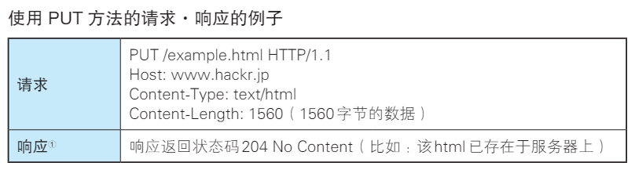

### HEAD：获得报文首部

- HEAD 方法和 GET 方法一样，只是不返回报文主体部分。用于确认URI 的有效性及资源更新的日期时间等。

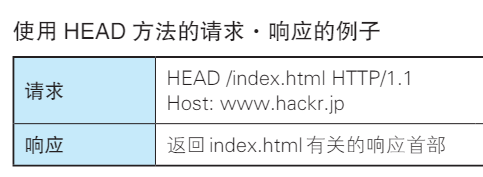

### DELETE：删除文件
- DELETE 方法用来删除文件，是与 PUT 相反的方法。DELETE 方法按请求 URI 删除指定的资源。
- 但是，HTTP/1.1 的 DELETE 方法本身和 PUT 方法一样不带验证机制，所以一般的 Web 网站也不使用 DELETE 方法。
- 当配合 Web 应用程序的验证机制，或遵守 REST 标准时还是有可能会开放使用的。

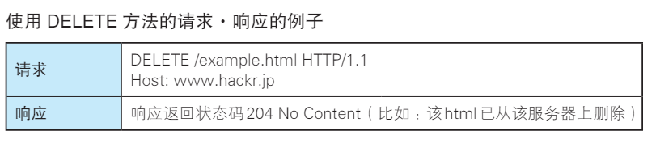

### OPTIONS：询问支持的方法

OPTIONS 方法用来查询针对请求 URI 指定的资源支持的方法。

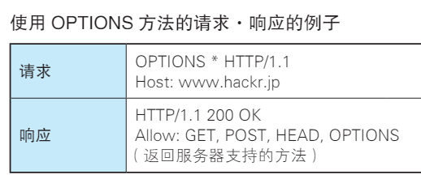

### TRACE：追踪路径

TRACE 方法是让 Web 服务器端将之前的请求通信环回给客户端的方法。

- 发送请求时，在 Max-Forwards 首部字段中填入数值，每经过一个服务器端就将该数字减 1，当数值刚好减到 0 时，就停止继续传输，最后接收到请求的服务器端则返回状态码 200 OK 的响应。
- 客户端通过 TRACE 方法可以查询发送出去的请求是怎样被加工修改 / 篡改的。这是因为，请求想要连接到源目标服务器可能会通过代理中转，TRACE 方法就是用来确认连接过程中发生的一系列操作。
- 但是，TRACE 方法本来就不怎么常用，再加上它容易引发 XST（Cross-Site Tracing，跨站追踪）攻击，通常就更不会用到了。

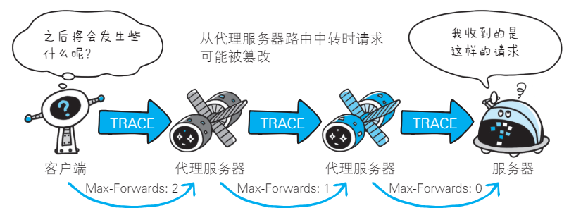

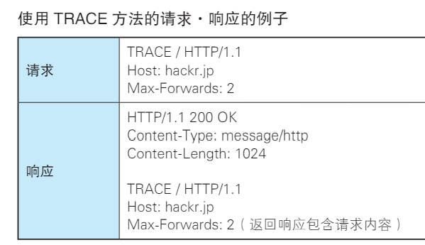

### CONNECT：要求用隧道协议连接代理

CONNECT 方法要求在与代理服务器通信时建立隧道，实现用隧道协议进行 TCP 通信。
- 主要使用 SSL（Secure Sockets Layer，安全套接层）和 TLS（Transport Layer Security，传输层安全）协议把通信内容加密后经网络隧道传输。
- CONNECT 方法的格式如下所示。

```http
CONNECT 代理服务器名:端口号 HTTP版本
```

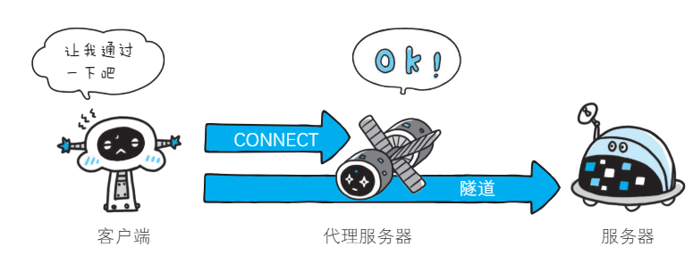

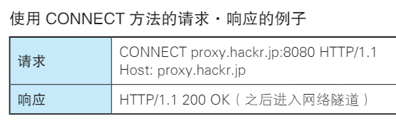

## 2.6 使用方法下达命令

- 向请求 URI 指定的资源发送请求报文时，采用称为方法的命令。
- 方法的作用在于，可以指定请求的资源按期望产生某种行为。方法中有 GET、POST 和 HEAD 等。

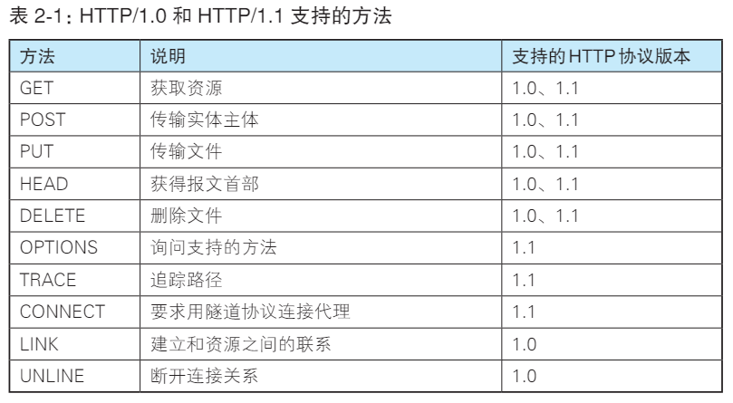

## 2.7 持久连接节省通信量

HTTP 协议的初始版本中，每进行一次 HTTP 通信就要断开一次TCP 连接。

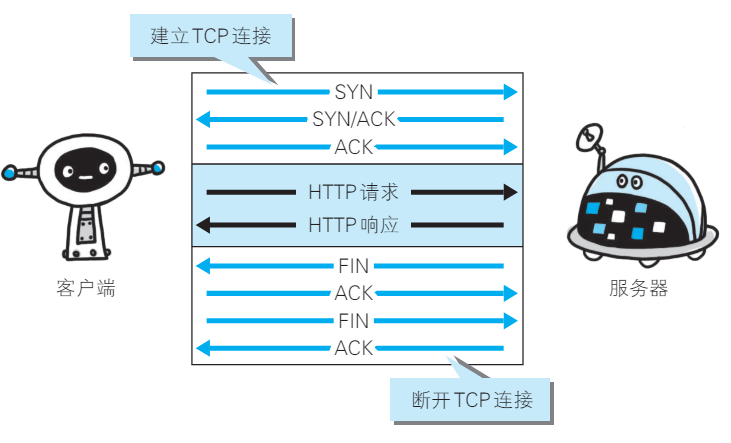

- 以当年的通信情况来说，因为都是些容量很小的文本传输，所以即使这样也没有多大问题。可随着 HTTP 的普及，文档中包含大量图片的情况多了起来。
- 比如，使用浏览器浏览一个包含多张图片的 HTML 页面时，在发送请求访问 HTML 页面资源的同时，也会请求该 HTML 页面里包含的其他资源。因此，每次的请求都会造成无谓的 TCP 连接建立和断开，增加通信量的开销。

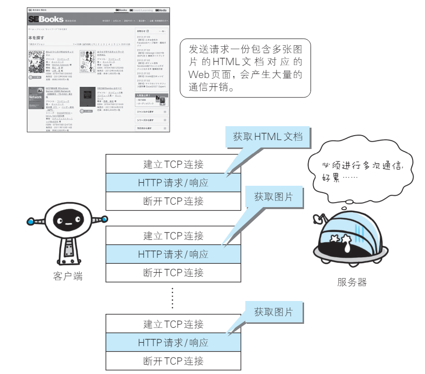

### 2.7.1　持久连接

- 为解决上述 TCP 连接的问题，HTTP/1.1 和一部分的 HTTP/1.0 想出了持久连接（HTTP Persistent Connections，也称为 HTTP keep-alive 或HTTP connection reuse）的方法。
- 持久连接的特点是，只要任意一端没有明确提出断开连接，则保持 TCP 连接状态。

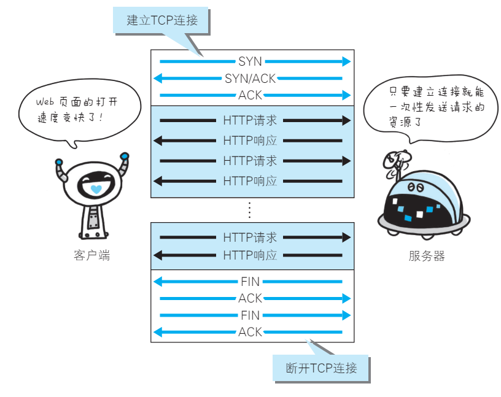

- 持久连接的好处在于减少了 TCP 连接的重复建立和断开所造成的额外开销，减轻了服务器端的负载。
- 另外，减少开销的那部分时间，使HTTP 请求和响应能够更早地结束，这样 Web 页面的显示速度也就相应提高了。
- 在 HTTP/1.1 中，所有的连接默认都是持久连接，但在 HTTP/1.0 内并未标准化。虽然有一部分服务器通过非标准的手段实现了持久连接，但服务器端不一定能够支持持久连接。
- 毫无疑问，除了服务器端，客户端也需要支持持久连接。

### 2.7.2　管线化

- 持久连接使得多数请求以管线化（pipelining）方式发送成为可能。从前发送请求后需等待并收到响应，才能发送下一个请求。
- 管线化技术出现后，不用等待响应亦可直接发送下一个请求。
- 这样就能够做到同时并行发送多个请求，而不需要一个接一个地等待响应了。

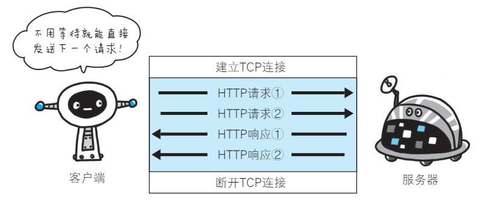

## 2.8　使用 Cookie 的状态管理

- HTTP 是无状态协议，它不对之前发生过的请求和响应的状态进行管理。也就是说，无法根据之前的状态进行本次的请求处理。
- 不可否认，无状态协议当然也有它的优点。由于不必保存状态，自然可减少服务器的 CPU 及内存资源的消耗。从另一侧面来说，也正是因为 HTTP 协议本身是非常简单的，所以才会被应用在各种场景里
- 保留无状态协议这个特征的同时又要解决类似的矛盾问题，于是引入了 Cookie 技术。
    - Cookie 技术通过在请求和响应报文中写入 Cookie 信息来控制客户端的状态。
    - Cookie 会根据从服务器端发送的响应报文内的一个叫做 Set-Cookie的首部字段信息，通知客户端保存 Cookie。当下次客户端再往该服务器发送请求时，客户端会自动在请求报文中加入 Cookie 值后发送出去。
    - 服务器端发现客户端发送过来的 Cookie 后，会去检查究竟是从哪一个客户端发来的连接请求，然后对比服务器上的记录，最后得到之前的状态信息。


上图展示了发生 Cookie 交互的情景，HTTP 请求报文和响应报文的内容如下。

1. 请求报文（没有 Cookie 信息的状态）
```http
GET /reader/ HTTP/1.1
Host: hackr.jp
*首部字段内没有Cookie的相关信息
```

2. 响应报文（服务器端生成 Cookie 信息）
```http
HTTP/1.1 200 OK
Date: Thu, 12 Jul 2012 07:12:20 GMT
Server: Apache
＜Set-Cookie: sid=1342077140226724; path=/; expires=Wed,
10-Oct-12 07:12:20 GMT＞
Content-Type: text/plain; charset=UTF-8
```

3. 请求报文（自动发送保存着的 Cookie 信息）


```http
GET /image/ HTTP/1.1
Host: hackr.jp
Cookie: sid=1342077140226724
```
