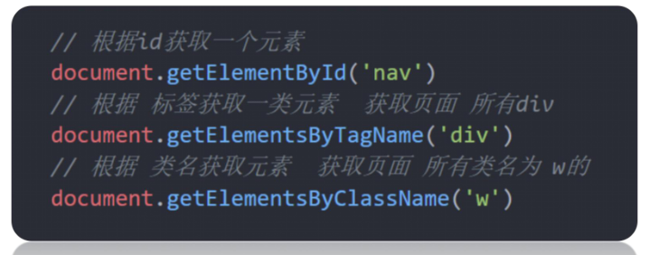

# 02.获取DOM元素

### 2.1 根据CSS选择器来获得DOM元素

#### 选择匹配的第一个元素

```javascript
document.querySelector('css选择器')
```
参数：包含一个或多个有效的CSS选择器字符串<br/>
返回值：CSS选择器匹配的第一个元素,一个HTMLElement对象。如果没有匹配到，则返回null。

#### 选择匹配的多个元素
```javascript
document.querySelectorAll('css选择器')
```
参数：包含一个或多个有效的CSS选择器字符串 <br/>
返回值：CSS选择器匹配的NodeList对象集合 <br/>

得到的是一个伪数组：有长度有索引号的数组，但是没有pop()  push() 等方法，想要得到里面的每一个对象，则需要遍历(for)的方式获得

注意：参数必须是字符串，所以一定要加**引号**

### 2.2 其他获取DOM元素的方法（了解）

