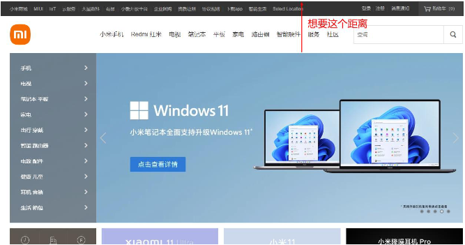
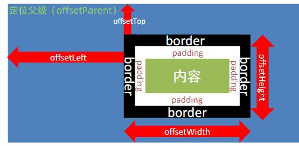
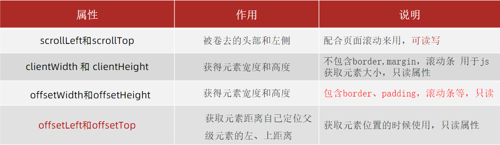

# 17.元素尺寸与位置

- 使用场景：
    - 前面案例滚动多少距离，都是我们自己算的，最好是页面滚动到某个元素，就可以做某些事。
    - 简单说，就是通过js的方式，得到元素在页面中的位置
    - 这样我们可以做，页面滚动到这个位置，就可以做某些操作，省去计算了

### 17.1 尺寸：

- 获取宽高：
    - 获取元素的自身宽高、包含元素自身设置的宽高、padding、border   ： 内容 + padding + border
    - offsetWidth和offsetHeight
    - 获取出来的是数值,方便计算
    - 注意: 获取的是可视宽高, 如果盒子是隐藏的,获取的结果是0

### 17.2 位置：
- 获取位置：
    - 获取元素距离自己定位**父级元素**的左、上距离
    - offsetLeft和offsetTop 注意是只读属性

- element.getBoundingClientRect()
- 方法返回元素的大小及其相对于视口的位置

### 17.3 总结：
