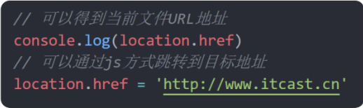

# 04.location 对象

- location 的数据类型是对象，它拆分并保存了 URL 地址的各个组成部分
- 常用属性和方法：
  - href 属性获取完整的 URL 地址，对其赋值时用于地址的跳转
  - search 属性获取地址中携带的参数，符号 ？后面部分
  - hash 属性获取地址中的啥希值，符号 # 后面部分
  - reload 方法用来刷新当前页面，传入参数 true 时表示强制刷新



```
// search 属性获取地址中携带的参数，符号 ？后面部分
console.log(location.search)

// hash 属性获取地址中的啥希值，符号 # 后面部分
// 为后期vue路由的铺垫，经常用于不刷新页面，显示不同页面，比如 网易云音乐
console.log(location.hash)

// reload 方法用来刷新当前页面，传入参数 true 时表示强制刷新
location.reload()
location.reload(true) // 强制刷新，类似于ctrl+f5
```
