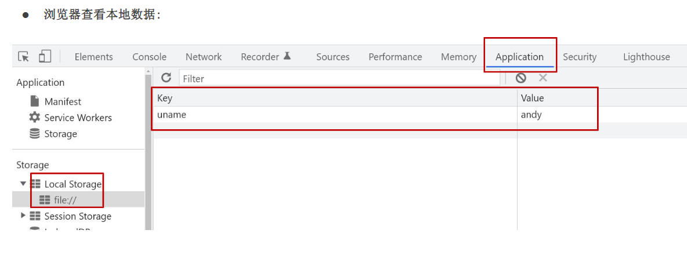

# 07.本地存储

### 7.1 本地存储介绍

1. 本地存储（Local Storage）是 HTML5 规范中提供的一种存储机制，可以将数据存储在用户的浏览器中，在下一次访问时可以直接获取。
2. 本地存储的特点：
   - 存储在本地，浏览器关闭后数据也不会丢失。
   - 容量大，可以存储大量的数据。
   - 存储的数据没有过期时间，除非手动清除。
   - 同源策略限制，不同源的网页无法共享数据。
   - 本地存储只能存储字符串类型的数据。
3. 本地存储的应用场景：
   - 存储用户偏好设置。
   - 存储浏览记录。
   - 存储游戏数据。
   - 存储表单数据。

### 7.2 本地存储分类

#### 7.2.1 localStorage

- 存储在本地，浏览器关闭后数据也不会丢失。
- 容量大，可以存储大量的数据。
- 存储的数据没有过期时间，除非手动清除。
- 同源策略限制，不同源的网页无法共享数据。
- 本地存储只能存储字符串类型的数据。

1. 存储数据：
   - `localStorage.setItem(key, value)`：设置本地存储的 key-value 对。
   - `localStorage.getItem(key)`：获取本地存储的 value。
   - `localStorage.removeItem(key)`：删除本地存储的 key-value 对。
   - `localStorage.clear()`：清空本地存储的所有数据。
2. 示例代码：

   ```javascript
   // 存储数据
   localStorage.setItem('name', '张三');
   localStorage.setItem('age', '25');
   localStorage.setItem('gender', '男');

   // 获取数据
   console.log(localStorage.getItem('name')); // 张三
   console.log(localStorage.getItem('age')); // 25
   console.log(localStorage.getItem('gender')); // 男

   // 删除数据
   localStorage.removeItem('age');

   // 清空数据
   localStorage.clear();
   ```

3. 注意事项：
   - 本地存储的 key 和 value 都是字符串类型。
   - 本地存储的容量受限于浏览器的限制，不同浏览器的限制可能不同。
   - 本地存储的数据没有过期时间，除非手动清除。
   - 同源策略限制，不同源的网页无法共享数据。

#### 7.2.2 sessionStorage

- 存储在本地，浏览器关闭后数据会丢失。
- 容量小，可以存储少量的数据。
- 存储的数据没有过期时间，除非手动清除。
- 同源策略限制，不同源的网页无法共享数据。

1. 存储数据：
   - `sessionStorage.setItem(key, value)`：设置 sessionStorage 的 key-value 对。
   - `sessionStorage.getItem(key)`：获取 sessionStorage 的 value。
   - `sessionStorage.removeItem(key)`：删除 sessionStorage 的 key-value 对。
   - `sessionStorage.clear()`：清空 sessionStorage 的所有数据。
2. 示例代码：

   ```javascript
   // 存储数据
   sessionStorage.setItem('age', '30');
   sessionStorage.setItem('gender', '女');

   // 获取数据
   console.log(sessionStorage.getItem('age')); // 30
   console.log(sessionStorage.getItem('gender')); // 女

   // 删除数据
   sessionStorage.removeItem('age');

   // 清空数据
   sessionStorage.clear();
   ```

3. 注意事项：
   - sessionStorage 的数据在浏览器关闭后会自动清除。
   - sessionStorage 的容量受限于浏览器的限制，不同浏览器的限制可能不同。
   - sessionStorage 的数据没有过期时间，除非手动清除。
   - 同源策略限制，不同源的网页无法共享数据。



### 7.3 存储复杂数据类型

本地存储只能存储字符串类型的数据，如果需要存储复杂数据类型，可以使用 JSON 字符串进行存储。

1. 存储数据：
   - `localStorage.setItem(key, JSON.stringify(value))`：设置本地存储的 key-JSON 字符串对。
   - `JSON.parse(localStorage.getItem(key))`：获取本地存储的 JSON 字符串。
2. 示例代码：

   ```javascript
   // 存储数据
   const user = {
       age: 35,
       gender: '女'
   };
   localStorage.setItem('user', JSON.stringify(user));

   // 获取数据
   const userStr = localStorage.getItem('user');
   const userObj = JSON.parse(userStr);
   console.log(userObj.age); // 35
   console.log(userObj.gender); // 女
   ```

3. 注意事项：
   - JSON 字符串只能存储对象类型的数据。
   - JSON 字符串的大小受限于浏览器的限制，不同浏览器的限制可能不同。
   - 同源策略限制，不同源的网页无法共享数据。