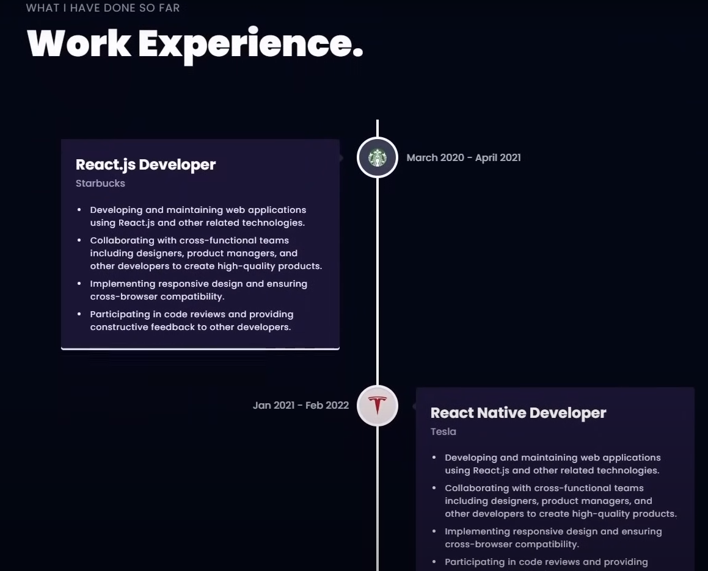
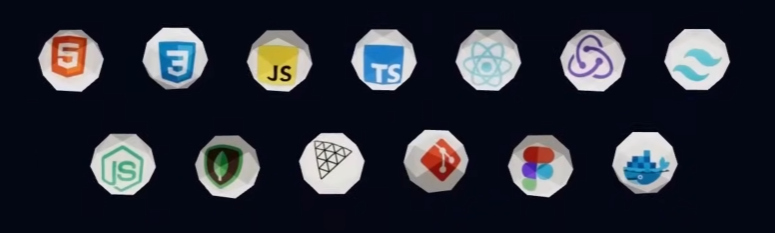
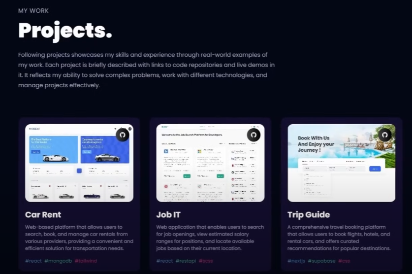
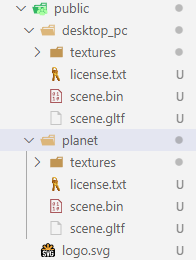

# Beginner Three.js Tutorial
- This is a beginner Three.js tutorial.
## What your will learn in this tutorial?

- Alongside building your own 3D Dev Portfolio, you will also learn:
    - **Three.js**(a powerful 3D graphics library for rendering and animating 3D models)
    - **React Three Fiber** (Library for Three.js in React)
    - **Tailwindcss** (A popilar utility-first CSS styling framework)
    - **Framer Motion** (The most popular animation library for React)
    - Learn how to ***Load***、***Creat*** 、***Customize*** stunning 3D Models and Geometries with various lights
    - Understand the 3D world with ***Camera*** 、***Positioning*** of an object in the space
    - Make your code Reusable and Scalable(Higher Order Components and Industry-Standard Best Practices)
        - Send emails to a form on **EmailJS**

## A quick demo

1. A wonderful-looking 3D model that you can move around.


2. The introduction section for who you are and what you do.


3. A great work experinece section



4. Some balls that showcase technology you're passionate about.



5. Some projects you've worked on.



6. Other's feedback section.


7. A contact section with a moving 3D model.


## setup

### install vite complate

```
npm create vite@latest ./ -- --template react
```
- When you create a React project using Vite, the basic directory structure might look as follows:
```
my-vite-react-project/
├── public/
│   └── index.html
│   └── favicon.ico
│   └── manifest.json
│   └── robots.txt
│   └── ... (other static assets)
├── src/
│   ├── App.jsx
│   ├── index.jsx
│   ├── components/
│   │   ├── Header.jsx
│   │   ├── Footer.jsx
│   │   └── ...
│   ├── assets/
│   │   ├── images/
│   │   │   ├── logo.png
│   │   │   └── ...
│   │   ├── fonts/
│   │   │   └── ...
│   │   └── ...
│   ├── styles/
│   │   ├── global.css
│   │   └── ...
│   ├── utils/
│   │   ├── api.js
│   │   └── ...
│   ├── hooks/
│   │   ├── useFetch.js
│   │   └── ...
│   └── ...
├── .env
├── tsconfig.json
├── vite.config.js
├── package.json
├── README.md
├── .gitignore
└── .eslintrc.js
```
Let's break down each part:

- ```public/```: Contains static resources and HTML files.
    - ```index.html```: The entry HTML file for your application.
- ```src/```: The source code directory.
    - ```App.jsx```: The main component file.
    - ```index.jsx```: The entry JS file for your application, responsible for rendering the App component.
    - ```components/```: Directory for all React components.
    - ```assets/```: Directory for static resources such as images and fonts.
    - ```styles/```: Directory for CSS or SCSS style files.
    - ```utils/```: Directory for utility functions and helper libraries.
    - ```hooks/```: Directory for custom React Hooks.
- ```.env```: Environment variables file.
- ```tsconfig.json```: TypeScript configuration file, if your project uses TypeScript.
- ```vite.config.js```: Configuration file for Vite.
- ```package.json```: File containing project metadata and dependency management.
- ```README.md```: Documentation and introduction for the project.
- ```.gitignore```: List of files and directories to ignore by Git.
- ```.eslintrc.js```: ESLint configuration file for code style and error checking.

This is just a basic example. In actual projects, there may be additional directories and files, such as a ```tests/``` directory for testing, or an ```api/``` directory for API logic. Also, if you're using TypeScript, JSX files will have the ```.tsx``` extension instead of ```.jsx```.


### install taliwindcss
```
npm install -D tailwindcss
npx tailwindcss init
```

### install react libraries
```
npm install [-- legacy-peer-deps] @react-three/fiber @react-three/drei maath react-tilt react-vertical-timeline-component @emailjs/browser framer-motion react-router-dom
```
- for each library:
    1. @react-three/fiber - A React renderer for Three.js, making it easy to integrate 3D scenes into your React applications.

    2. @react-three/drei - A collection of helpers and components that make working with @react-three/fiber even more accessible, adding useful features and simplifying common tasks in 3D scene creation.

    3. maath - A mathematics library optimized for WebGL and GPU computing, providing functions for operations that are too complex or too slow to be done on the CPU.

    4. react-tilt - A simple React component that creates a tilt effect on mouse movement over an element, adding a dynamic and interactive feel to your web pages.

    5. react-vertical-timeline-component - Allows you to easily create vertical timelines in your React applications, perfect for displaying sequences of events or data points in chronological order.

    6. @emailjs/browser - A service that allows you to send emails directly from the browser using JavaScript, eliminating the need for a backend server.

    7. framer-motion - A production-ready animation and gesture library for React, offering a powerful and flexible API for creating smooth and interactive animations.

    8. react-router-dom - The DOM bindings for React Router, which is a standard library for routing in React. It enables navigation and rendering components based on the current URL, crucial for building single-page applications (SPAs).

### delete ```public/```
- then paste the following one.(which contains a desktop_pc model as well as a planet model)



### delete ```src/assets/```

- then paste the following one.(which contains all icons and images used in the project)

### paste ```components/```


## 1. Hero section

## 2. About section
- in ```about.js```
    - use ```import Tilt from "react-tilt";``` to tilt the cards that we are displaying
    - use ```import {motion} from "framer-motion";``` to animate the cards

- use ```<></>``` as regular react fragment to return multiple elements from a component without wrapping them in an extra tag.

### 2.1 overview part

- use ```<motion.div>``` to create a motion div that will animate when the page loads.


### 2.2 introduction part

- When you use the spread syntax ```{...service}``` to pass props to a component in React,This operator allows you to destructure all enumerable properties of an object and pass them as individual arguments.
-


### 2.3 card part

- ```options={}``` is to com


### 2.4 section wrapper for all

- HOC
- The term ```staggerContainer``` refers to a feature in the ```framer-motion``` library that allows you to control a group of animations in a staggered sequence.

- Typically, creating a ```<span>``` element designated for URL hash purposes in HTML serves to pinpoint a specific location on the page. The aim is to enable users to directly navigate to this precise spot via the URL. ( insert a ```<span>``` element into your HTML document and assign it a unique id attribute. )In this scenario, the ```<span>``` element carries an id attribute with the value of ```my-anchor```. Consequently, you can directly jump to this location through the URL ```http://example.com/#my-anchor```.

## 3 technology section