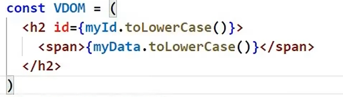

# 01. React入门

## React简介
### 什么是React？
- React是用于构建用户界面的JavaScript库。
    - 发送请求获取数据
    - 处理数据（过滤，整理格式等）
    - 操作DOM呈现页面

### 官网
1.	英文官网: https://reactjs.org/
2.	中文官网: https://react.docschina.org/


### 为什么要使用React？
1. 原生JavaScript操作DOM繁琐，效率低（DOM-API操作UI）
2. 使用JavaScript直接操作DOM，浏览器会进行大量的重绘重排
3. 原生JavaScript没有组件化编码方案，代码复用率低


### React的特点
1. 使用组件化模式，声明式编码，提高开发效率以及组件复用率
2. 在React Native中可以使用React语法进行移动端开发
3. 使用虚拟DOM+优秀的Diffing算法，尽量减少与真实DOM的交互

## React的基本使用

### 相关js库
1.	react.js：React核心库。
2.	react-dom.js：提供操作DOM的react扩展库。
3.	babel.min.js：解析JSX语法代码转为JS代码的库。

### 创建虚拟DOM的两种方式


1.	纯JS方式(一般不用)
2.	JSX方式

```js
// JSX方式

const VDOM = (
    <!-- 此处一定不要写引号，因为不是字符串 -->
    <h1 id="title">
        <span>Hello</span>
    </h1>
)
```


### 虚拟DOM与真实DOM
1.	React提供了一些API来创建一种 “特别” 的一般js对象
	- ```const VDOM = React.createElement('xx',{id:'xx'},'xx')```
	- 上面创建的就是一个简单的虚拟DOM对象
2.	虚拟DOM对象最终都会被React转换为真实的DOM
3.	我们编码时基本只需要操作react的虚拟DOM相关数据, react会转换为真实DOM变化而更新界。


## React JSX

### 效果


### JSX
1.	全称:  JavaScript XML
2.	react定义的一种类似于XML的JS扩展语法:
    - JS + XML本质是```React.createElement(component, props, ...children)```方法的语法糖
3.	作用: 用来简化创建虚拟DOM
    1)	写法：```var ele = <h1>Hello JSX!</h1>```
    2)	注意1：它不是字符串, 也不是HTML/XML标签
    3)	注意2：它最终产生的就是一个JS对象
4.	标签名任意: HTML标签或其它标签
5.	标签属性任意: HTML标签属性或其它
6.	基本语法规则：
    1. 定义虚拟DOM时，不要写引号
    2. 标签中混入JS表达式时要用```{}```。
        
    3. 样式的类名指定不要用class，要用```className```。
    4. 内联样式，要用```style={{key:value}}```的形式去写。
    5. 虚拟DOM只有一个根标签
    6. 标签必须闭合
    7. 标签首字母：
        1. 若小写字母开头，则将该标签专为html中同名元素。若html中无该标签对应的同名元素，则报错。
        2. 若大写字母开头，则该标签为自定义组件，可以嵌套其他标签或JSX表达式。若组件没有定义，则报错。

7.	babel.js的作用
    1)	浏览器不能直接解析JSX代码, 需要babel转译为纯JS的代码才能运行
    2)	只要用了JSX，都要加上```type="text/babel"```, 声明需要babel来处理

### 渲染虚拟DOM(元素)
1. 语法:  ```ReactDOM.render(virtualDOM, containerDOM)```
2. 作用: 将虚拟DOM元素渲染到页面中的真实容器DOM中显示
3. 参数说明
    1)	参数一: 纯js或jsx创建的虚拟dom对象
    2)	参数二: 用来包含虚拟DOM元素的真实dom元素对象(一般是一个div)

## 模块与组件、模块化与组件化的理解
### 模块
1.	理解：向外提供特定功能的js程序, 一般就是一个js文件
2.	为什么要拆成模块：随着业务逻辑增加，代码越来越多且复杂。
3.	作用：复用js, 简化js的编写, 提高js运行效率
### 组件
1.	理解：用来实现局部功能效果的代码和资源的集合(html/css/js/image等等)
2.	为什么要用组件：一个界面的功能更复杂
3.	作用：复用编码, 简化项目编码, 提高运行效率
### 模块化
- 当应用的js都以模块来编写的, 这个应用就是一个模块化的应用
### 组件化
- 当应用是以多组件的方式实现, 这个应用就是一个组件化的应用