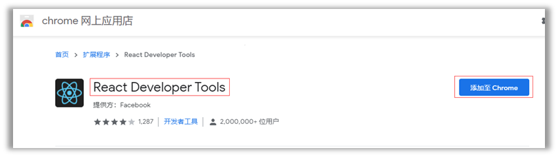
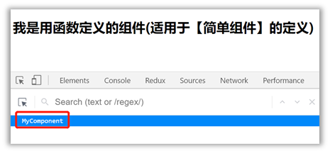
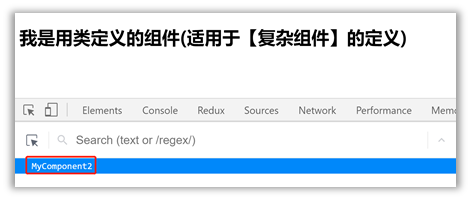

# 02. React面向组件编程

## 基本理解和使用
### 使用React开发者工具调试


###  效果
- 函数式组件：

```JavaScript
<script type="text/babel">
    function MyComponent(){
        consle.log(this) // 此处的this是undefined，因为babel编译后开启了严格模式
        return <h1>我是用函数定义的组件（适用于【简单组件】的定义）</h1>
    }

    ReactDOM.render(<MyComponent/>, document.getElementById('root'));
<script/>
```


- 类式组件：

```JavaScript
<script type="text/babel">
    class MyComponent extends React.Component{
        render(){
            console.log(this)
        // 此处的this是MyComponent的实例对象 MyComponent组件实例对象
        // render是放在哪里的？ -- MyComponent的原型对象上，供实例使用
            return <h1>我是用类定义的组件（适用于【复杂组件】的定义）</h1>
        }
    }
    ReactDOM.render(<MyComponent/>, document.getElementById('root'));
    /*
        执行了ReactDOM.render(...)后，发生了什么？
            1. React解析组件标签，找到了MyComponent组件
            2. 发现组件是用类定义的，于是创建了实例对象，并通过该实例调用到原型上的render方法
            3. 将render返回的虚拟DOM解析为真实DOM，并插入到指定的页面元素内部
    */
<script/>
```



### 注意
1.	组件名必须首字母大写
2.	虚拟DOM元素只能有一个根元素
3.	虚拟DOM元素必须有结束标签

### 渲染类组件标签的基本流程
1.	React内部会创建组件实例对象
2.	调用render()得到虚拟DOM, 并解析为真实DOM
3.	插入到指定的页面元素内部

## 组件三大核心属性1: state

### 2.2.2. 理解
1.	state是组件对象最重要的属性, 值是对象(可以包含多个key-value的组合)
2.	组件被称为"状态机", 通过更新组件的state来更新对应的页面显示(重新渲染组件)

### 2.2.3. 强烈注意
1.	组件中render方法中的this为组件实例对象
2.	组件自定义的方法中this为undefined，如何解决？
    1. 强制绑定this: 通过函数对象的bind()
    2.	箭头函数
3.	状态数据，不能直接修改或更新
