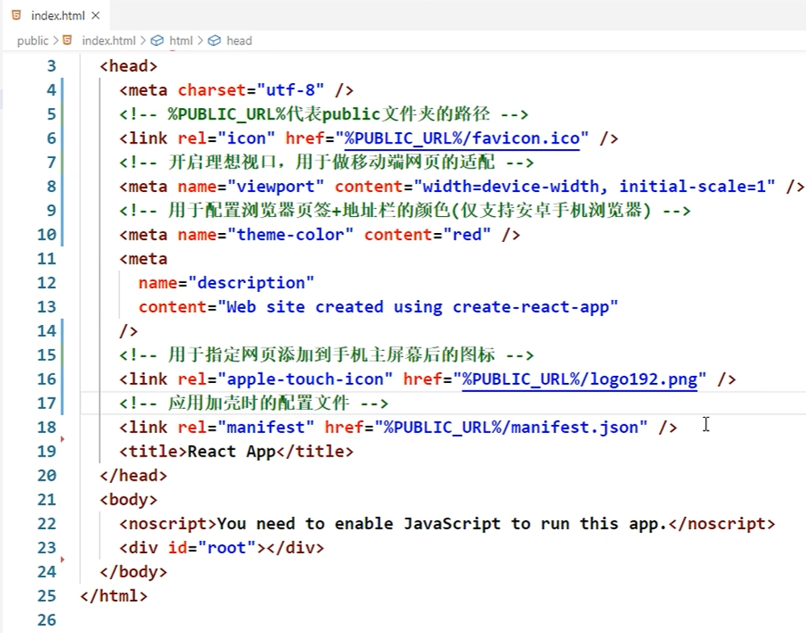
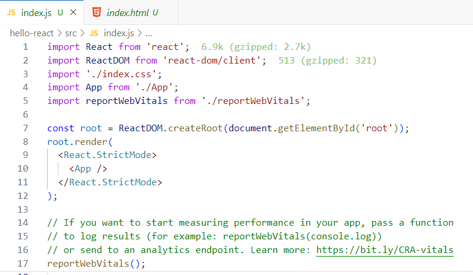
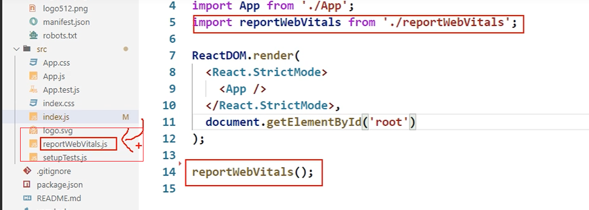

# 03. React应用(基于脚手架)

## 3.1. 使用create-react-app创建react应用
### 3.1.1. react脚手架
1.	xxx脚手架: 用来帮助程序员快速创建一个基于xxx库的模板项目
1.	包含了所有需要的配置（语法检查、jsx编译、devServer…）
2.	下载好了所有相关的依赖
3.	可以直接运行一个简单效果
2.	react提供了一个用于创建react项目的脚手架库: create-react-app
3.	项目的整体技术架构为:  react + webpack + es6 + eslint
4.	使用脚手架开发的项目的特点: 模块化, 组件化, 工程化

### 3.1.2. 创建项目并启动

1. 全局安装：npm i -g create-react-app
2. 切换到想创项目的目录，使用命令：create-react-app hello-react
3. 进入项目文件夹：cd hello-react
4. 启动项目：npm start

### 3.1.3. react脚手架项目结构
- public ---- 静态资源文件夹
  - favicon.icon ------ 网站页签图标
  - ***index.html -------- 主页面***
  - logo192.png ------- logo图
  - logo512.png ------- logo图
  - manifest.json ----- 应用加壳的配置文件
  - robots.txt -------- 爬虫协议文件
- src ---- 源码文件夹
  - App.css -------- App组件的样式
  - ***App.js --------- App组件***
  - App.test.js ---- 用于给App做测试
  - index.css ------ 样式
  - ***index.js ------- 入口文件***
  - logo.svg ------- logo图
  - reportWebVitals.js --- 页面性能分析文件(需要web-vitals库的支持)
  - setupTests.js --- 组件单元测试的文件(需要jest-dom库的支持)

### 3.1.4 public>index.html



### 3.1.5 src>index.js



- ```<React.StrictMode> </React.StrictMode>```严格模式,帮助检查潜在的错误，并在开发模式下提供更好的警告和错误提示。



- ```reportWebVitals()```用于记录性能指标，需要web-vitals库的支持。

## 3.2 代码片段

- ```rcc``` 快速创建react组件
- ```rfc``` 快速创建react函数组件

## 3.3 功能界面的组件化编码流程（通用）
1. 拆分组件: 拆分界面,抽取组件
2. 实现静态组件: 使用组件实现静态页面效果
3. 实现动态组件
  - 动态显示初始化数据
    - 数据类型
    - 数据名称
    - 保存在哪个组件?
  - 交互(从绑定事件监听开始)