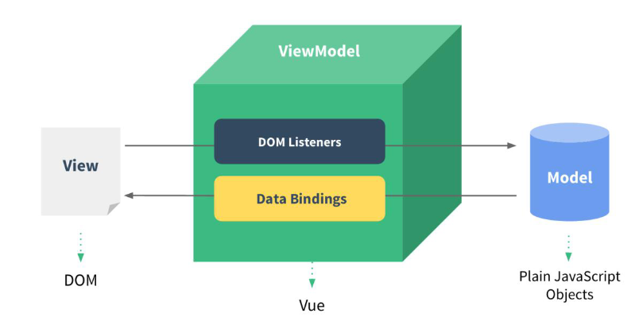

# 02.数据绑定

### 2.1 单向数据绑定

- 语法：v-bind:href ="xxx" 或简写为 :href
- 特点：数据只能从 data 流向页面

### 2.2 双向数据绑定

- 语法：v-model="xxx" 或简写为 :value="xxx"
- 特点：数据可以双向流动，即页面数据改变时，data 也会跟着改变，反之亦然。

### 2.3 MVVM 模式

- Model-View-ViewModel 模式
- 特点：将数据和视图分离，通过 ViewModel 进行双向数据绑定，将业务逻辑和视图层解耦。
    - M：模型(Model) ：对应 data 中的数据
    - V：视图(View) ：模板
    - VM：视图模型(ViewModel) ： Vue 实例对象

