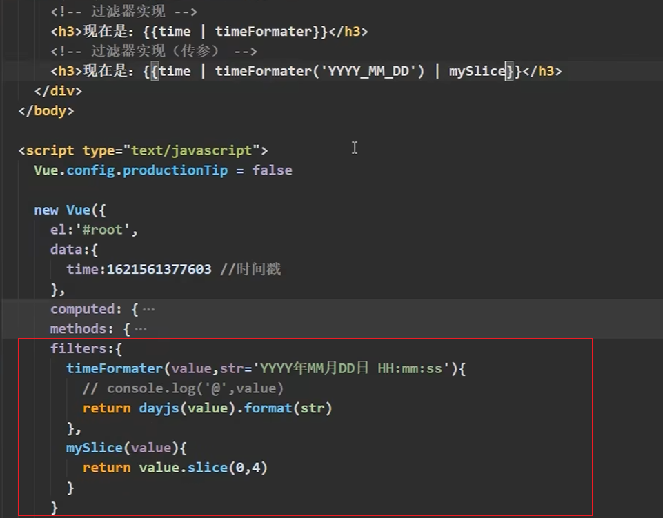
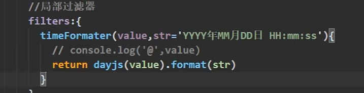
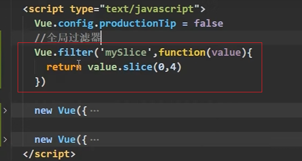

# 10.过滤器

- 定义：对要显示的数据进行格式化、处理等操作的函数。

- 语法：
    1. 注册过滤器：Vue.filter(过滤器名称, 过滤器函数) 或 new Vue({ filters: { 过滤器名称: 过滤器函数 } })
    2. 使用过滤器：{{ 要过滤的数据 | 过滤器名称 }} 或 v-bind:属性="要过滤的数据 | 过滤器名称"

- 注意：
    1. 过滤器也可以接受额外参数
    2. 多个过滤器可以串联
    3. 并没有改变原本的数据，是产生新的对应的数据

- 作用：
    - 格式化数据：如将日期格式化为字符串
    - 数据处理：如将数据进行加工，如将数字转换为货币格式
    - 数据校验：如检查输入的数据是否符合要求

局部过滤器

全局过滤器

