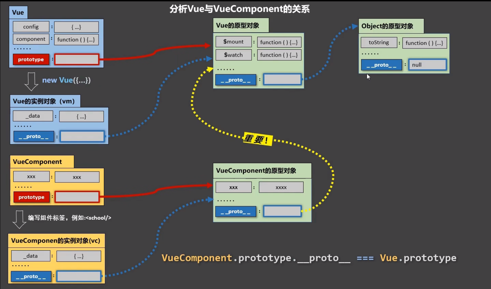

# 14.组件简介

### 14.1 什么是组件


### 14.2 组件的组成

1. 模板：组件的HTML模板，包含了组件的结构和展示内容。
2. 脚本：组件的JavaScript代码，包含了组件的逻辑和数据。
3. 样式：组件的CSS样式，包含了组件的外观和感觉。

### 14.3 组件的作用

1. 复用：组件可以被多处使用，可以提高代码的复用性。
2. 封装：组件可以封装一些通用功能，使得代码更加整洁。
3. 隔离：组件可以将逻辑和数据分离，使得代码更加清晰。

### 14.4 非单文件组件

```js
// 1. 创建一个school组件

const school = Vue.extend({
  // 组件定义时，一定不要写el配置项，因为他们最终都要被一个vm管理。
  template:
  '
  <div>
    <h1>我是{{name}}</h1>
    <button @click="changeName">修改名字</button>
  </div>
  '

  // name配置项来指定组件在开发者工具中的显示名称。
  name:'xuexiao'

  // data要写成一个函数的形式。避免组件被复用时，数据存在引用关系。
  data() {
    return {
      name: '北京大学'
    }
}
})


// 2. 注册组件
new Vue({
  el: '#app',
  data: {
    name: '张三'
  },
  components: {
    school: school
  }
})


// 3. 在父组件中使用
<template>
  <div>
    <school></school>
  </div>
</template>
```

- 注意：
    1. 组件定义时，一定不要写el配置项，因为他们最终都要被一个vm管理。
    2. data要写成一个函数的形式。避免组件被复用时，数据存在引用关系。
    3. 组件的模板中，只能有一个根元素。
    4. 使用template标签定义组件模板，配置组件结构
    5. name配置项来指定组件在开发者工具中的显示名称。

- 关于组件的命名：
    1. 一个单词组成：
        1. 首字母小写：school
        2. 驼峰命名法：School
    2. 多个单词组成：
        1. kebab-case命名法：my-component
        2. CamelCase命名法：MyComponent(需要Vue脚手架支持)

- 关于组件标签：
    1. ```<school></school>```
    2. ```<school/>```
    3. 不使用脚手架的时，```<school/>```会导致后续组件不能渲染

- 简写方式： ```const school = {}```


### 14.5 关于VueComponent

- school 组件本质是一个名为VueComponent的构造函数，是由Vue.extend()方法创建的。
- 我们只需要写<school>,Vue解析时会帮我们创建school组件的实例对象。即：Vue帮我们执行```new VueComponent({...})```
- 每次调用Vue.extend()都会返回一个新的VueComponent构造函数！！！
- 关于this的指向：
    - 组件配置中：
        - data函数，methods中的函数，watch中的函数，computed中的函数，生命周期函数，它们的this指向VueComponent实例对象。
    - Vue()配置中：
        - data对象，methods对象，watch对象，computed对象，生命周期函数，它们的this指向Vue实例对象。

### 14.6 Vue与VueComponent的关系

- 一个重要的内置关系：``` VueComponent.prototype.__proto__ === Vue.prototype ```
- 为什么要有这个关系：让vc实例可以访问Vue原型上的属性和方法。




