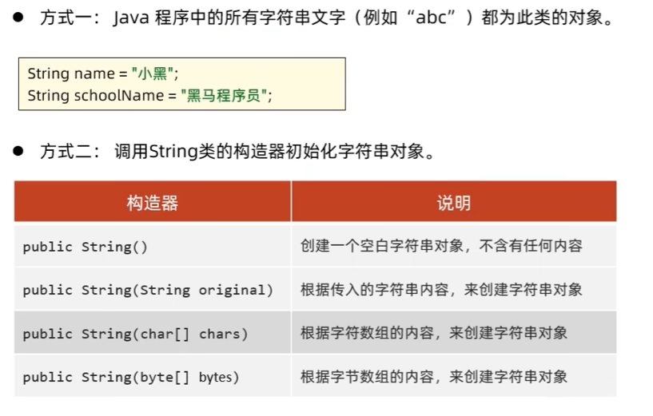
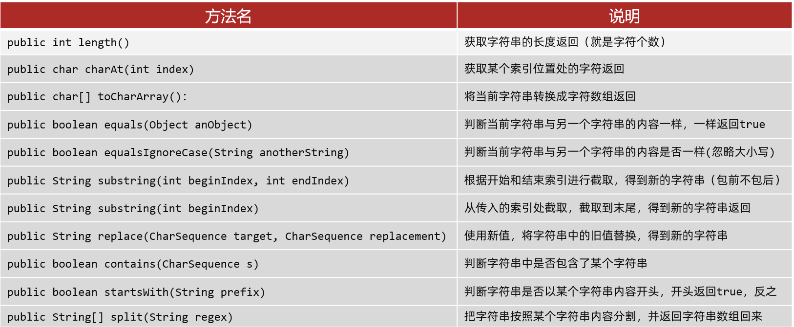
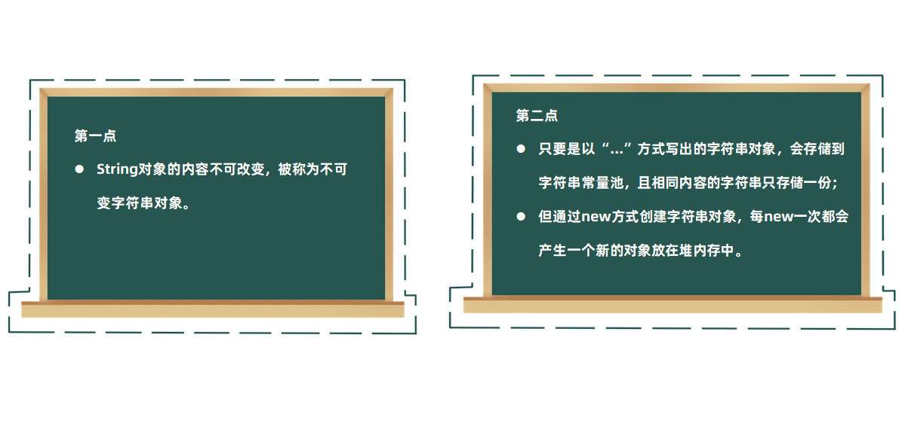
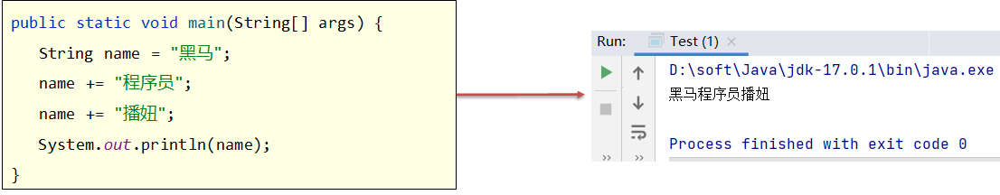
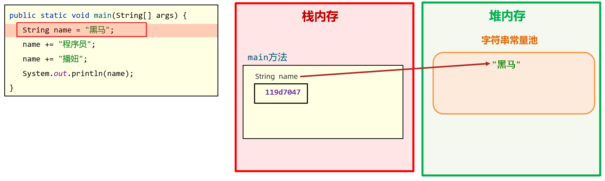
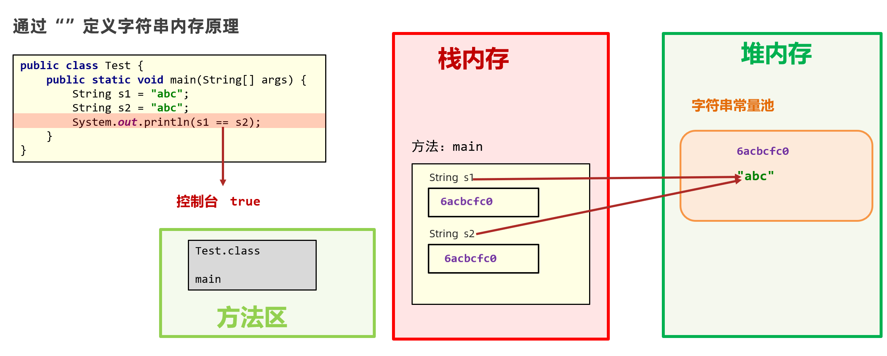
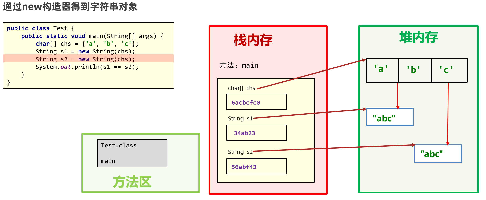
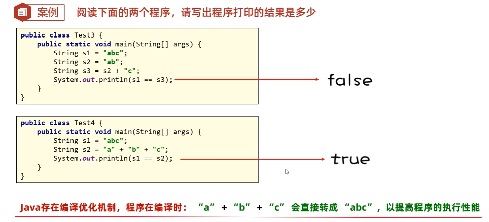

# 02.String对象

### 1.String类概述

String类是Java中用于表示和操作字符串的类。String类是final类，不能被继承，因此String对象一旦创建，其内容就不能被修改。String类提供了一系列的构造方法和方法，用于创建、操作和处理字符串。

### 2.String类创建方式

String类提供了多种创建方式，包括：



### 3.String类常用方法

String类提供了一系列常用的方法，用于操作字符串。常用的方法如下：



```java
public class StringDemo2 {
    public static void main(String[] args) {
        //目标：快速熟悉String提供的处理字符串的常用方法。
        String s = "黑马Java";
        // 1、获取字符串的长度
        System.out.println(s.length());

        // 2、提取字符串中某个索引位置处的字符
        char c = s.charAt(1);
        System.out.println(c);

        // 字符串的遍历
        for (int i = 0; i < s.length(); i++) {
            // i = 0 1 2 3 4 5
            char ch = s.charAt(i);
            System.out.println(ch);
        }

        System.out.println("-------------------");

        // 3、把字符串转换成字符数组，再进行遍历
        char[] chars = s.toCharArray();
        for (int i = 0; i < chars.length; i++) {
            System.out.println(chars[i]);
        }

        // 4、判断字符串内容，内容一样就返回true
        String s1 = new String("黑马");
        String s2 = new String("黑马");
        System.out.println(s1 == s2); // false
        System.out.println(s1.equals(s2)); // true

        // 5、忽略大小写比较字符串内容
        String c1 = "34AeFG";
        String c2 = "34aEfg";
        System.out.println(c1.equals(c2)); // false
        System.out.println(c1.equalsIgnoreCase(c2)); // true

        // 6、截取字符串内容 (包前不包后的)
        String s3 = "Java是最好的编程语言之一";
        String rs = s3.substring(0, 8);
        System.out.println(rs);

        // 7、从当前索引位置一直截取到字符串的末尾
        String rs2 = s3.substring(5);
        System.out.println(rs2);

        // 8、把字符串中的某个内容替换成新内容，并返回新的字符串对象给我们
        String info = "这个电影简直是个垃圾，垃圾电影！！";
        String rs3 = info.replace("垃圾", "**");
        System.out.println(rs3);

        // 9、判断字符串中是否包含某个关键字
        String info2 = "Java是最好的编程语言之一，我爱Java,Java不爱我！";
        System.out.println(info2.contains("Java"));
        System.out.println(info2.contains("java"));
        System.out.println(info2.contains("Java2"));

        // 10、判断字符串是否以某个字符串开头。
        String rs4 = "张三丰";
        System.out.println(rs4.startsWith("张"));
        System.out.println(rs4.startsWith("张三"));
        System.out.println(rs4.startsWith("张三2"));

        // 11、把字符串按照某个指定内容分割成多个字符串，放到一个字符串数组中返回给我们
        String rs5 = "张无忌,周芷若,殷素素,赵敏";
        String[] names = rs5.split(",");
        for (int i = 0; i < names.length; i++) {
            System.out.println(names[i]);
        }
    }
}
```

### 4.String类的注意事项



- **注意事项1：String类的对象是不可变的对象**

我们先看一段代码，分析这段代码的结果



以上代码中，先定义了一个String变量 name第一次赋值为`“黑马”;` 然后对`name`变量记录的字符串进行两次拼接，第一次拼接`“程序员”`，第二次拼接`“播妞”`；我们发现得到的结果是：`黑马程序员播妞`

这里问题就来了，你不是是说：**String类的对象是不可变的字符串对象吗**我看name的值变了呀！！！!


下面我们就解释一下，String是不可变对象到底是什么含义。

需要注意的是：只要是以`“”`方式写出的字符串对象，会在堆内存中的**字符串常量池**中存储。

执行第一句话时，会在堆内存的常量池中，创建一个字符串对象`“黑马”`，然后把`“黑马”`的地址赋值给`String name`



当执行第二句话时，又会再堆内存的常量池中创建一个字符串`“程序员”`，和`“黑马”`拼接，拼接之后还会产生一个新的字符串对象`”黑马程序员“`，然后将新产生的`“黑马程序员”`对象的地址赋值给`String name`变量。


此时你会发现，之前创建的字符串对象`“黑马”`内容确实是没有改变的。所以说String的对象是不可变的。

- **注意事项2：字符串字面量和new出来字符串的区别**
  1. 只要是以`“...”`方式写出的字符串对象，会存储到字符串常量池，且相同内容的字符串只存储一份。如下图一所示
  2. 但通过`new`方式创建字符串对象，每new一次都会产生一个新的对象放在堆内存中。如下图二所示

  

  


- 总结一下，字符串的注意事项。

```java
1. String是不可变字符串对象
2. 只要是以“...”方式写出的字符串对象，会存储到字符串常量池，且相同内容的字符串只存储一份；
3. 但通过new方式创建字符串对象，每new一次都会产生一个新的对象放在堆内存中。
```

