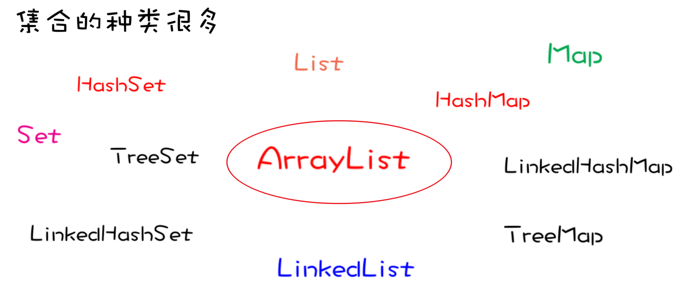
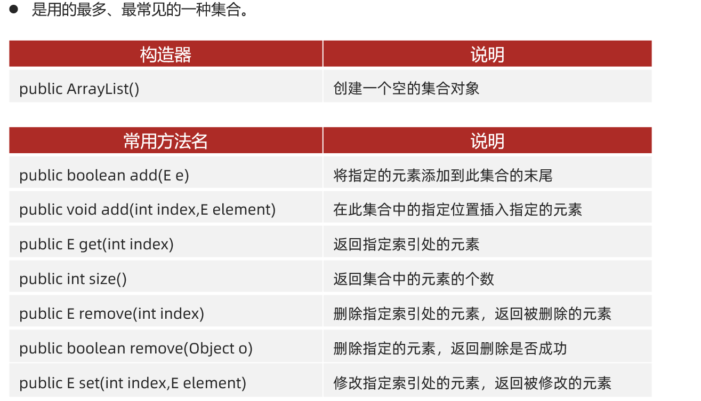
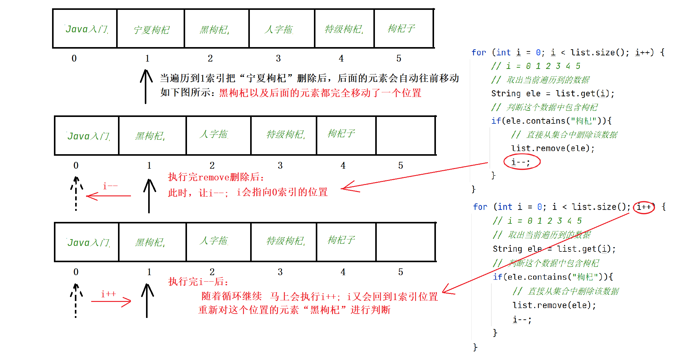
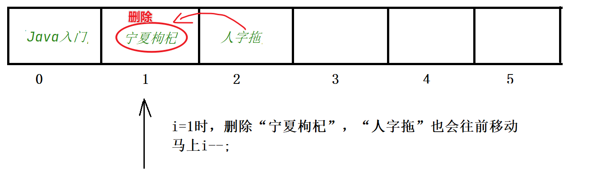
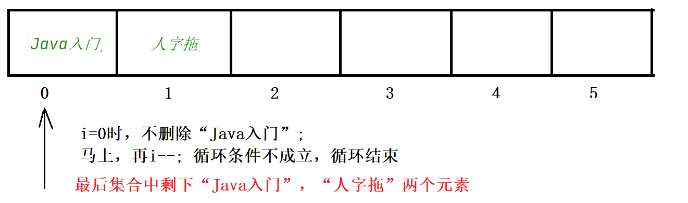

# 03. ArrayList类

### 3.1 概述

ArrayList表示一种集合，它是一个容器，用来装数据的，类似于数组。那有了数组，为什么要有集合呢？

因为数组一旦创建大小不变，比如创建一个长度为3的数组，就只能存储3个元素，想要存储第4个元素就不行。而集合是大小可变的，想要存储几个元素就存储几个元素，在实际工作中用得更多。

ArrayList类是Java中提供的最基本的集合类之一，它是一个动态数组，可以存储多个元素。ArrayList类提供了对元素的随机访问，即可以通过索引（index）来访问元素。

集合有很多种，而ArrayList只是众多集合中的一种，如下图所示：



### 3.2 如何使用ArrayList

想要使用ArrayList存储数据，并对数据进行操作：

第一步：创建ArrayList容器对象。一般使用空参数构造方法。
```Java
ArrayList list = new ArrayList();
```

第二步：调用ArrayList类的常用方法对容器中的数据进行操作。



```java
public class ArrayListDemo1 {
    public static void main(String[] args) {
        // 1、创建一个ArrayList的集合对象
        // ArrayList<String> list = new ArrayList<String>();
        // 从jdk 1.7开始才支持的
        ArrayList<String> list = new ArrayList<>();

        list.add("黑马");
        list.add("黑马");
        list.add("Java");
        System.out.println(list);

        // 2、往集合中的某个索引位置处添加一个数据
        list.add(1, "MySQL");
        System.out.println(list);

        // 3、根据索引获取集合中某个索引位置处的值
        String rs = list.get(1);
        System.out.println(rs);

        // 4、获取集合的大小（返回集合中存储的元素个数）
        System.out.println(list.size());

        // 5、根据索引删除集合中的某个元素值，会返回被删除的元素值给我们
        System.out.println(list.remove(1));
        System.out.println(list);

        // 6、直接删除某个元素值，删除成功会返回true，反之
        System.out.println(list.remove("Java"));
        System.out.println(list);

        list.add(1, "html");
        System.out.println(list);

        // 默认删除的是第一次出现的这个黑马的数据的
        System.out.println(list.remove("黑马"));
        System.out.println(list);

        // 7、修改某个索引位置处的数据，修改后会返回原来的值给我们
        System.out.println(list.set(1, "黑马程序员"));
        System.out.println(list);
    }
}
```

### 3.3 删除元素的注意事项
- **集合删除元素方式一**：每次删除完元素后，让控制循环的变量`i--`；如下图所示


具体代码如下：

```java
// 方式一：每次删除一个数据后，就让i往左边退一步
for (int i = 0; i < list.size(); i++) {
    // i = 0 1 2 3 4 5
    // 取出当前遍历到的数据
    String ele = list.get(i);
    // 判断这个数据中包含枸杞
    if(ele.contains("枸杞")){
        // 直接从集合中删除该数据
        list.remove(ele);
        i--;
    }
}
System.out.println(list);
```

- **集合删除元素方式二**：我们只需要倒着遍历集合，在遍历过程中删除元素就可以了




```java
// 方式二：从集合的后面倒着遍历并删除
// [Java入门, 人字拖]
//   i
for (int i = list.size() - 1; i >= 0; i--) {
    // 取出当前遍历到的数据
    String ele = list.get(i);
    // 判断这个数据中包含枸杞
    if(ele.contains("枸杞")){
        // 直接从集合中删除该数据
        list.remove(ele);
    }
}
System.out.println(list);
```