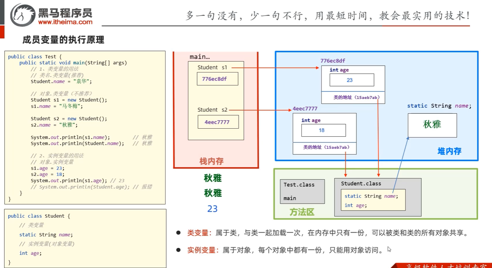
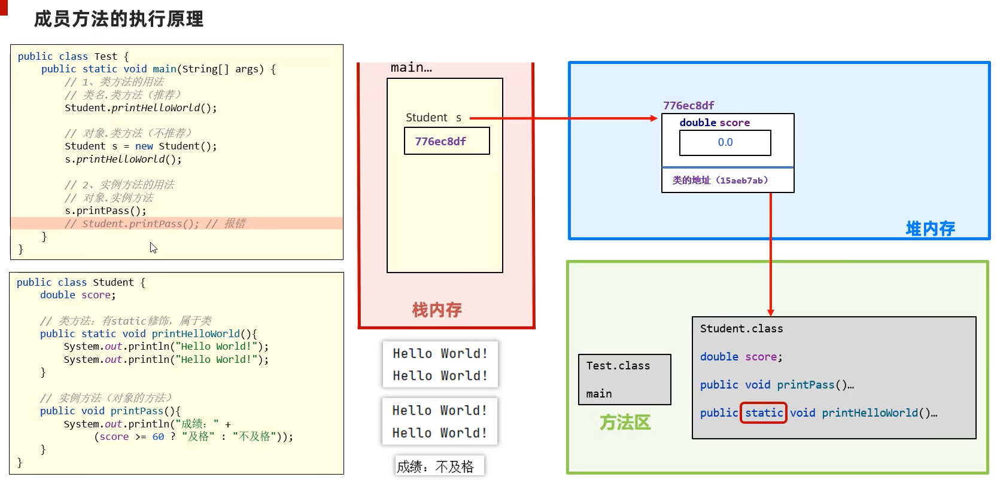
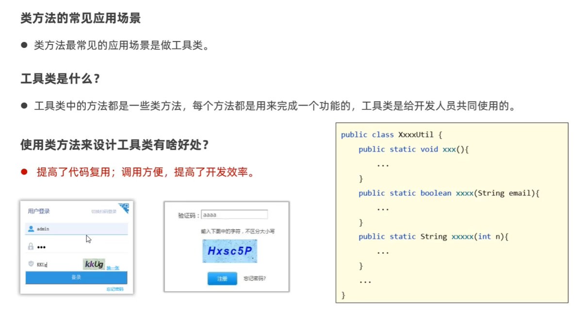
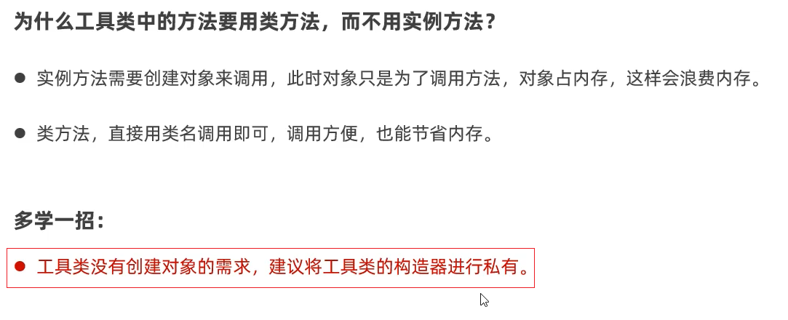
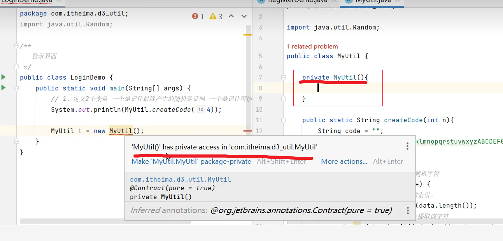
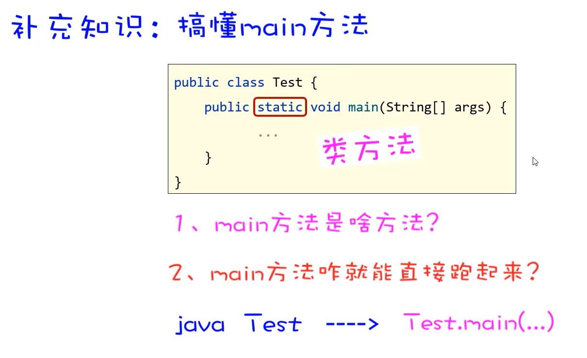

# 04. static

叫静态,可以修饰成员变量，成员方法。

### 4.1 成员变量的分类

- 成员变量按照有无static修饰，分为两种：
    - 类变量（静态成员变量）：类变量在内存中只有一份，所有实例共享。
    - 实例变量（对象变量）：实例变量在内存中有一份，每个实例都有一份。

### 4.2 成员变量的执行原理

### 4.3 成员方法的分类

- 成员方法按照有无static修饰，分为两种：
    - 静态方法（类方法）：静态方法可以直接通过类名调用，无需创建对象。
    - 实例方法（对象方法）：实例方法必须通过对象调用，需要创建对象。

### 4.4 静态方法的执行原理

### 4.5 类方法的应用场景

### 4.6 main方法拓展

### 4.7 代码块概述

- 代码块是类的5大成分之一（成员变量，构造器，方法，代码块，内部类）

- 代码块分类：
    - 静态代码块：
        1. 格式： static {}
        2. 特点： 类加载时自动执行，由于类只会加载一次，所以静态代码块也只会执行一次
        3. 作用： 完成类的初始化，例如：对类变量进行初始化赋值

    - 实例代码块：
        1. 格式： {}
        2. 特点： 每次创建对象时，执行实例代码块，并在构造器之前执行
        3. 作用：和构造器一样，都是用来完成对象的初始化的，例如：对实例变量进行初始化赋值