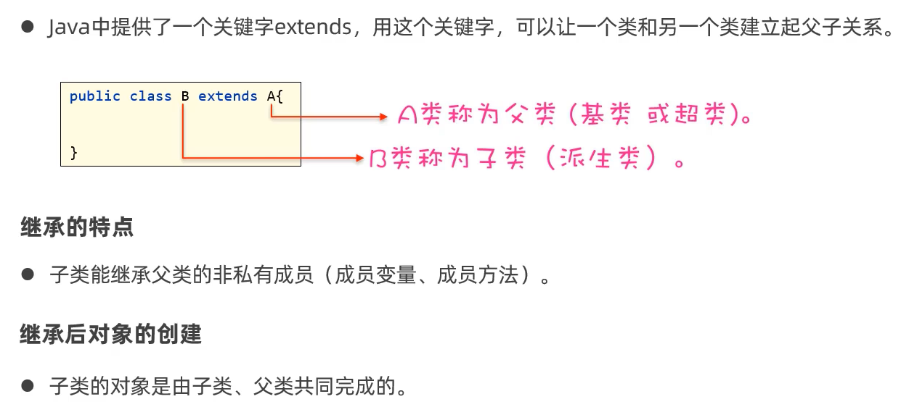
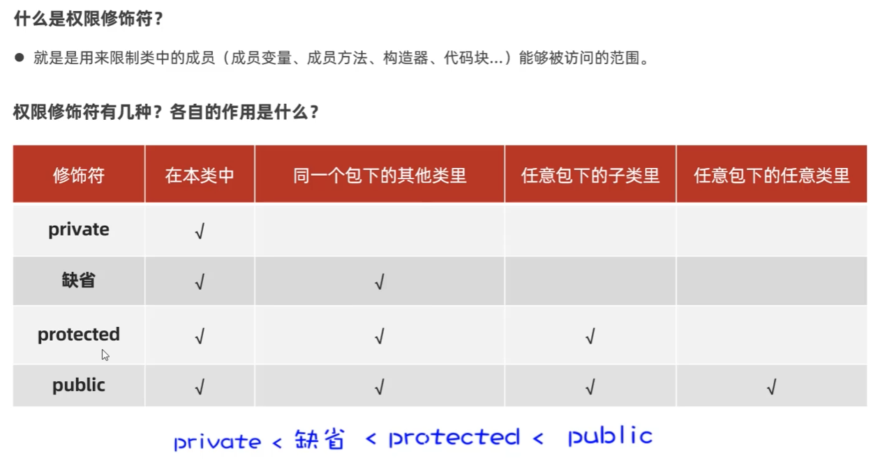
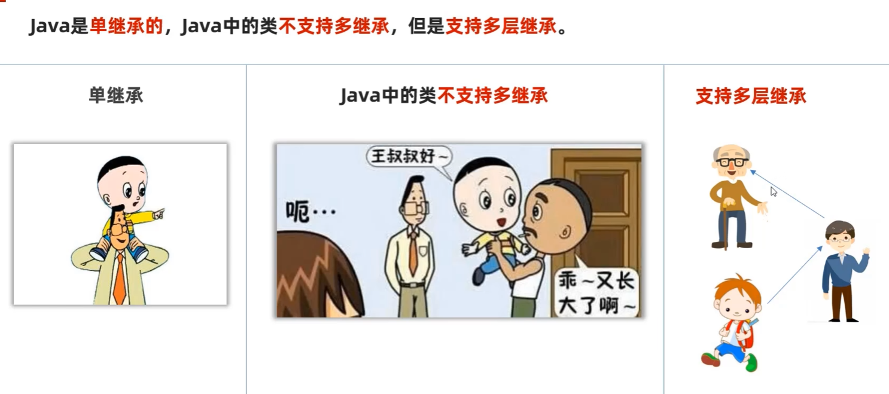
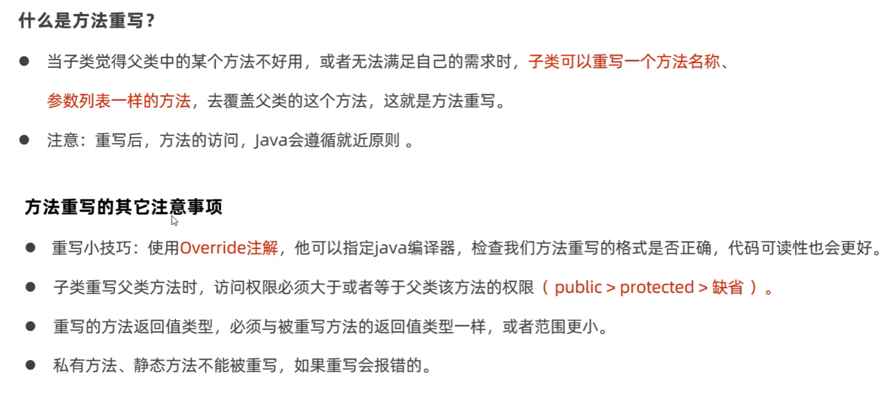
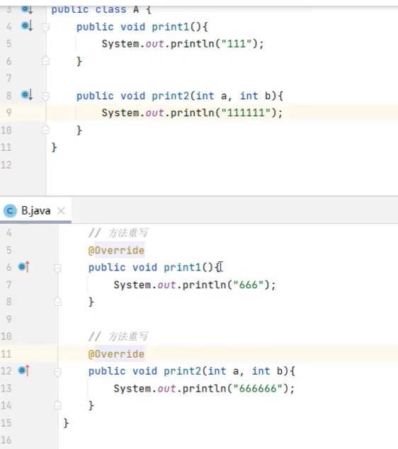
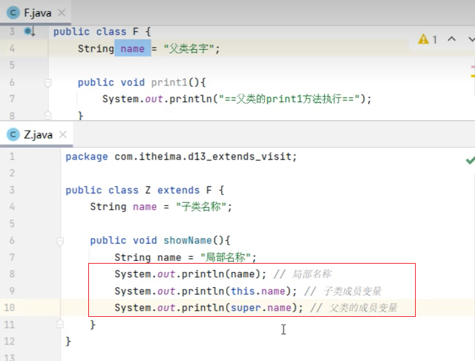
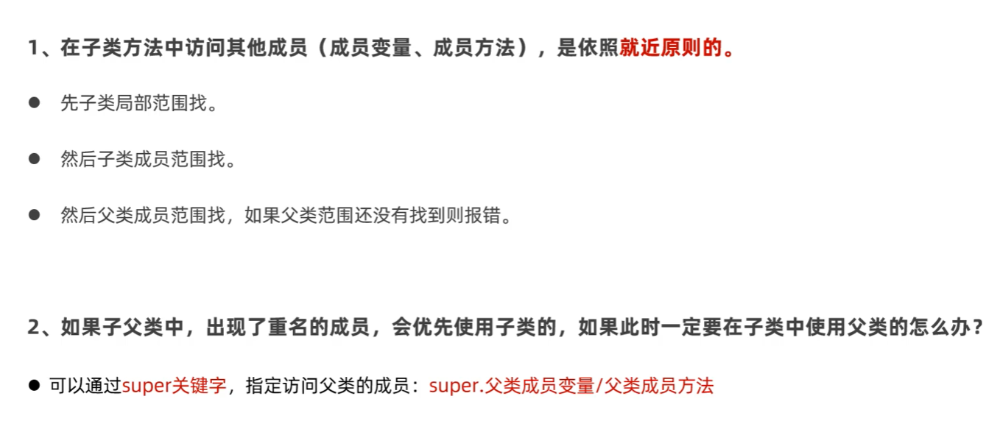
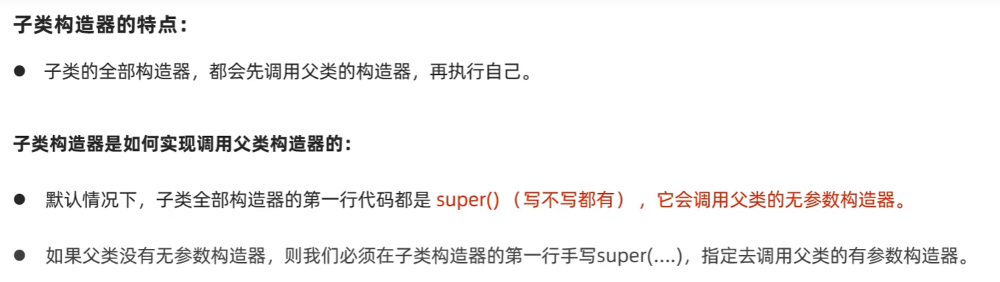
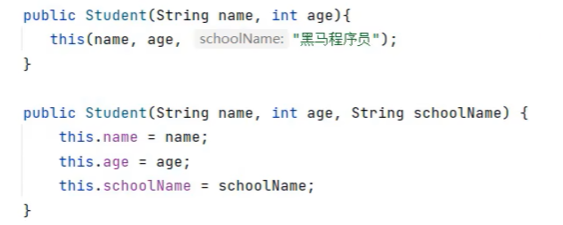

# 05. 继承

### 5.1 继承的概念

继承是面向对象编程的重要概念。继承是指一个类从另一个类中继承了其属性和方法，并可以添加新的属性和方法。继承可以使得子类获得父类的全部属性和方法，并可以根据需要进行修改。继承的好处是可以重用代码，提高代码的可重用性，减少代码的重复编写，提高代码的维护性。



### 5.2 继承的注意事项

#### 5.2.1 权限修饰符



#### 5.2.2 单继承



#### 5.2.3 Object类

1. Object类是所有类的父类，它是所有类的父类，它是所有类的祖先类。
2. Object类中定义了所有类的共有属性和方法，包括toString()、equals()、hashCode()、clone()等。


#### 5.2.4 方法重写






#### 5.2.5 访问重名成员变量





#### 5.2.6 子类构造器的特点



- 补充知识：this(...) 调用兄弟构造器




### 5.3 final关键字

- final关键字用来修饰类、方法和变量，用来表示“不可变”的意思。
    - 修饰类：表示该类不能被继承。
    - 修饰方法：表示该方法不能被重写。
    - 修饰变量：表示该变量只能被赋值一次，不能被修改。

- 注意：
    - final修饰基本类型的变量，变量存储的数据不能被改变
    - final修饰引用类型的变量，变量存储的地址不能被改变，但是引用的对象可以被改变。

- 常量：
    - 使用了static final修饰的成员变量被称为常量
    - 作用：通常用于记录系统的配置信息
        ```java
        public class Constants {
            public static final int MAX_SIZE = 100;
            public static final String VERSION = "1.0";
        }
        ```
    - 命名规范：建议使用全大写，多个单词使用下划线连接起来
    - 优势：代码可读性好，可维护性好
    - 执行原理：程序编译之后，变量会被"宏替换"(出现常量的地方全部会被替换成其记住的字面量，这样可以保证使用常量和直接使用字面量的性能是一样的)