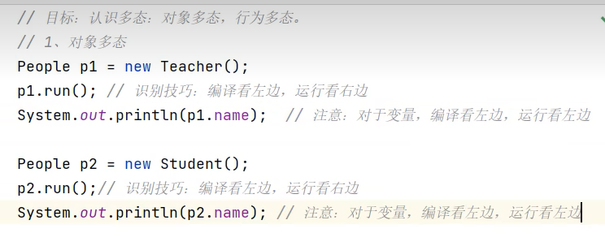
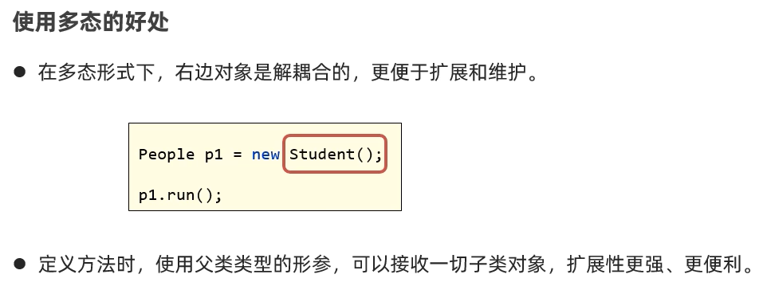
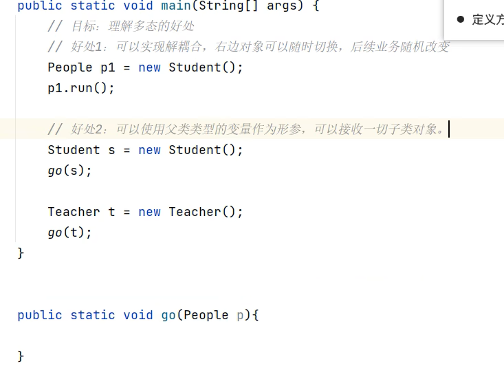
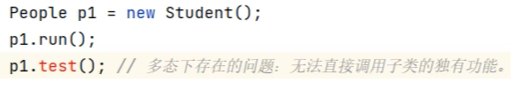
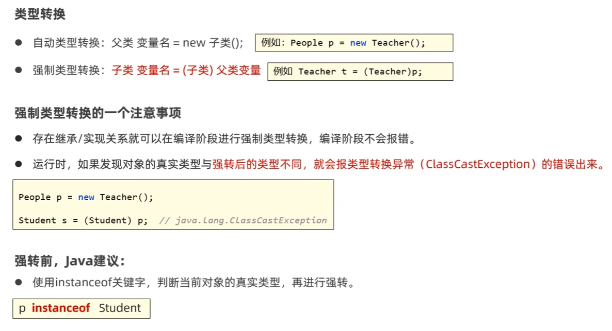
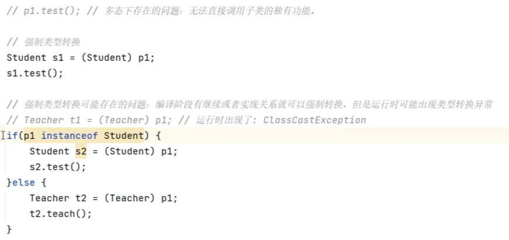

# 06.多态

### 6.1 认识多态

### 6.2 多态的好处

### 6.3 多态的一个问题

- 多态下不能实现子类的独有功能

### 6.4 解决多态的问题

- 类型转换有几种形式？能解决什么问题？
    - 自动类型转换，强制类型转换
    - 可以吧对象转换成其真正的类型，从而解决了多态下不能调用子类独有方法的问题。

- 强制类型转换需要注意什么？
    - 存在继承/实现时，就可以进行强制类型转换，编译阶段不会报错。
    - 但是，运行时，如果发现对象的真实类型与强转后的类型不同会报错（ClassCastException）

- 强制类型转换前Java建议我们做什么？
    - 使用instanceof关键字来判断当前对象的真实类型：  对象instanceof 类型