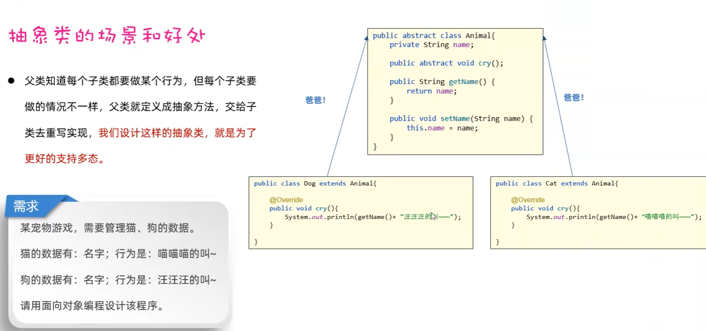
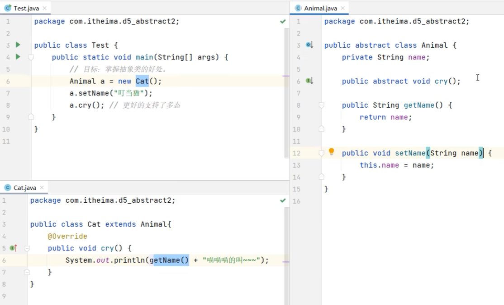
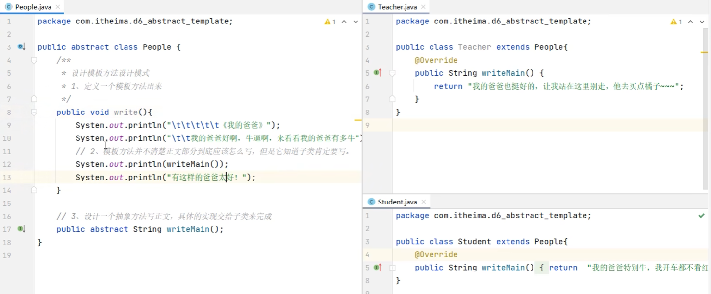

# 07.抽象类

### 7.1 认识

- 抽象类中不一定有抽象方法，有抽象方法的类一定是抽象类
- 类该有的成员（成员变量，方法，构造器） 抽象类都可以有
- 抽象类最主要的特点：抽象类不能创建对象，仅作为一种特殊的父类，让子类继承并实现
- 一个类继承抽象类，必须重写完抽象类的全部抽象方法，否则这个类也必须定义为抽象类

### 7.2 抽象类的作用

- 父类知道每个子类都要做的行为，但每个子类的做法不一样，父类就定义为抽象方法，交给子类去重写实现，我们抽象出这样的抽象类，就是为了更好的支持多态。

### 7.3 模板设计方法

- 定义一个抽象类，在里面定义一个模板方法（把相同的代码放进去），再定义一个抽象方法，然后让子类去继承这个抽象类，并实现抽象方法

- 建议使用final关键字修饰模版方法
    - 模板方法是给对象直接使用的，不能被子类重写
    - 一旦子类重写了模板方法，模板方法就失效了
