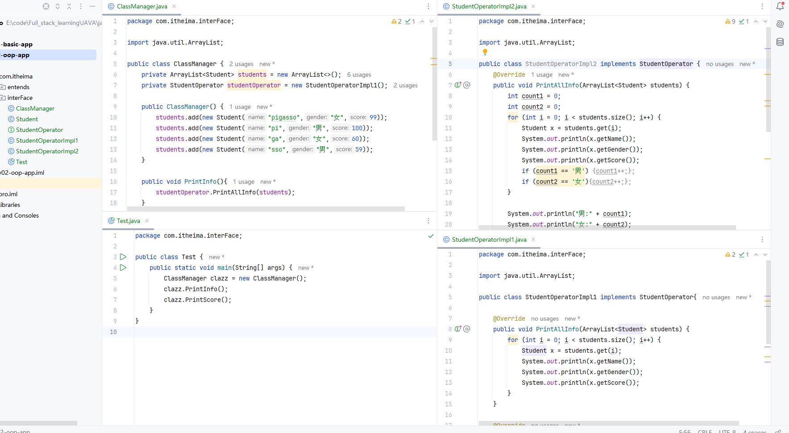
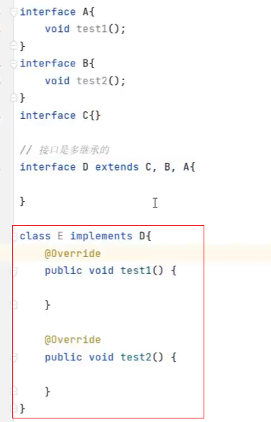
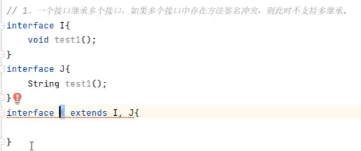
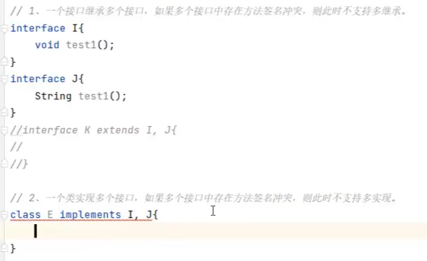

# 08.接口

### 8.1 认识接口

- Java提供了一个关键字 ```interface```， 用这个关键字，我们可以定义出一个特殊的结构：接口。
    ```java
    public interface A {
        // 成员变量（常量）
        String SCHOOL_NAME = "清华大学";

        // 成员方法（抽象方法）
        void study();
    }
    ```

- 注意： 接口不能创建对象，接口是用来被类实现(implements)的，实现接口的类称为实现类。
    ```java
    修饰符 class 实现类名 implements 接口名1, 接口名2, 接口名3 {
    }
    ```

- 一个类可以实现多个接口（接口可以理解为干爹），实现类实现多个接口，必须重写完全部接口的全部抽象方法，否则实现类需要定义成抽象类。

### 8.2 接口的好处

- 弥补了类单继承的不足，一个类可以同时实现多接口
- 让程序可以面向接口编程，这样程序员可以灵活方便的切换各种业务实现

### 8.3 整个接口的示例：




### 8.4 JDK8以后新增的方法

- 默认方法：使用default修饰，使用实现类的对象调用
- 静态方法：使用static修饰，必须用当前接口名调用
- 私有方法：使用private修饰，JDK9后有，只能在当前接口中调用
- 他们都会默认被public修饰

- 增强了接口的能力，使得接口更加灵活，更加适合多接口的场景

### 8.5 接口的多继承

- 一个接口可以同时继承多个接口,便于实现类去实现
```java
public interface A extends B, C {
}
```




### 8.6 接口的其他注意事项（了解）

1. 一个接口继承多个接口，如果多个接口中存在方法签名冲突，则此时不支持多继承。
2. 一个类实现多个接口，如果多个接口中存在方法签名冲突，则此时不支持多实现。
3. 一个类继承了父类，又同时实现了接口，父类中和接口中有同名的方法，实现类会优先用父类的。
4. 一个类实现了多个接口，多个接口中存在同名的默认方法，可以不冲突，这个类重写该方法即可。




