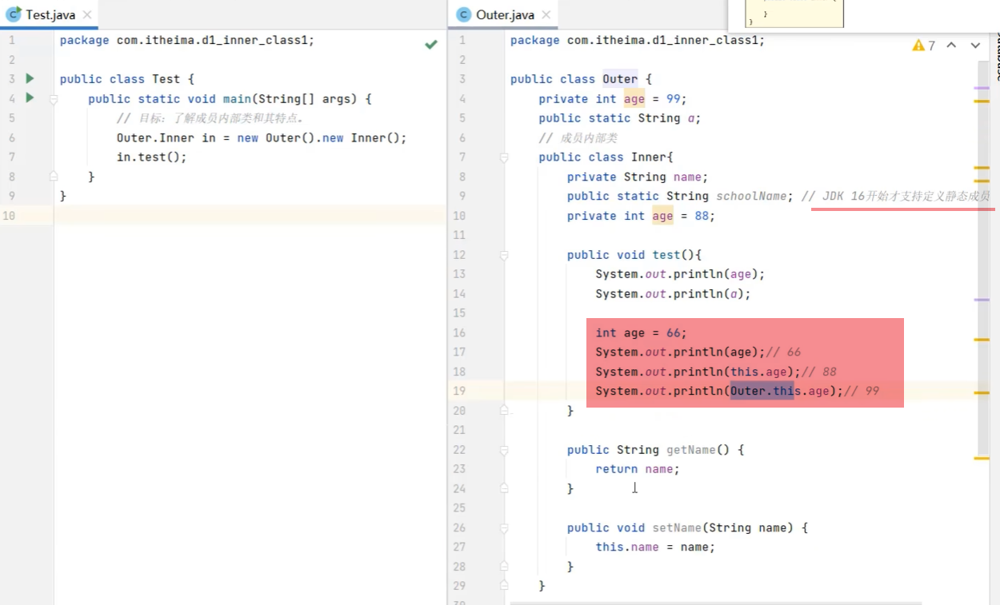
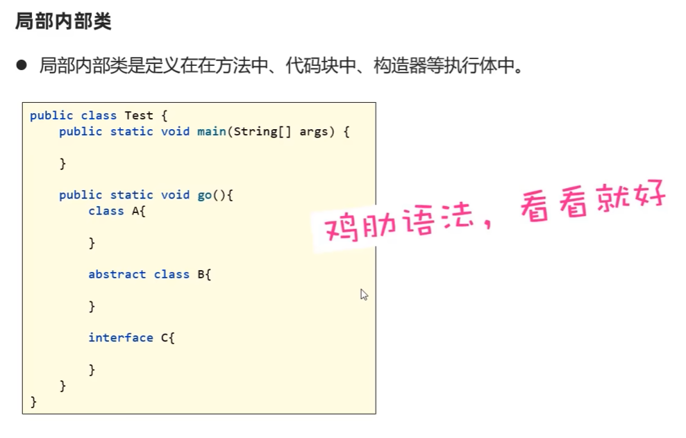
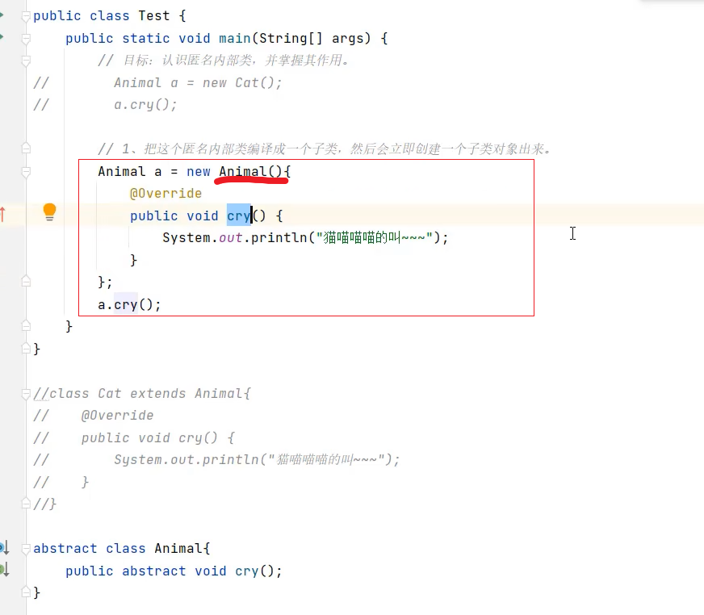

# 09.内部类

- 是类的五大成分之一（成员变量，方法，构造器，内部类，代码块）
- 如果一个类定义在另一个类的内部，这个类就是内部类
- 当一个类的内部，包含了一个完整的事物，且这个事物没有必要单独设计，就可以把这个事物设计成内部类
```java
public class car{
    public class Engine{

    }
}
```

### 9.1 成员内部类(了解)

- 就是类中的一个普通成员，类似起那面我们学过的普通的成员变量，成员方法。

```java
public class Outer{
    public class Inner{

    }
}
```

- 注意：JDK16之前，成员内部类中不能定义静态成员，JDK16开始也可以定义静态成员了。

- 创建对象的格式:
```外部类名.内部类名 对象名 = new 外部类名(...).new 内部类名(...);```
```java
Outer.Inner inner = new Outer().new Inner();
```

- 成员内部类中访问其他成员的特点：
    1. 和前面学过的实例方法一样，成员内部类的实例方法中，同样可以直接访问外部类的实例成员，静态成员
    2. 可以在成员内部类的实例方法中，拿到当前外部类的对象，格式是：```外部类名.this```



### 9.2 静态内部类(了解)

```java
public class Outer{
    public static class Inner{

    }
}
```

- 创建对象的格式：
```外部类名.内部类名 对象名 = new 外部类名(...).内部类名(...);```
```java
Outer.Inner inner = new Outer().Inner();
```

- 静态内部类和成员内部类最大的区别是：静态内部类只能访问外部类的静态成员，不能访问外部类的实例成员。

### 9.3 局部内部类(了解)



### 9.4 匿名内部类(重点)

- 就是一种特殊的局部内部类。
- 匿名指的是程序员不需要为这个类声明名字


```java
new 类或接口(参数){
    类体(一般是方法重写)；
}；
```

```java
new Animal(){

    @override
    public void cry(){

    }
}
```

- 特点：匿名内部类本质就是一个子类，并会立即创建出一个子类对象
- 作用：用于更方便的创建一个子类对象




- 使用场景：
    