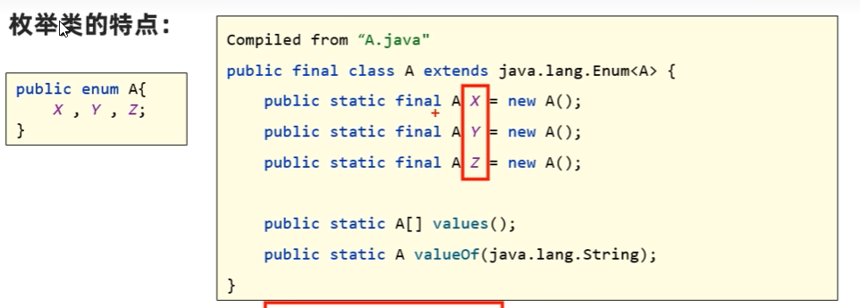
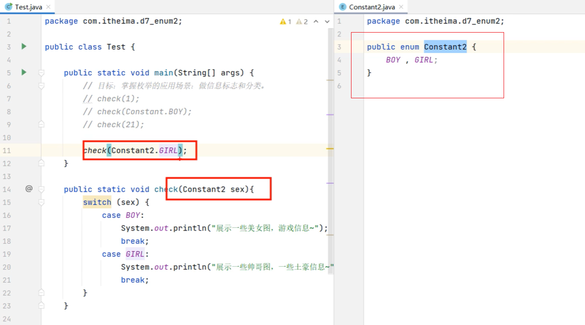

# 10. enum类

- 枚举类，是一种特殊的类，它是一种抽象类，不能实例化，只能作为其他类的成员变量使用。

- 格式：

```java
修饰符 enum 类名{
    名称1，名称2，名称3，...;

    其他成员;
}
```



- 枚举类的特点：
    - 枚举类的第一行只能罗列一些名称，这些名称都是常量，并且每个常量记住的都是枚举类的一个对象
    - 枚举类的构造器都是私有的（写不写都只能是私有的），因此枚举类对外不能创建对象
    - 枚举都是最终类，不可以被继承
    - 枚举类中，从第二行开始，可以定义类的其他各种成员
    - 编译器为枚举类新增了几个方法，并且枚举类都是继承：java.lang.Enum类的，从enum类也会继承到一些方法


- 枚举类的使用场景：


