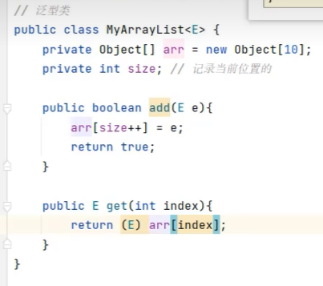
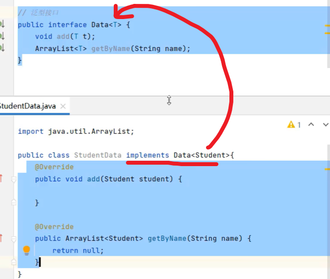
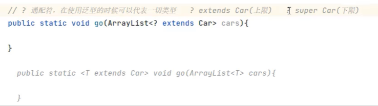
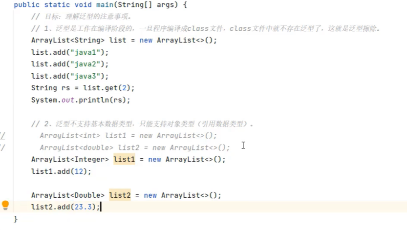

# 11. 泛型

- 定义类，接口，方法时，同时声明了一个或多个类型变量（如：<E>）,称为泛型类，泛型接口，泛型方法，他们统称为泛型。


### 11.1 泛型类

```java
public class ArraryList<E>{
    ...
}

```

- 作用：泛型提供了在编译阶段约束所能操作的数据类型，并自动进行检查的能力，这样可以避免强制类型转换，以及可能出现的异常
- 泛型的本质：把具体的数据类型作为数据传给类型变量




### 11.2 泛型接口

```java
public interface A<T>{
    ...
}
```



### 11.3 泛型方法

```java
public static <T> void test(T t){
    ...
}
```

```java
修饰符 <类型变量，类型变量> 返回值类型 方法名(参数列表){
    方法体
}
```

- 通配符： ?  ：表示该类型参数可以是任何类型
- 上限： ? extends T  ：表示该类型参数只能是T的子类
- 下限： ? super T  ：表示该类型参数只能是T的父类





### 11.4 泛型的注意事项

- 泛型是工作在编译阶段的，一旦程序编译成class文件，class文件中就不存在泛型了，这就是泛型擦除
- 泛型不支持基本数据类型，只能支持对象类型（引用数据类型）

