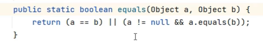

# 13.util.Objects

- Objects是一个工具类，提供了很多操作对象的静态方法(静态方法是可以直接用类名调用的)

### 13.1 Objects类的常见方法

|方法名|说明|
|--|--|
|public static boolean equals(Object a, Object b)|先做非空判断，再比较两个对象|
|public static isNull(Object obj)|判断对象是否为null|
|public static nonNull(Object obj)|判断对象是否不为null|

### 13.2 equals

- 使用了非空校验，更安全

