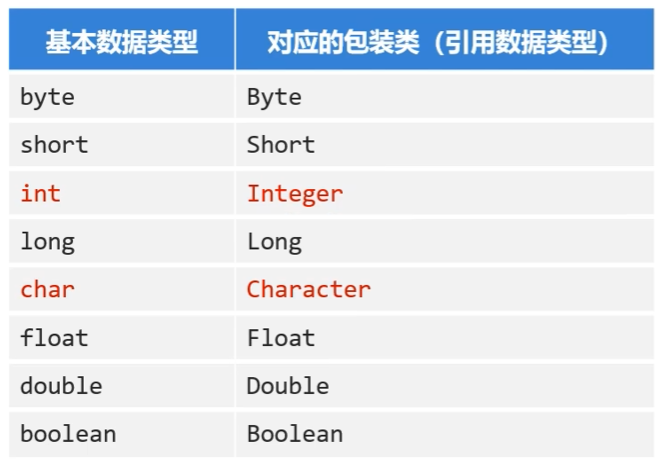
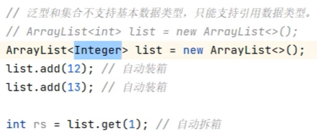
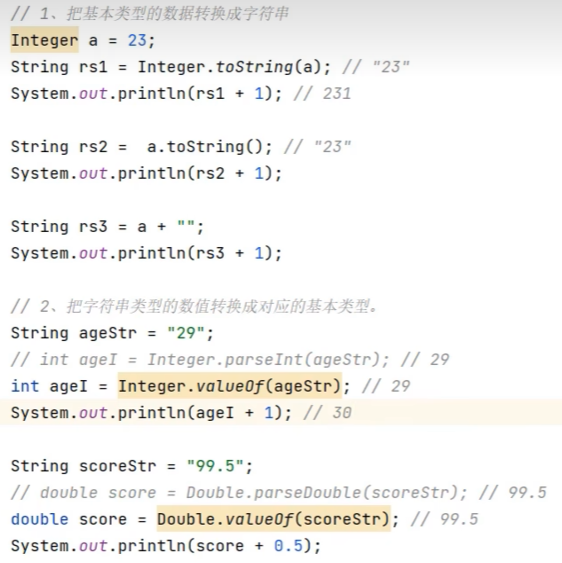

# 14. 包装类

- 包装类(wapper class)就是把基本类型的数据包装成对象



#### 基本使用：

  ```java
  Integer i = new Integer(10); // 基本类型数据包装成Integer对象
  ```


- 自动装箱：```Integer i = 10; // 自动装箱，编译器会自动将int类型的数据包装成Integer对象```

- 自动拆箱：```int i2 = i; // 自动拆箱，编译器会自动将Integer对象转换成int类型的数据```



#### 其他常见操作：

- 可以把基本类型的数据转换成字符串类型
    ```public static String toString(double d) ```
    ```public String toString()```
- 可以把字符串类型的数值转换成数值本身对应的数据类型
    ```public static int parseInt(String s)```
    ```public static Integer valueOf(String s)```

