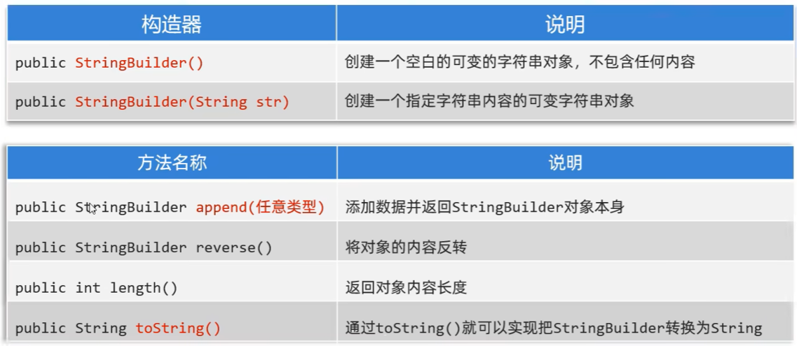
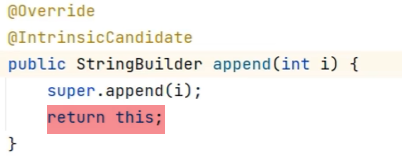

# 15. lang.StringBuilder

- StringBuilder代表可变字符串对象，相当于是一个容器，它里面装的字符串是可以改变的，就是用来操作字符串的
- 好处：StringBuilder比String更适合做字符串的修改操作，效率高，因为它是可变的，可以减少创建新对象的时间，提高性能。

### 15.1常用的构造器和方法



### 15.1.1 构造器

```java
// 1. 默认构造器
StringBuilder sb = new StringBuilder();

// 2. 通过字符串构造器
StringBuilder sb2 = new StringBuilder("Hello");
```

### 15.1.2 append()

- append()方法可以将字符串或其他对象添加到StringBuilder中，并返回StringBuilder对象本身，可以连续调用append()方法，将多个字符串或对象添加到StringBuilder中。(也称为链式编程)

```java
// 支持链式编程
StringBuilder sb = new StringBuilder();
sb.append("Hello").append(" ").append("World");
System.out.println(sb.toString()); // Hello World
```



### 15.1.3 reverse()

```java
sb.reserve() // 反转字符串
```

### 15.1.4 length()

```java
int length = sb.length(); // 获取StringBuilder的长度
```

### 15.1.5 toString()

```java
String str = sb.toString(); // 将StringBuilder转换为字符串
```

