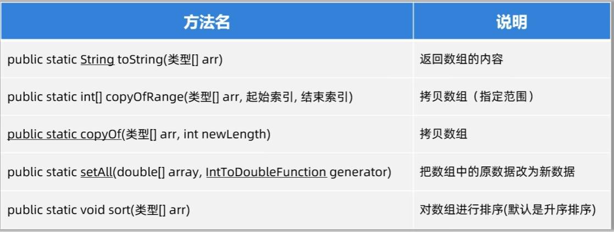
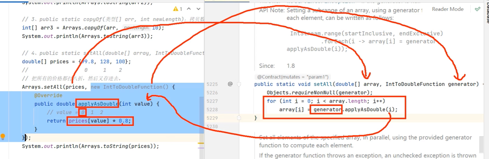
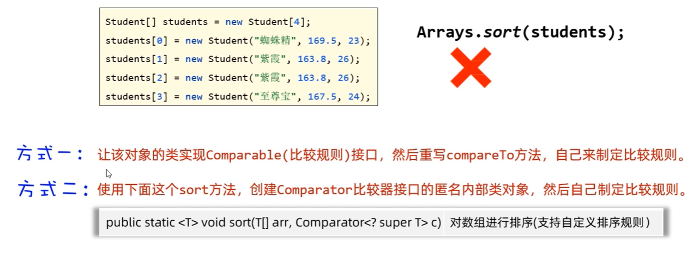
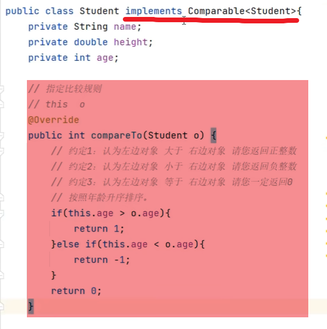
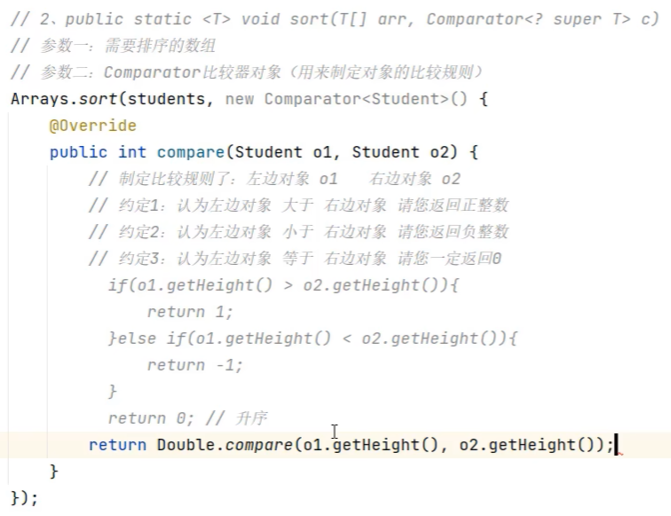

# 22. util.Arrays

- 用来操作数组的一个工具类


### 常用方法




### seAll() 讲解


### sort() 讲解

#### 对数组中的数据进行排序

```java
double prices[] = {10.5, 2.3, 8.9, 5.6, 3.1};
Araays.sort(prices);
System.out.println(Arrays.toString(prices)); // 默认升序排序
```

### 对数组中的对象进行排序



- 方式一：



简写方式：

```java
@Override
public int compareTo(Student o){
    return this.age - o.age;
}
```

- 方式二：



