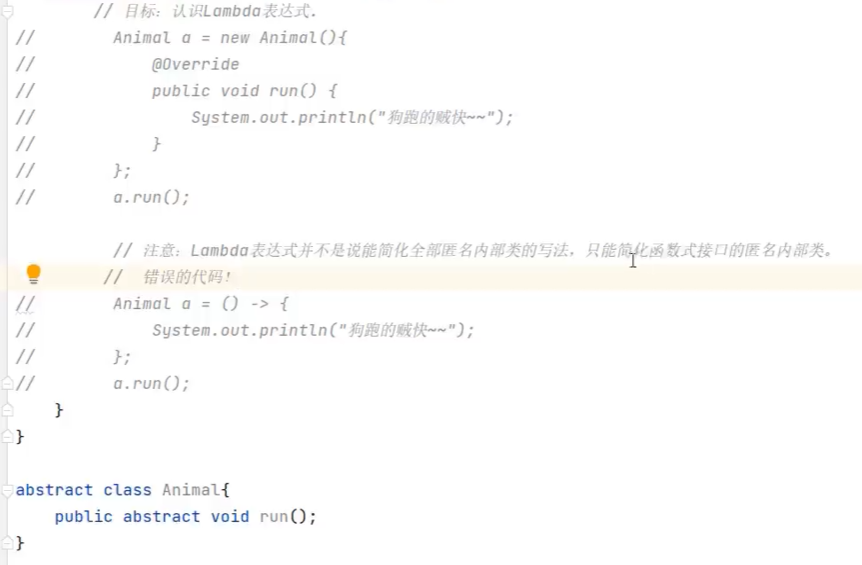
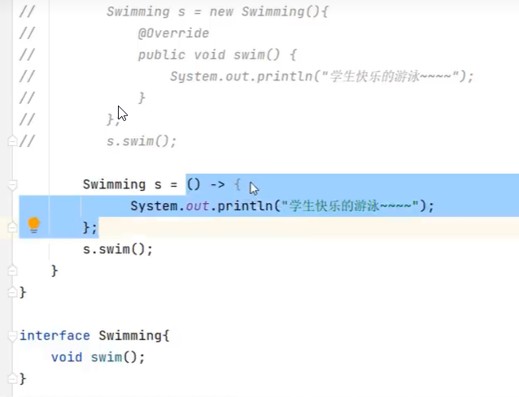
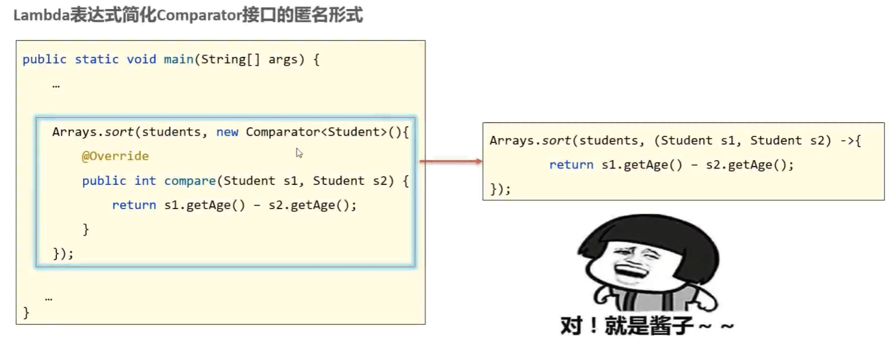
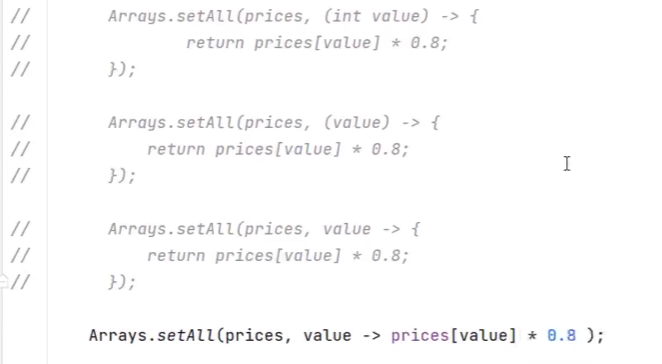

# 23. LambdaExpression

- Lambda表达式是Java 8中引入的新特性，用于简化匿名内部类的代码写法。

```java
(被重写的形参列表) -> {
    被重写方法的方法体代码。
}
```

- 并不是可以简化全部匿名内部类的写法，***只能简化函数式接口的匿名内部类***（函数式接口指的是只包含一个抽象方法的接口 /// 将来见到的大部分函数式接口，上面都有可能会有一个```@FunctionalInterface```注解，有这个注解的接口就是函数式接口）。

错误示范：



正确示范：





- 省略写法：
    - 参数类型可以省略不写
    - 如果只有一个参数，参数类型可以省略，同时()也可以省略
    - 如果Lambda表达式中的方法体代码只有一行代码，可以省略大括号不写，同时要省略分号。此时，如果这行代码是return语句，可以省略return关键字。


