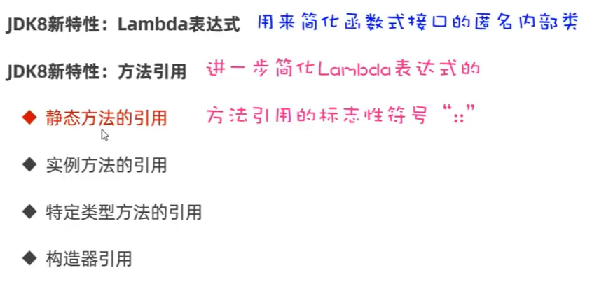
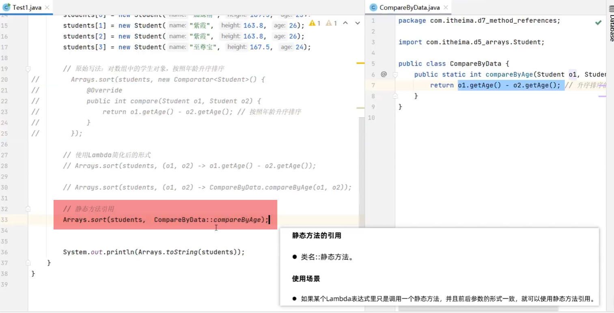
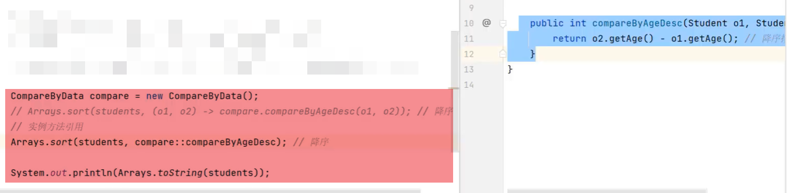
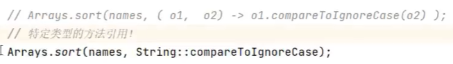
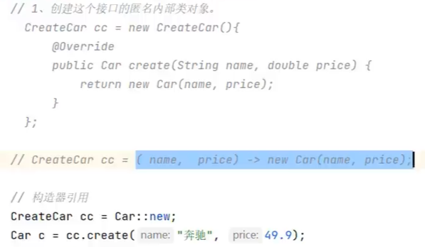

# 24. JDK8 新特性：方法引用



### 静态方法引用：
- ```类名::静态方法名```

- 使用场景：如果某个Lambda表达式里只是调用一个静态方法，并且前后参数的形式一致，就可以使用静态方法引用。



### 实例方法引用：

- ```实例名::实例方法名```

- 使用场景：如果某个Lambda表达式里只是调用一个实例方法，并且前后参数的形式一致，就可以使用实例方法引用。



### 特定类型的方法引用：

- ```类型::实例方法名```

- 使用场景：如果某个Lambda表达式里只是调用一个特定类型的实例方法，并且前面参数列表中的第一个参数是作为方法的主调，后面的所有参数都是作为该实例方法的入参的，就可以使用特定类型的方法引用。



### 构造器引用：

- ```类名::new```

- 使用场景：如果某个Lambda表达式只是在创建对象，并且前后参数一致，就可以使用构造器引用。

