# 26. Exception

- 异常就是代表程序可能出现的问题

- 作用：
    - 用来查询系统Bug的关键参考信息
    - 可以作为方法内部的一种特殊返回值，以便通知删除更调用者底层的执行情况

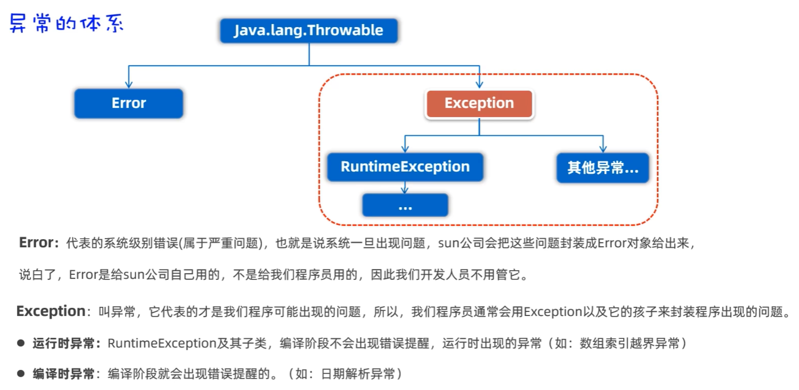

### 编译时异常的处理：

- 第一种方法：
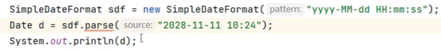

使用快捷键 ```ctrl + alt + t```，选中try-catch，即可快速生成try-catch代码块。

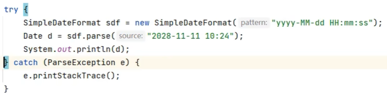


- 第二种方法：

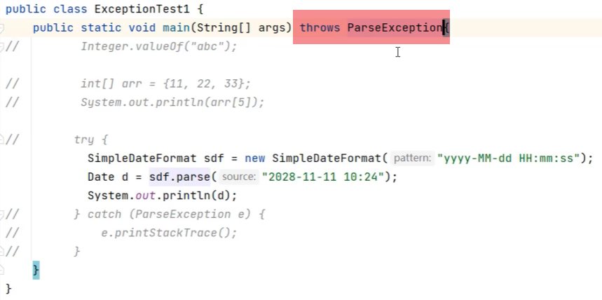

将异常往上一层抛出（main的上一层是JVM虚拟机）

- 总结：

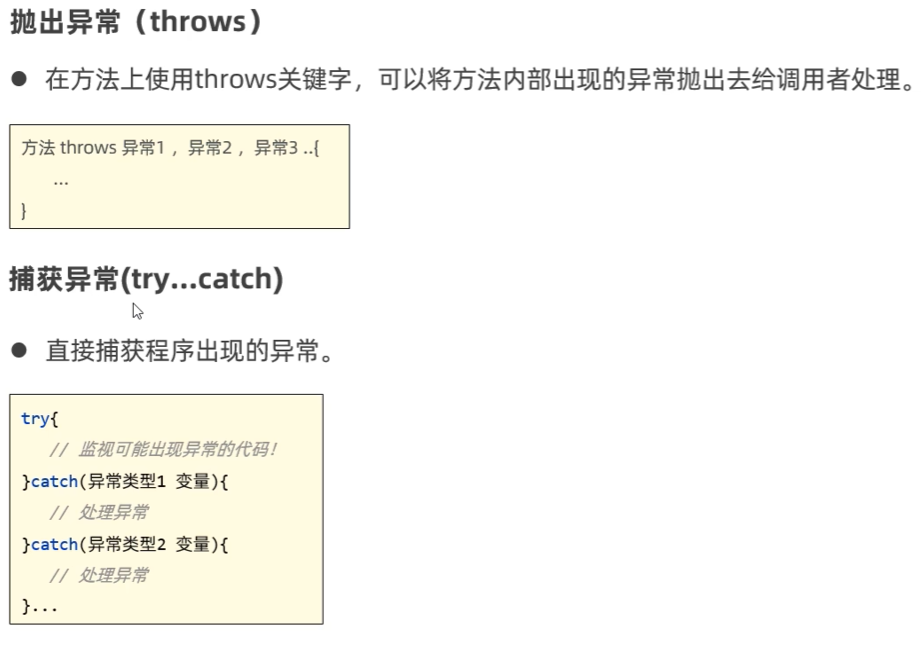

### 自定义异常：

- Java无法为这个世界上全部的异常类型提供具体的异常类，所以需要自定义异常类。

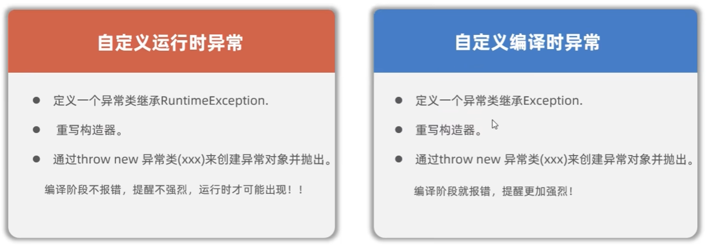

#### 自定义运行时异常：

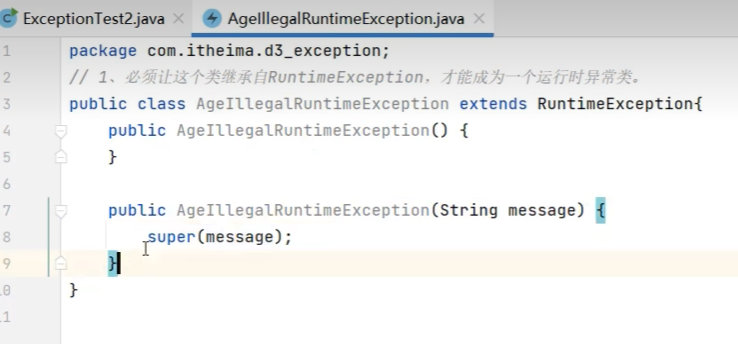

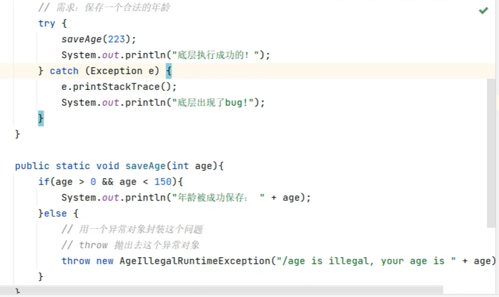

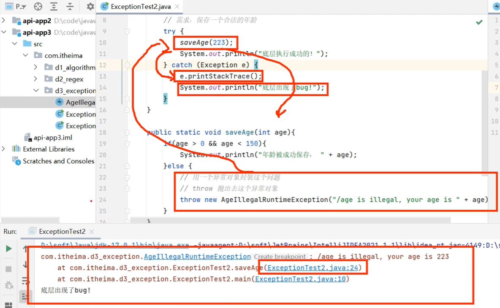

#### 自定义编译时异常：

与自定义运行时异常类似，只不过需要继承自```Exception```类。

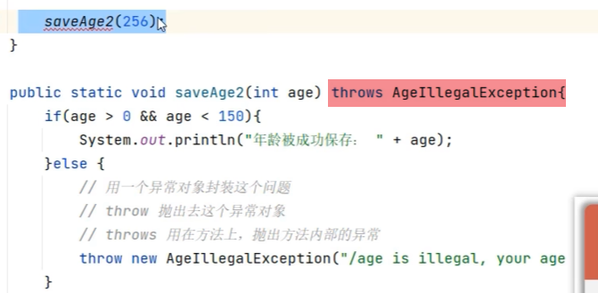

注意：要在方法上声明抛出自定义异常```thorws AgeIllegalException```，并在方法体中抛出异常。


### 开发中对于异常的常见处理方式

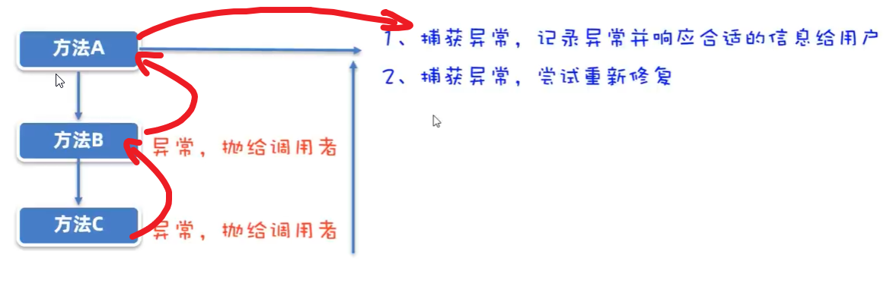

- 两种处理方式：
    - 捕获异常，记录异常并响应何时的信息给用户
    - 捕获异常，尝试重新修复

- 第一种：捕获异常，记录异常并响应何时的信息给用户

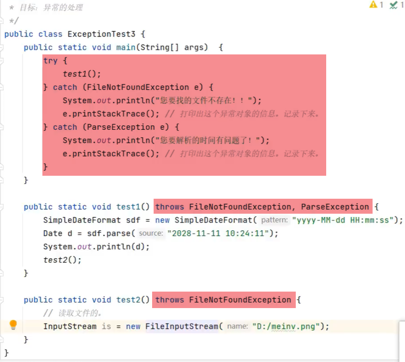

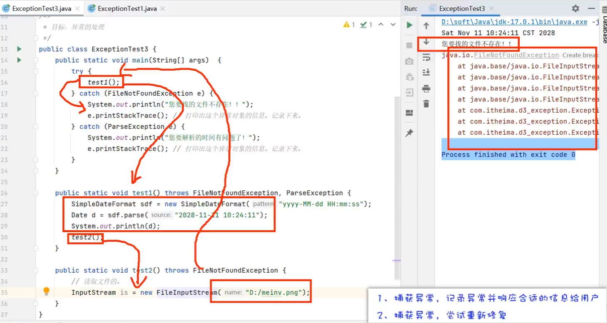

写法上的优化：

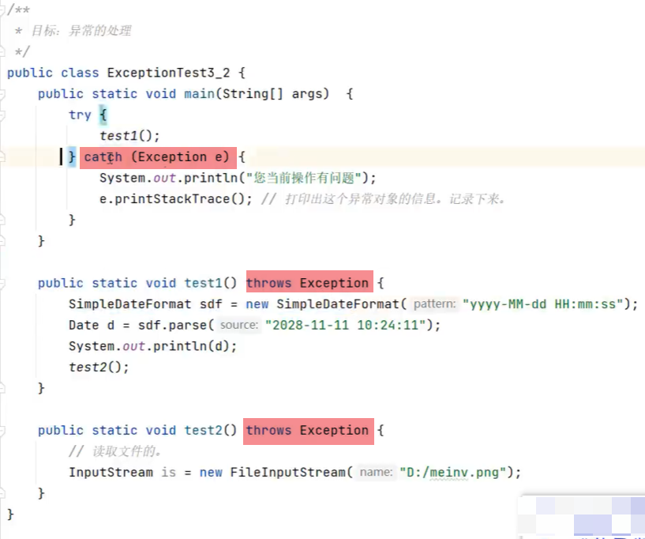


- 第二种：捕获异常，尝试重新修复

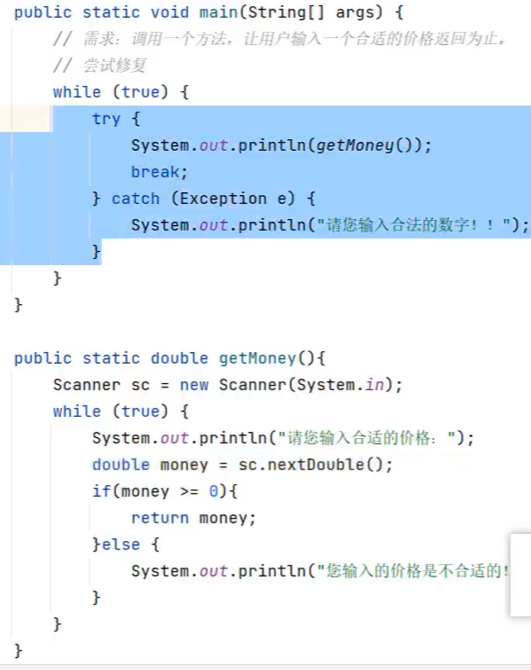
