# 27. Collection Framework

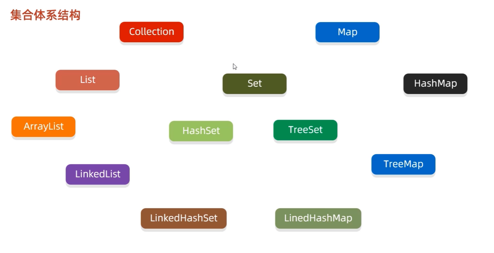

- 集合分为两大类：
  - Collection：集合的父接口，定义了集合的基本操作。
  - Map：键值对映射表，存储键值对的数据结构。


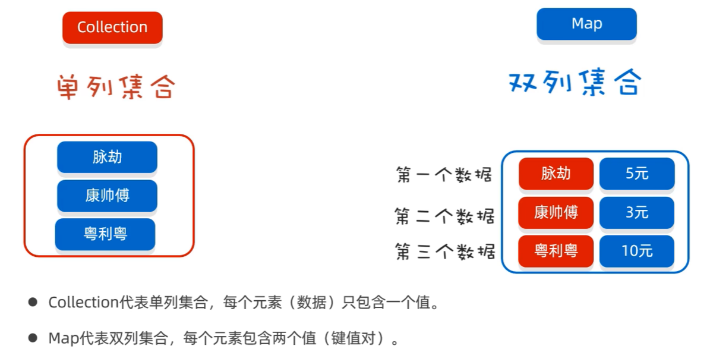

## Colletion 集合

#### Collection 分为两大类

  - List：元素有序、可重复，元素可以为空，有索引。
  - Set：元素无序、不可重复，元素不可以为空，无索引。

<!--
  | 集合 | 顺序 | 重复 | 空元素 | 索引 |
  | ---- | ---- | ---- | ------ | ---- |
  |List| 有序 | 可重复 | 允许 | 有 |
  |Set| 无序 | 不可重复 | 不允许 | 无 | -->

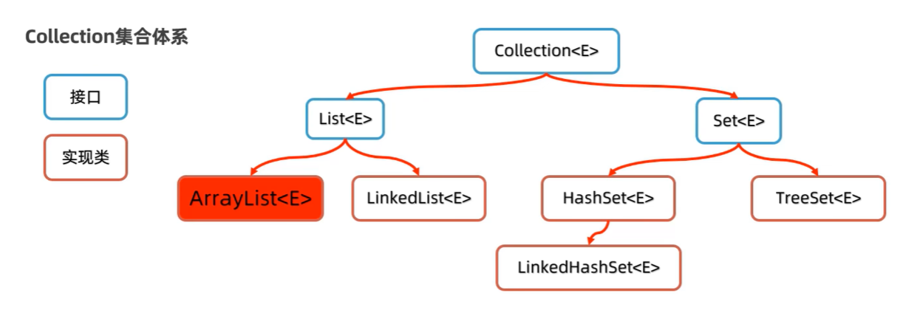

#### Collection 集合特点

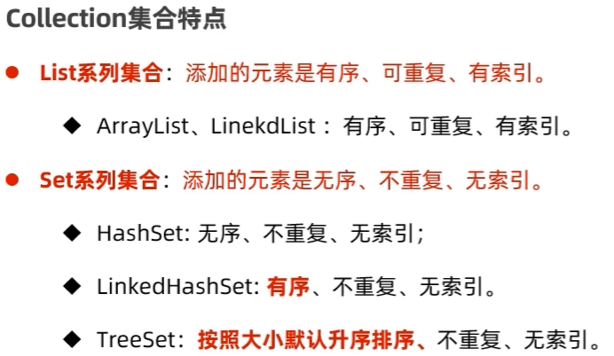

#### Collection 常用方法

```Collection<String> c = new ArrayList<>(); //多态写法```  构造一个新的 ArrayList 集合。

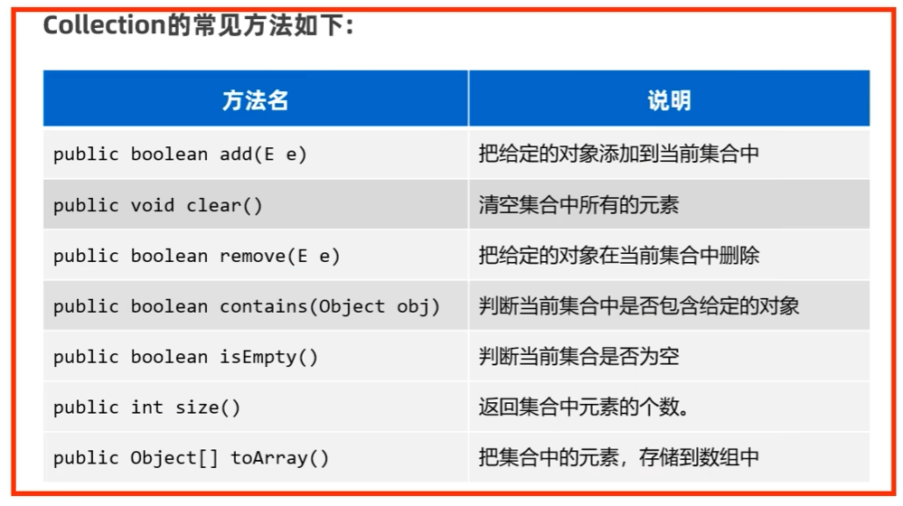

#### Collection 的遍历方式

##### 迭代器

- 迭代器是用来遍历集合的专用方式（数组没有迭代器）
- 在Java中迭代器的代表是```Iterator```

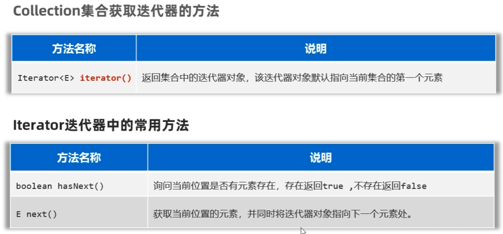

```java
Collection<String> c = new ArrayList<String>();
c.add("A");
c.add("B");
c.add("C");

// 1. 从集合对象中获取迭代器对象
Iterator<String> it = c.iterator();

// 2. 将循环结合迭代器遍历集合
while(it.hasNext()) {
    System.out.println(it.next());
}
```

##### 增强 for 循环

- 可以用来遍历数组和集合
- 本质上就是迭代器遍历集合的简化写法
- ```c.for```可以直接生成

```java
for(元素的数据类型 变量 : 数组或集合){

}
```
```java
Collection<String> c = new ArrayList<String>();
//...
for(String s : c){
    System.out.println(s);
}
```

##### Lambda 表达式遍历集合

- 得益于JDK8开始的新技术Lambda表达式，可以用更简洁的方式遍历集合

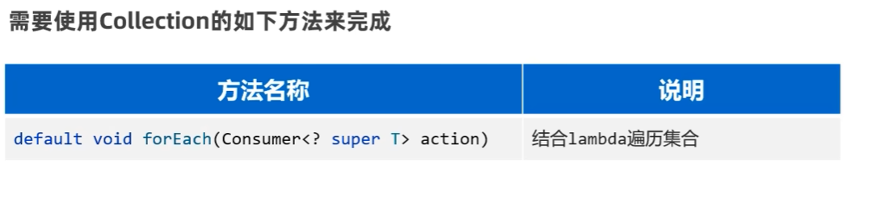

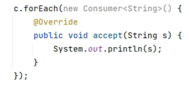


由于此处```println```是一个方法，```out```是一个对象。
经过简化后：```c.forEach(System.out::println);```


#### Collection 存储对象的原理

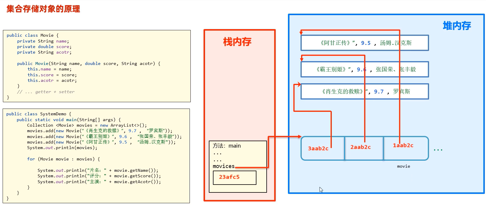


### List集合

#### List集合的常用方法

- List集合因为支持索引，所以多了很多与索引相关的方法
- Collection的功能，List也都继承了

```list<String> list = new ArrayList<>();```

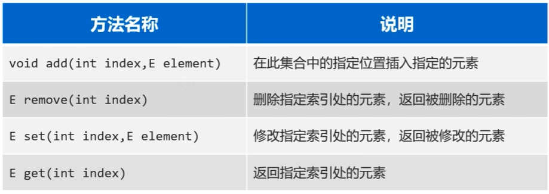

#### List集合的遍历方式

- List集合的遍历方式有四种：
    - for 循环(特有)
    - 增强 for 循环
    - 迭代器
    - Lambda 表达式

##### for 循环

- 因为List集合有索引，所以可以直接通过索引访问元素

```java
List<String> d = new ArrayList<>();
d.add("A");
d.add("B");
d.add("C");
d.add("D");

for (int i = 0; i < d.size(); i++) {
    System.out.println(d.get(i));
}
```

#### ArratList的底层原理

- 基于数组实现的
    - 数组的特点：
        - 查询速度快（注意：是根据索引查询数据块）：查询数据通过地址值和索引定位，查询任意数据耗时相同
        - 删除效率低：可能要把后面所有的数据前移
        - 添加效率极低：可能要把后面所有的数据后移，也有可能需要对数组进行扩容
- 查询快，增删慢

- 底层实现：
    1. 利用无参构造器创建的集合，会在底层创建一个默认长度为0的数组。
    2. 添加第一个元素时，底层会创建一个新的长度为10的数组
    3. 存满时，会扩容1.5倍
    4. 如果一次添加多个元素，1.5倍还放不下，则新创建数组的长度以实际为准

- 使用场景：
    1. 适合于：根据索引查询数据，比如根据随机索引取数据（高效）或者数据量不是很大的时候
    2. 不适合：数据量大的同时，又要频繁的进行增删操作！


#### LinkedList的底层原理

- 基于双向链表实现的
- 链表中的每一个节点都是独立的对象，在内存中是不连续的，每个节点包含数据值和下一个节点的地址
    - 单向链表的特点：
        - 查询慢：需要从头开始遍历链表，直到找到指定位置的元素
        - 链表增删相对块
    - 双向链表的特点：
        - 对于首尾的进行增删改查的速度是极快的
- 使用场景：
    1. 可以用来设计队列
    2. 可以用来设计栈

#### LinkedList对于首尾元素添加的特有方法

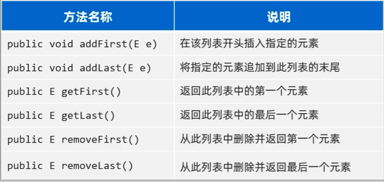

### Set集合

#### Set集合的常用方法

- Set要用到的常用方法，基本上是Collection提供的，自己几乎没有额外新增一些常用功能

#### HashSet集合的底层原理

- 要弄清楚HashSet的底层原理，首先要弄清楚哈希值：
    - 哈希值就是一个int类型的数值，Java中每个对象都有一个哈希值
    - Java中的所有对象，都可以调用Object类提供的hashCode方法，返回该对象自己的hash值
    - ```public int hashCode()``` : 返回该对象的哈希码值。
    - 同一个对象多次调用hashCode方法，返回的哈希码值一定相同
    - 不同对象调用hashCode方法，返回的哈希码值一般不同，但也有可能相同（哈希碰撞）


- HashSet集合的底层原理：


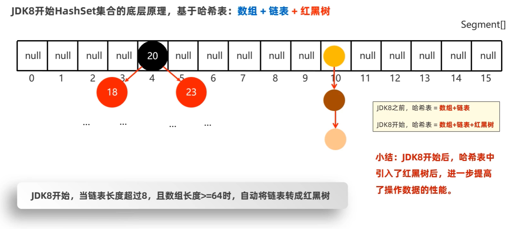

- 红黑树简介：
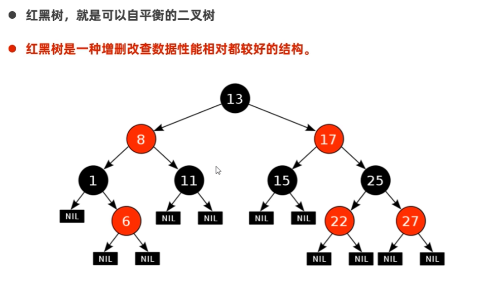


- HashSet集合默认不能对内容一样的不同的两个对象去重（比如内容一样的两个学生对象存入到HashSet中去，HashSet集合是不会去重的）
- 如果希望Set集合认为2个内容一样的对象是重复的，必须要重写对象的hashCode()和equals()方法。（直接用IDEA自带的快捷键）

#### LinkedHashSet集合的底层原理

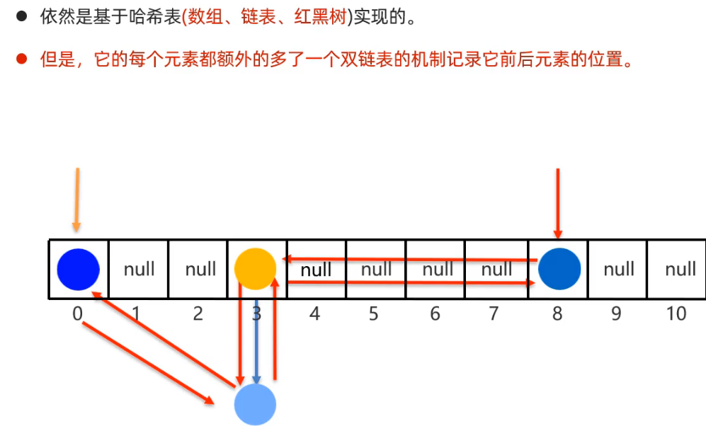


#### TreeSet集合制定排序规则

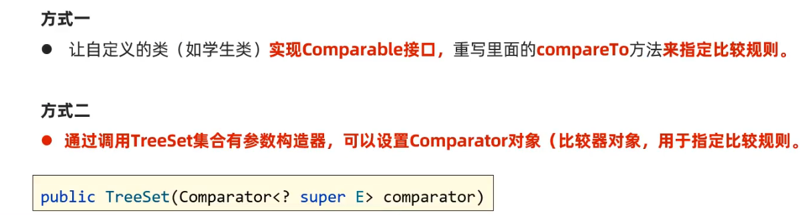


### 总结

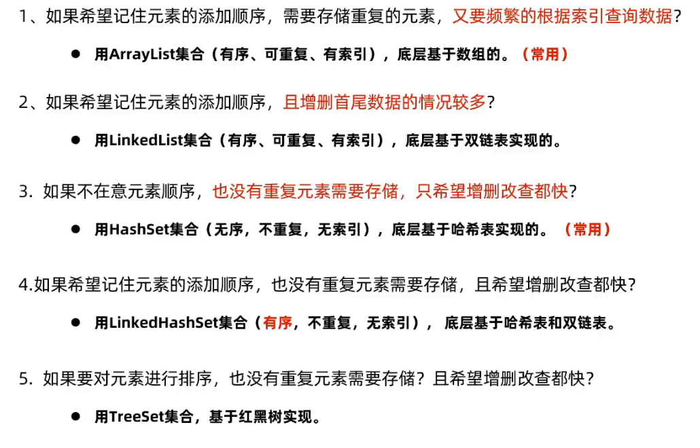

### 集合的并发修改异常问题


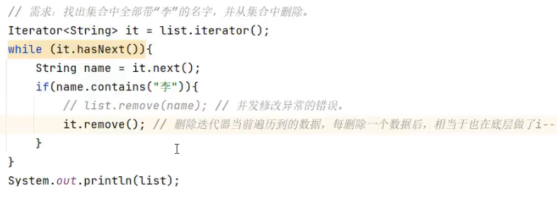

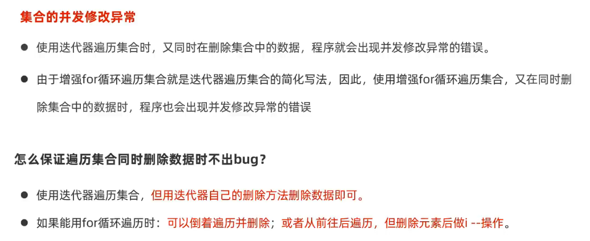

### Collection的其他相关知识

#### 可变参数

- 就是一种特殊的形参，定义在方法、构造器的形参列表里，格式是：```类型... 变量名```

- 特点：可以不传数据给他，可以传一个或多个数据给他，也可以传一个数组
- 好处：常常用来灵活的接收数据

- 注意事项：
    - 可变参数在方法内部就是一个数组
    - 一个形参列表中可变参数只能有一个
    - 可变参数必须放在形参列表的最后面


#### Collections工具类

##### 常见静态方法

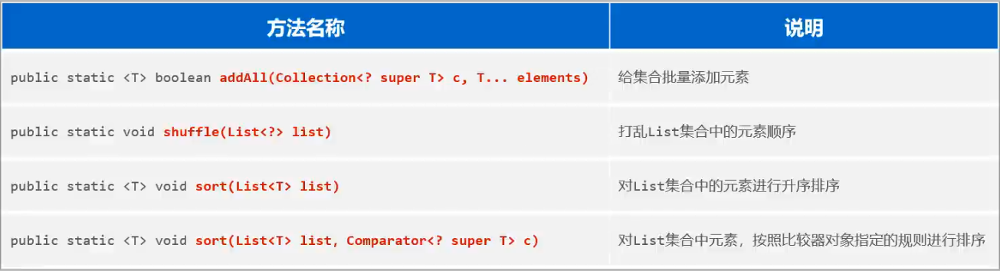

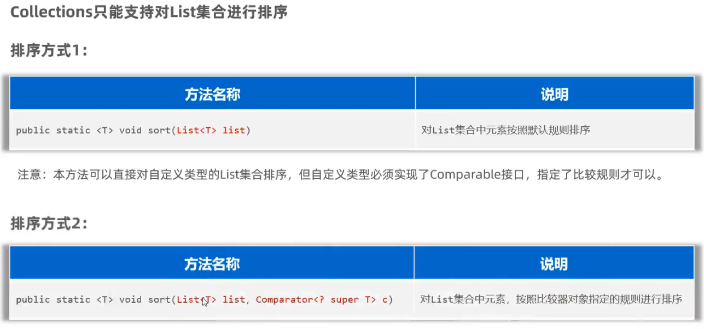


## Map集合

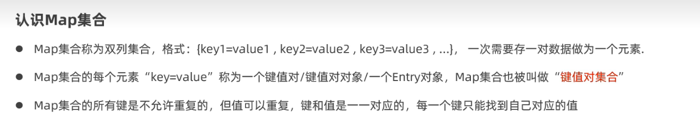

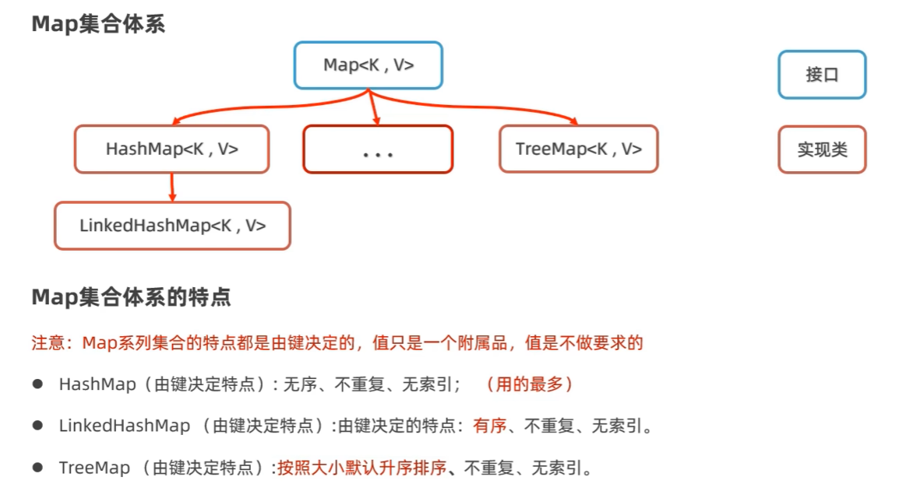

#### Map集合常用方法

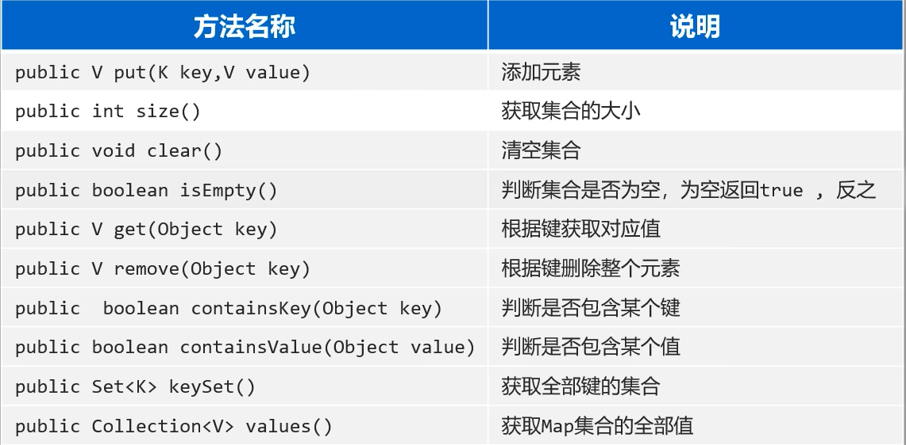

#### Map集合的遍历方式
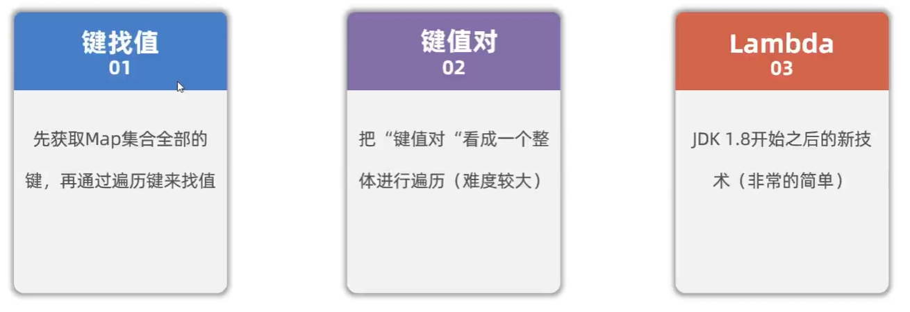

##### 键找值

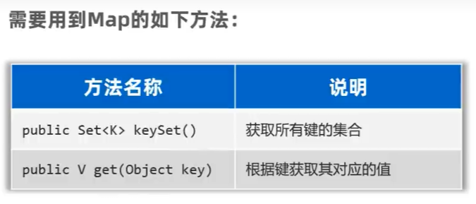


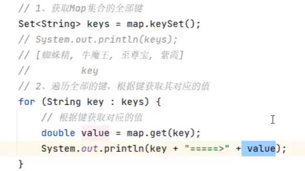

##### 键值对

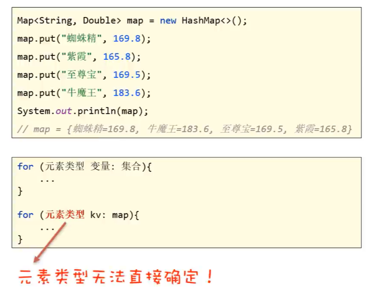

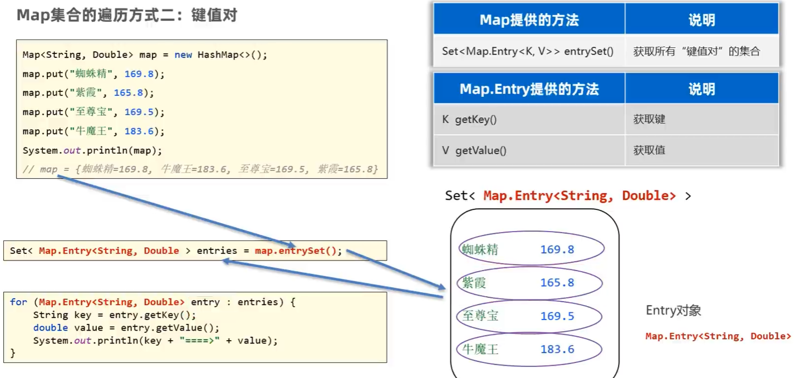